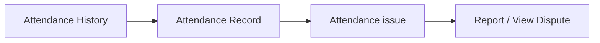
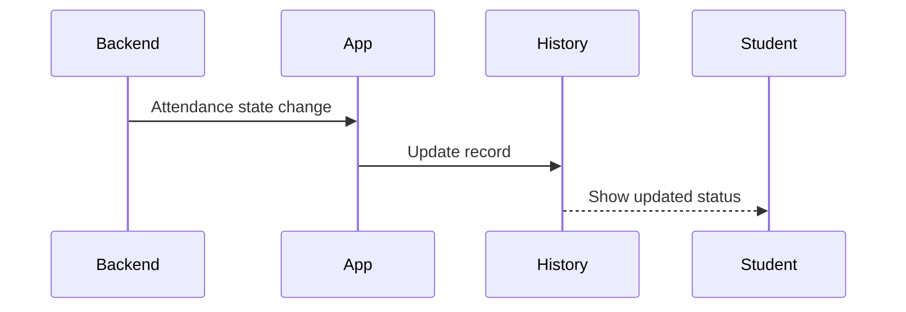
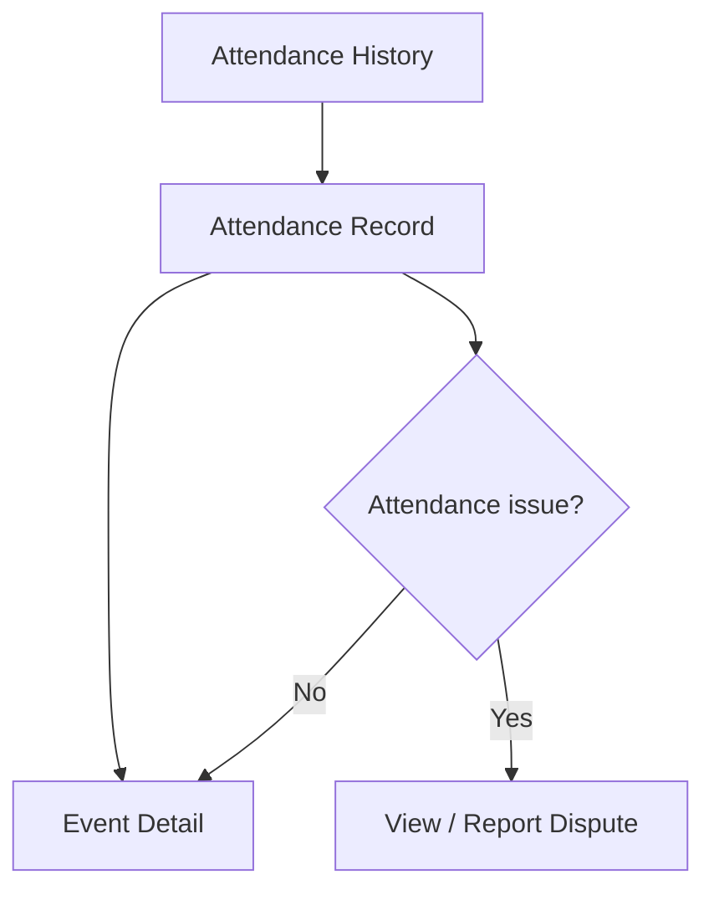

# Student Web UX — Attendance History

## 1. Product Job

Attendance History answers one question:

"What is my attendance record?"

The student should be able to understand, almost instantly:

Which event?
When?
Present or not?
Is there anything I need to do?

The screen should be factual, compact, and easy to scan.

## 2. Core Mental Model

MY ATTENDANCE

Event
↓
Date
↓
Result
↓
Action, only if needed

Do not turn attendance history into analytics.

No graphs.

No percentages.

No attendance dashboard.

No administrative metadata.

## 3. Entry Points

Attendance History should be reachable from:

Event Detail
My Events
Profile / personal area if desired

The strongest contextual path is:

My Events
→ Past event
→ Attendance

and:

Event Detail
→ Attendance status
→ Attendance details

## 4. Screen

```text
┌────────────────────────────────────────────────────────────────────┐
│ Attendance                                                        │
│ Your attendance history.                                          │
│                                                                    │
│ ┌───────────────────────────────────────────────────────────────┐  │
│ │ AI/ML Workshop                                                │  │
│ │ ML Club · Sep 12 · Lab 3                                     │  │
│ │                                                               │  │
│ │ ✓ PRESENT                                      View event →  │  │
│ └───────────────────────────────────────────────────────────────┘  │
│                                                                    │
│ ┌───────────────────────────────────────────────────────────────┐  │
│ │ Hackathon                                                      │  │
│ │ Coding Club · Sep 2 · Main Auditorium                         │  │
│ │                                                               │  │
│ │ ⚠ NO RECORD                               Report issue →     │  │
│ └───────────────────────────────────────────────────────────────┘  │
│                                                                    │
└────────────────────────────────────────────────────────────────────┘
```

That should be most of the screen.

## 5. No Filters Initially

Do not add:

Date filter
Club filter
Attendance filter
Event type filter
Search

unless the attendance volume makes them necessary.

For a student, attendance history is naturally chronological and personal.

Default:

Most recent first

## 6. Attendance Item

Each row/card should contain only:

Event
Club
Date/time
Location
Attendance result
Action, only when needed

Example:

AI/ML Workshop
ML Club · Sep 12 · 4:00 PM
Lab 3

✓ PRESENT

The information should be readable without opening the record.

## 7. Result Is the Visual Priority

The student cares much more about:

PRESENT

than:

attendance method
session ID
device

Therefore the result should be prominent.

Supported student-facing states may include:

✓ PRESENT
NO RECORD
ISSUE REPORTED
UNDER REVIEW

Use only states actually supported by the backend.

## 8. PRESENT

Normal successful record:

AI/ML Workshop
ML Club · Sep 12 · 4:00 PM

✓ PRESENT
Recorded at 4:13 PM

The recorded timestamp can be shown if available and useful.

## 9. NO RECORD

If no attendance record exists:

AI/ML Workshop
ML Club · Sep 12 · 4:00 PM

NO RECORD

[ REPORT AN ISSUE ]

Do not automatically call this:

ABSENT

unless the backend explicitly defines the student's state as absent.

"No record" and "absent" are distinct concepts.

## 10. ISSUE REPORTED

If a dispute exists:

AI/ML Workshop

ISSUE REPORTED
Under review

[ VIEW ISSUE ]

The student immediately understands that they have already taken action.

Do not show Report an issue again.

## 11. ISSUE RESOLVED

Approved:

AI/ML Workshop

✓ PRESENT
Attendance issue resolved

Rejected:

AI/ML Workshop

NO RECORD
Issue resolved

[ VIEW ISSUE ]

The exact state must follow the backend's resulting attendance/dispute state.

## 12. Record Detail

Opening a record should not create an enormous detail page.

Keep it contextual:

AI/ML Workshop

✓ PRESENT

Sep 12 · 4:13 PM
Lab 3

[ VIEW EVENT ]

If there is an issue:

AI/ML Workshop

NO RECORD

Attendance issue
UNDER REVIEW

[ VIEW ISSUE ]

The history page remains the overview; dedicated workflows own the details.

## 13. Attendance → Dispute

The history page should be the easiest place to identify an attendance problem.



This is the natural exception path.

## 14. Dispute Eligibility

The Report an issue action should only appear when the backend says the student is eligible.

NO RECORD
↓
Check eligibility
↓
Eligible → REPORT AN ISSUE
Not eligible → no active dispute action

Do not rely solely on client-side date calculations if the backend exposes authoritative eligibility.

## 15. Chronological Organization

Use recent-first ordering:

TODAY
Yesterday
Sep 12
Sep 8
Sep 2

Date grouping is optional.

Use it only if it materially improves scanning.

For a short list, simply displaying dates on each item may be cleaner.

Do not create excessive headers.

## 16. History Should Stay Quiet

Unlike Home or Discover, there is no need for a large visual hero.

The screen should communicate:

These are my records.

Then get out of the way.

## 17. No Attendance Analytics

Do not add:

Attendance percentage
Attendance streak
Monthly graph
Club attendance comparison
Total sessions
Attendance ranking

unless those become explicit product requirements.

The student asked:

"What happened to my attendance?"

not:

"Give me an attendance analytics dashboard."

## 18. Empty State

If the student has never had an attendance record:

No attendance records yet.

Your attendance history will appear here after you participate in events.

No error state.

No artificial statistics.

## 19. Loading

Use compact record skeletons.

```text
┌──────────────────────────────────────────────────────────────┐
│ ███████████████                                              │
│ █████ · █████ · █████                                       │
│ █████████████████████                                      │
└──────────────────────────────────────────────────────────────┘
```

Keep the page structure visible.

## 20. Error

Couldn't load your attendance history.

[ Retry ]

Global navigation stays available.

## 21. Realtime

Attendance history does not need to constantly animate.

Only update when there is a meaningful state change:

NO RECORD
→ PRESENT

UNDER REVIEW
→ RESOLVED

The affected record should update in place.

Do not reorder the entire history unnecessarily.

## 22. Realtime Attendance Update



Use this only where the existing realtime architecture supports the corresponding event.

## 23. Navigation



## 24. Mobile

Use compact stacked records:

Attendance

AI/ML Workshop
ML Club
Sep 12 · 4:00 PM

✓ PRESENT
Recorded 4:13 PM

Hackathon
Coding Club
Sep 2 · 10:00 AM

NO RECORD
[ REPORT ISSUE ]

The result remains immediately visible.

## 25. Desktop

Use a centered content list:

Attendance
Your attendance history.

AI/ML Workshop
ML Club · Sep 12 · 4:00 PM · Lab 3

✓ PRESENT                                      View event →

Hackathon
Coding Club · Sep 2 · 10:00 AM · Main Auditorium

NO RECORD                                      Report issue →

Do not use a wide administrative table.

## 26. Accessibility

Every record should semantically communicate:

Event
Date
Attendance state
Available action

Statuses cannot rely only on color.

Examples:

✓ PRESENT
NO RECORD
UNDER REVIEW

must remain understandable in text.

## 27. Core Student Experience

The interaction should be:

Open Attendance
↓
Scan history
↓
See PRESENT / NO RECORD
↓
Act only when something is wrong

No unnecessary interactions.

## 28. Final Architecture

```text
ATTENDANCE HISTORY
│
├── Chronological Records
│   ├── Event
│   ├── Date
│   ├── Location
│   ├── Result
│   └── Action if needed
│
└── Contextual Detail
    └── Dispute
```

## 29. Product Principle

Attendance History should feel like a receipt, not a dashboard.

The student opens it to verify:

"Was I marked present?"

The ideal answer is visible immediately:

✓ PRESENT

When something is wrong:

NO RECORD
↓
REPORT ISSUE

That is the complete job of this screen.

## 30. Backend Contract

Before implementation, verify:

GET /users/me/attendance
Attendance record fields
Attendance status values
Recorded timestamp
Event relationship
Dispute relationship
Dispute eligibility
Dispute status
Realtime attendance updates
Realtime dispute updates

Every attendance state shown in the history must map directly to backend data.

Do not expose technical attendance metadata.
