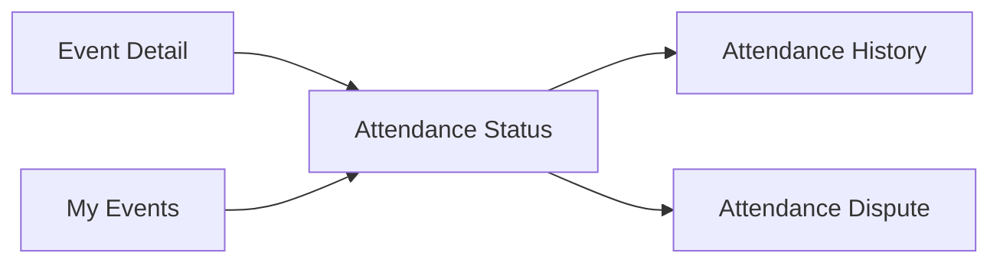
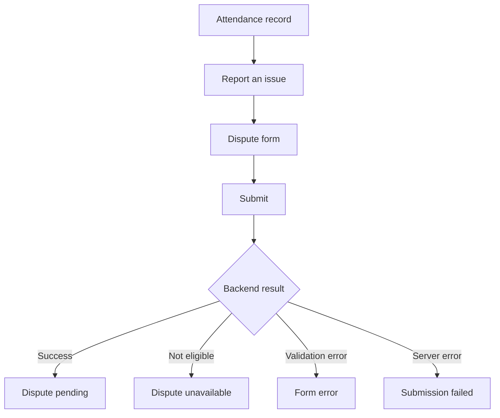
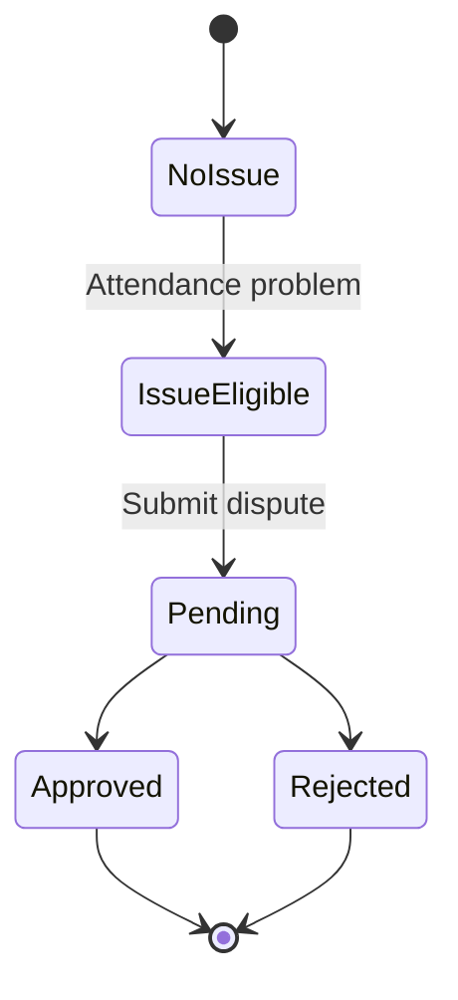
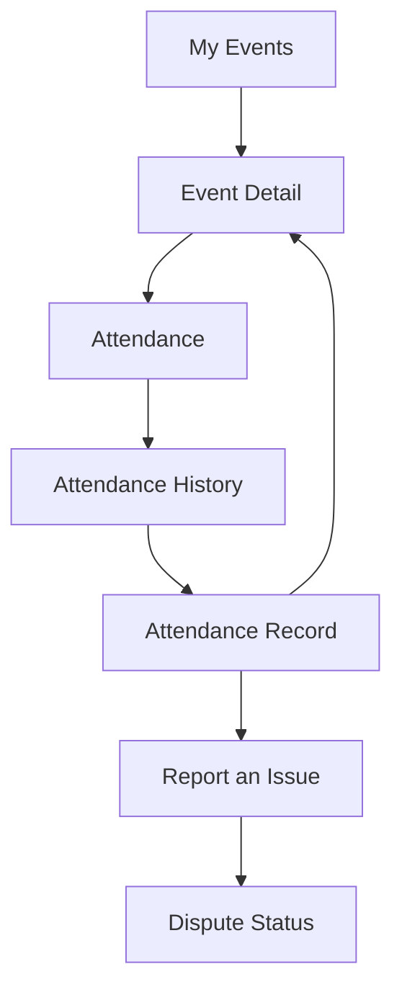
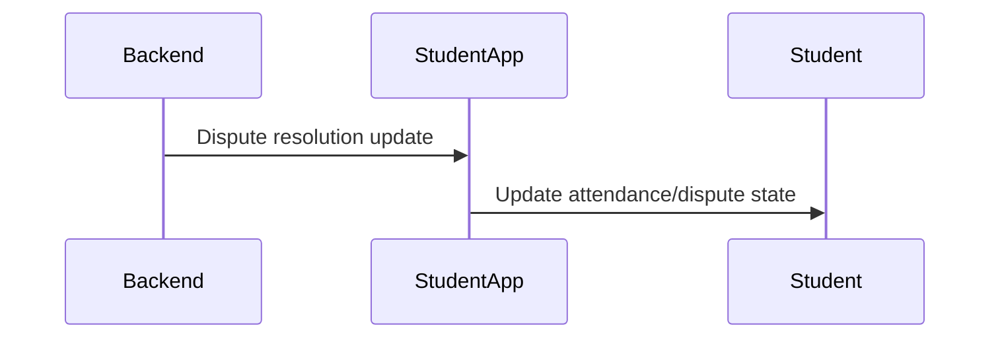

# Student Web UX — Attendance

## 1. Product Job

The Student Web App does not perform attendance check-in.

QR scanning and physical check-in happen outside the web application.

The web app's attendance experience exists to answer:

```text
Am I marked present?
What is my attendance status?
When was I marked?
Is something wrong?
Can I report it?
What happened to my dispute?
```

The web experience should therefore be a status and exception-management experience, not a scanner.

---

## 2. Explicit Product Boundary

The Student Web App must NOT contain:

```text
QR scanner
Camera attendance
Camera permission flow
QR generation
QR expiration handling
Scanning UI
Manual QR entry
```

Those belong to the attendance/check-in client outside the student web application.

The web application consumes the resulting attendance state.

---

## 3. Student Mental Model

The student should think:

```text
I attended.
↓
Was I marked present?
↓
Yes / No
↓
If something is wrong, report it.
```

The student should never need to understand how attendance was technically recorded.

Do not expose:

```text
QR payload
Cryptographic validation
Geofencing implementation
Spoof detection
Device metadata
Attendance session internals
```

---

# 4. Attendance Surfaces

Attendance should appear in three places:

```text id="9w3m7k"
1. Event Detail
2. My Events
3. Attendance History
```

Disputes are a separate workflow connected to these surfaces.



---

# 5. Event Detail — Attendance Status

Attendance should appear contextually inside Event Detail.

### Before attendance is recorded

```text id="a8c4qk"
YOUR ATTENDANCE

Not marked yet
```

Do not imply that the student needs to do anything through the web app.

If the actual product provides a separate physical/mobile check-in mechanism, the web app may simply communicate:

```text
Attendance is recorded separately.
```

Only include such copy if necessary.

### After attendance is recorded

```text id="x8y1n4"
YOUR ATTENDANCE

✓ PRESENT

Checked in at 4:13 PM
```

The student gets immediate reassurance.

---

# 6. Attendance Statuses

Use student-facing concepts.

Potential states:

```text id="m3yq7c"
Not marked
Present
Absent / No record
Dispute pending
Attendance issue resolved
```

Only use states supported by the actual backend attendance model.

Do not expose internal enum names directly.

---

# 7. My Events — Attendance State

The event item should summarize attendance only when useful.

Example:

```text id="q7m3b4"
AI/ML Workshop
ML Club · Sep 12 · Lab 3

✓ ATTENDED

View event →
```

If attendance has not yet been recorded:

```text id="0u1l7w"
AI/ML Workshop
Sep 12 · 4:00 PM

Attendance not recorded yet
```

If there is a known issue:

```text id="a4f8x0"
AI/ML Workshop

Attendance issue

View details →
```

The exact representation must follow backend state.

---

# 8. Attendance History

Create a dedicated personal attendance history experience.

Its job is:

> "Show me the attendance records that belong to me."

The page should remain lightweight.

```text id="p2s7xk"
┌──────────────────────────────────────────────────────────────┐
│ Attendance                                                   │
│ Your attendance history.                                    │
│                                                              │
│ ┌──────────────────────────────────────────────────────────┐ │
│ │ AI/ML Workshop                                           │ │
│ │ Sep 12 · 4:00 PM · Lab 3                                │ │
│ │                                                          │ │
│ │ ✓ PRESENT                                 View event → │ │
│ └──────────────────────────────────────────────────────────┘ │
│                                                              │
│ ┌──────────────────────────────────────────────────────────┐ │
│ │ Hackathon                                                │ │
│ │ Sep 2 · 10:00 AM · Main Auditorium                      │ │
│ │                                                          │ │
│ │ NO RECORD                              Report issue →   │ │
│ └──────────────────────────────────────────────────────────┘ │
└──────────────────────────────────────────────────────────────┘
```

The exact page placement/navigation should follow the final application architecture.

---

# 9. Attendance History Item

Each item should communicate:

```text id="s18a4j"
Event
Date/time
Location
Attendance result
Relevant action
```

Do not expose technical metadata.

Avoid showing:

```text
device
OS
IP
QR token
verification method
audit ID
```

unless explicitly required by the student product.

---

# 10. Attendance Record Detail

If the backend exposes enough information to make a detailed record useful, clicking an attendance record can open:

```text id="9h8ddm"
AI/ML Workshop

Attendance
✓ PRESENT

Recorded
Sep 12 · 4:13 PM

[ View event ]
```

Keep the detail concise.

Do not recreate the admin attendance record.

---

# 11. Missing Attendance

If a student attended physically but has no recorded attendance:

```text id="d8x9b7"
Attendance

No attendance record found.

Think this is incorrect?

[ REPORT AN ISSUE ]
```

This is the primary exception path.

Do not claim the student was "absent" unless the backend explicitly defines that status.

"No record" and "absent" are not necessarily equivalent.

---

# 12. Attendance Issue

An attendance issue should be presented as an exception, not as a normal action.

Example:

```text id="k8f9as"
Attendance issue

Your attendance for AI/ML Workshop
doesn't appear to be recorded.

[ REPORT AN ISSUE ]
```

The exact copy should reflect the actual backend status.

---

# 13. Dispute Entry

When the student is eligible to dispute:

```text id="j4l5p2"
Attendance

No attendance record

[ REPORT AN ISSUE ]
```

Clicking opens the dispute flow.

The student should not have to navigate through an administrative "dispute management" page.

---

# 14. Dispute Form

The form should collect only information supported by the backend.

Conceptually:

```text id="8h4tqz"
┌──────────────────────────────────────────────┐
│ Report an attendance issue               ✕  │
│                                              │
│ Event                                        │
│ AI/ML Workshop                               │
│                                              │
│ What happened?                               │
│ ┌────────────────────────────────────────┐  │
│ │ Describe the issue...                  │  │
│ └────────────────────────────────────────┘  │
│                                              │
│ Evidence                                     │
│ [ Add evidence ]                             │
│                                              │
│ [ Cancel ]                [ Submit issue ]   │
└──────────────────────────────────────────────┘
```

The actual reason/evidence fields must match backend validation.

---

# 15. Dispute Submission



---

# 16. Dispute Pending

After successful submission:

```text id="qx9mk2"
Attendance issue

Your dispute is being reviewed.

Status
PENDING

Submitted
Sep 12 · 5:02 PM

[ VIEW DETAILS ]
```

The student should clearly understand:

```text
The request exists.
It has not been resolved yet.
No further action is currently required.
```

---

# 17. Dispute Approved

```text id="v3z5ry"
Attendance issue resolved

Your attendance dispute was approved.

✓ APPROVED

[ VIEW DETAILS ]
```

If the backend updates the attendance record:

```text
Attendance
✓ PRESENT
```

must become visible through the relevant attendance surface.

---

# 18. Dispute Rejected

```text id="c4m6q1"
Attendance issue resolved

Your dispute was rejected.

[ VIEW DETAILS ]
```

Do not expose administrative reviewer information unless explicitly supported.

---

# 19. Dispute Expired

If the student is outside the backend-defined dispute window:

```text id="3rj5k8"
Attendance issue

This attendance issue can no longer be reported.
```

Do not show an active dispute CTA.

The backend currently defines a time-limited dispute window; the frontend should use the actual eligibility response/logic rather than approximating the window independently.

---

# 20. Existing Dispute

If a dispute already exists:

```text id="8j6xk2"
Attendance issue

You already have a dispute for this attendance record.

[ VIEW DISPUTE ]
```

Do not allow duplicate dispute submissions.

---

# 21. Attendance → Dispute Lifecycle



Use the actual backend status model when finalizing this state machine.

---

# 22. Attendance History Navigation



Avoid unnecessary navigation depth.

---

# 23. Realtime Attendance Updates

When attendance state changes through supported realtime infrastructure:

```text id="1a7q9s"
Backend
↓
Student app
↓
Attendance state updates
```

Examples:

```text id="0y7n2b"
Not recorded
→ Present

Dispute pending
→ Approved

Dispute pending
→ Rejected
```

The student should see the updated state without needing to manually refresh when realtime support exists.

---

# 24. Realtime Dispute Resolution



If a notification is generated for the same transition, the notification should link to the relevant attendance/dispute destination.

---

# 25. No QR Scanner

The following MUST NOT appear anywhere in the Student Web UX:

```text id="n2j5q0"
Scan QR
Open Camera
Allow Camera
QR expired
Scanning
Generate QR
Regenerate QR
Fullscreen QR
Manual QR code
```

The web application reports attendance outcomes; it does not perform physical check-in.

---

# 26. No Technical Attendance Information

Do not expose:

```text id="x8c2v4"
Session ID
QR payload
Cryptographic token
Geofence radius
Mock-location detection
Device fingerprint
OS metadata
Audit identifiers
```

The student needs the outcome, not the mechanism.

---

# 27. Loading

Attendance history:

```text id="7p2s9a"
Skeleton attendance rows
```

Event Detail:

```text id="w3r8x4"
Attendance status skeleton
```

Do not block the entire application with a spinner.

---

# 28. Error

For attendance history:

```text id="r6t8v1"
Couldn't load your attendance.

[ Retry ]
```

For a single record:

```text id="z4q1m8"
Couldn't load this attendance record.

[ Retry ]
```

Keep other navigation available.

---

# 29. Empty Attendance History

```text id="f4n2p7"
No attendance records yet.

Your event attendance will appear here after you participate.
```

Do not imply an error.

---

# 30. Student-Friendly Terminology

Prefer:

```text id="m6y7v8"
Present
Attendance recorded
No attendance record
Attendance issue
Dispute
Under review
Approved
Rejected
```

Avoid exposing raw backend enums.

---

# 31. Final Architecture

```text id="5q2k8j"
ATTENDANCE
│
├── Event Detail
│   └── Attendance Status
│
├── My Events
│   └── Attendance Summary
│
├── Attendance History
│   └── Attendance Record
│       └── Report Issue
│
└── Dispute
    ├── Pending
    ├── Approved
    └── Rejected
```

The physical check-in mechanism is outside the web application.

---

# 32. Core UX Principle

The web application should make attendance feel certain.

The student should never wonder:

> "Did the system actually mark me?"

They should see one clear answer:

```text
✓ PRESENT
```

or:

```text
NO ATTENDANCE RECORD

[ REPORT AN ISSUE ]
```

The complexity of QR validation, location verification, and physical check-in should remain invisible.

---

# 33. Backend Contract

Before implementation, verify:

```text id="z7q4n1"
Student attendance history endpoint
Attendance record shape
Attendance status values
Attendance timestamps
Attendance eligibility
Dispute creation
Dispute validation
Dispute evidence
Dispute status
Dispute resolution
Dispute eligibility window
Realtime attendance updates
Realtime dispute updates
Notification integration
```

Every displayed attendance state must map to an actual backend state.

Every dispute action must be backed by actual eligibility.

The Student Web App must never implement QR scanning or physical attendance capture.
