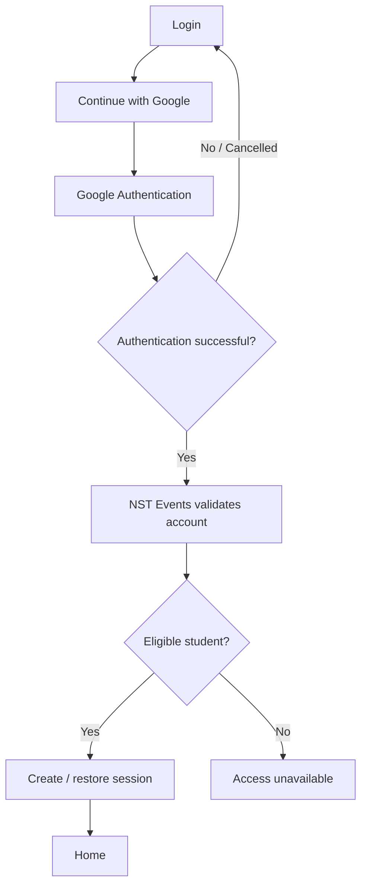
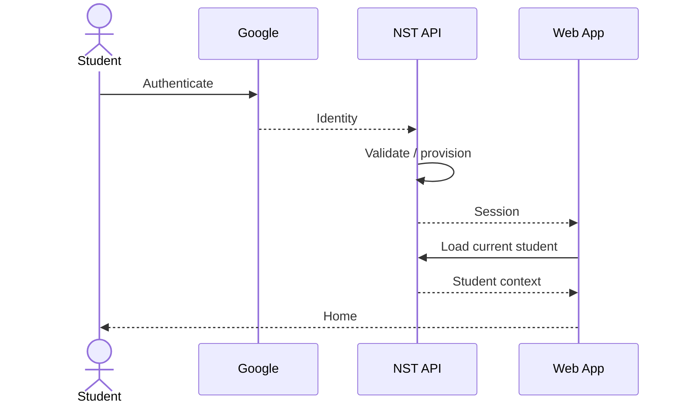
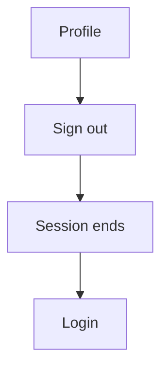

# Student Web UX — Authentication & Entry

## 1. Product Job

Get an eligible student into NST Events with minimum friction.

The entire experience should feel like:

```text
Open NST Events
↓
Continue with Google
↓
You're in
```

Authentication infrastructure must remain invisible to the student.

---

## 2. Login Screen

The login screen should contain only what the student needs.

```text
┌──────────────────────────────────────────────┐
│                                              │
│                 NST Events                   │
│                                              │
│          Everything on campus.               │
│                                              │
│      ┌────────────────────────────────┐      │
│      │  G  Continue with Google        │      │
│      └────────────────────────────────┘      │
│                                              │
│       Use your NST / ADYPU account.          │
│                                              │
└──────────────────────────────────────────────┘
```

The hierarchy is:

```text
Brand
↓
One-line purpose
↓
One primary action
↓
Account guidance
```

Nothing else.

---

## 3. Primary Action

The only primary CTA is:

```text
Continue with Google
```

Do not add:

```text
Email
Password
Create account
Role selection
Campus selection
```

Google is the identity entry point.

---

## 4. Login Interaction



The student should experience successful authentication as one continuous transition.

---

## 5. Loading During Authentication

When the student clicks Google:

```text
Continue with Google
↓
Loading / redirect
```

The CTA can enter a loading state:

```text
Signing you in...
```

Prevent repeated clicks.

Do not create a dedicated loading page unless technically necessary.

---

## 6. Account Eligibility

The student should not have to select an account type.

The backend determines eligibility from the authenticated identity.

Valid student:

```text
Google
↓
Account validation
↓
Home
```

Invalid account:

```text
Google
↓
Account validation
↓
Access unavailable
```

---

## 7. Access Unavailable

Use a simple explanation:

```text
┌──────────────────────────────────────────────┐
│                                              │
│       This account can't access NST Events.  │
│                                              │
│       Sign in with your NST / ADYPU account. │
│                                              │
│            [ Try another account ]           │
│                                              │
└──────────────────────────────────────────────┘
```

Do not expose:

```text
OAuth errors
domain names
JWT errors
HTTP status codes
authorization internals
database errors
```

---

## 8. Existing Student

Existing students should go directly to Home.

```text
Google
↓
Validated
↓
Session restored
↓
Home
```

No:

```text
Welcome back
Account loaded
Profile completed
```

interstitial.

---

## 9. New Student

A first-time student should also reach the product as quickly as possible.

```text
Google
↓
Account provisioned
↓
Home
```

Do not introduce a multi-step onboarding flow unless the backend/product actually requires information that cannot be inferred automatically.

The default assumption should be:

```text
First login ≠ setup wizard
```

---

## 10. First-Time Experience

If some required setup genuinely exists, make it minimal:

```text
Authentication
↓
Required setup
↓
Home
```

The student should never be asked to configure optional preferences before seeing the product.

---

## 11. Session Bootstrap

The technical sequence may be:



This is a technical representation.

The UI should hide the complexity.

---

## 12. Browser Refresh

After successful authentication:

```text
Refresh browser
↓
Restore valid session
↓
Return to current app
```

The student should not repeatedly authenticate during normal use.

---

## 13. Deep Link

If a student opens a protected URL while unauthenticated:

```text
Protected page
↓
Login
↓
Google
↓
Authentication
↓
Original destination
```

where technically supported.

Example:

```text
/student/events/123
```

should not unnecessarily dump the student at Home after login if the intended destination can safely be preserved.

---

## 14. Session Expiration

During normal app usage:

```text
Authenticated page
↓
Session expires
↓
Login
```

Use the normal authentication experience.

Avoid exposing technical token/session errors.

---

## 15. Authentication Error

Unexpected authentication failure:

```text
We couldn't sign you in.

Please try again.

[ Continue with Google ]
```

The error should remain on the login surface.

Do not replace the application with a technical error screen.

---

## 16. Logout

Logout leads back to Login.



The student should not see an unauthenticated Home.

---

## 17. Responsive Layout

Desktop:

```text
Centered authentication content
```

Mobile:

```text
Full-width centered content
```

The interaction remains identical.

---

## 18. Accessibility

The login screen must provide:

```text
Keyboard-accessible Google button
Visible focus
Clear accessible labels
Readable error states
Sufficient contrast
```

The authentication flow must not depend on color.

---

## 19. Deliberate Omissions

Do not add:

```text
Email/password login
Forgot password
Signup form
Role selection
Student/faculty selection
Campus selection
Interest selection
Club selection
Notification setup
Profile setup
Marketing carousel
Feature tour
```

unless a genuine product/backend requirement appears later.

---

## 20. Final Architecture

```text
AUTH
│
└── Login
    │
    └── Continue with Google
         │
         └── Account Validation
              │
              ├── Eligible
              │    └── Session
              │         └── Home
              │
              └── Not Eligible
                   └── Access Unavailable
```

That is the entire student authentication UX.

---

## 21. Core Principle

Authentication should disappear into the product.

The ideal student experience is:

> "I signed in with my college account, and NST Events opened."

Nothing about the underlying authentication architecture should distract from that.

---

## 22. Backend Contract

Before implementation, verify:

```text
Google OAuth entry
OAuth callback
Student eligibility validation
Account provisioning
Session restoration
Current-user bootstrap
Deep-link preservation
Session expiration
Logout
Authentication failures
```

Only expose UX states that correspond to actual backend behavior.
