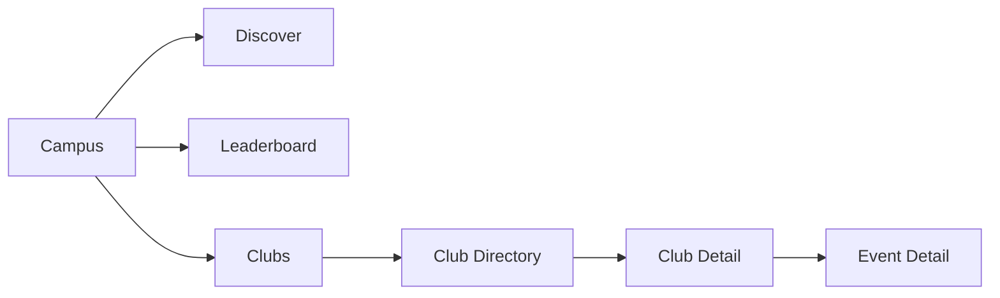
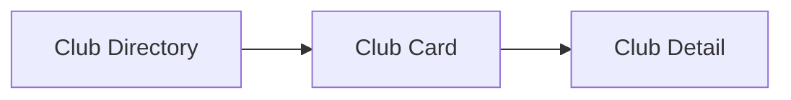
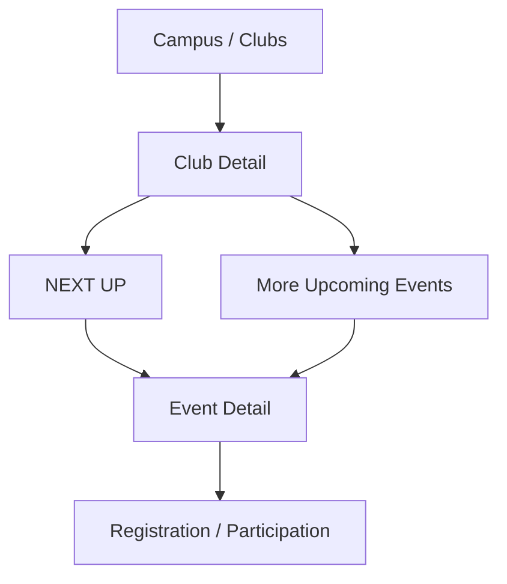

# Student Web UX — Campus → Clubs

## 1. Screen Purpose

Clubs is the student's campus community discovery experience.

The screen should answer three questions:

```text
What's this club?
        ↓
What are they doing?
        ↓
Can I participate in something they're doing?
```

The experience should feel alive and active rather than like a static directory.

---

## 2. Student Mental Model

The student should think:

```text
"Show me the communities on campus and what they're doing."
```

Not:

```text
"Show me club records."
```

The distinction is:

```text
Campus → Clubs
= Discover communities

Profile → My Clubs
= See communities I'm already part of
```

---

## 3. Campus Navigation

Campus contains:

```text
Discover
Leaderboard
Clubs
```

Clubs is the active destination.



---

## 4. Screen Hierarchy

The Clubs screen should contain only two discovery layers:

```text
Clubs
│
├── Search
│
├── Happening Through Clubs
│
└── All Clubs
```

`Happening Through Clubs` is a lightweight activity layer derived from clubs with upcoming published events.

It is not a separate social feed.

---

# 5. Page Header

Display:

```text
Clubs
Find something happening on campus.
```

The subtitle should reinforce activity and discovery.

Avoid:

```text
large hero
large statistics
marketing copy
administrative information
```

The clubs are the main content.

---

# 6. Search

Search is the primary utility.

```text
┌──────────────────────────────────────────────────────────────┐
│ 🔍 Search clubs                                              │
└──────────────────────────────────────────────────────────────┘
```

The searchable fields must correspond to backend-supported search behavior.

Potential fields:

```text
Club name
Description
```

Do not expose search concepts that the backend cannot support.

---

# 7. Search Behavior

The intended interaction:

```text
Student types
        ↓
Debounced search
        ↓
Fetch matching clubs
        ↓
Update directory
```

The search should not require a separate search page.

Where the application supports persistent URL state:

```text
/campus/clubs?q=coding
```

The search state should survive refresh and browser navigation.

---

# 8. Happening Through Clubs

This is the main element that makes the directory feel alive.

Show a small selection of clubs that currently have meaningful upcoming activity.

Conceptually:

```text
Happening through clubs                              Explore →

┌──────────────────────┐
│ Coding Club          │
│                      │
│ Hackathon            │
│ Sep 12 · 10:00 AM    │
└──────────────────────┘

┌──────────────────────┐
│ ML Club              │
│                      │
│ AI Workshop          │
│ Sep 14 · 4:00 PM     │
└──────────────────────┘

┌──────────────────────┐
│ Debate Club          │
│                      │
│ Debate Night         │
│ Sep 16 · 6:00 PM     │
└──────────────────────┘
```

The purpose is not to show everything.

The purpose is to answer:

> "Which clubs are actually doing something?"

---

# 9. Activity Card

The activity-focused club card should communicate:

```text
Club
Next event
Date/time
```

Example:

```text
Coding Club

Hackathon
Sep 12 · 10:00 AM
```

Clicking it can take the student directly to:

```text
Event Detail
```

or, where the interaction better fits the product architecture:

```text
Club Detail
```

Choose one consistent behavior during implementation.

---

# 10. Activity Ordering

Where supported by backend data, prioritize clubs with upcoming published events.

Conceptually:

```text
Has upcoming event
        ↓
Soonest upcoming activity
        ↓
Other active clubs
        ↓
Clubs with no upcoming activity
```

Do not introduce an artificial popularity or engagement score.

The activity signal must come from actual data.

---

# 11. All Clubs

Below the activity layer:

```text
All clubs
```

This is the complete discovery directory.

Use a card grid.

Desktop:

```text
3 cards per row
```

Tablet:

```text
2 cards per row
```

Mobile:

```text
1 card per row
```

---

# 12. Club Card

The card's information hierarchy:

```text
Visual identity
↓
Club name
↓
What they do
↓
Current activity
↓
Student membership
```

Example:

```text
┌───────────────────────────────┐
│                               │
│          BANNER               │
│                               │
├───────────────────────────────┤
│ Coding Club                   │
│ Build. Ship. Learn.           │
│                               │
│ ● 8 upcoming events           │
│                               │
│ Next: Hackathon               │
│ Sep 12 · 10:00 AM             │
│                               │
│ ✓ MEMBER                      │
└───────────────────────────────┘
```

The exact activity fields depend on backend availability.

---

# 13. Club Identity

The student should immediately recognize the club.

Display:

```text
Club banner / visual identity
Club name
Short description
```

Do not prioritize administrative information.

---

# 14. Club Activity

If the backend provides upcoming event information, surface a concise signal:

```text
8 upcoming events
```

and optionally:

```text
Next:
Hackathon · Sep 12
```

This gives the directory temporal context.

A student can understand:

```text
"This club is doing something."
```

instead of only:

```text
"This club exists."
```

---

# 15. Membership State

If the student belongs to the club, show:

```text
✓ MEMBER
```

This should remain secondary.

Do not transform the card into a personalized membership panel.

For students who are not members, no membership badge is necessary.

---

# 16. No Self-Join

Do not show:

```text
JOIN
FOLLOW
REQUEST TO JOIN
```

The current product model makes club membership administrator-controlled.

The Clubs experience is therefore discovery-oriented.

The student can discover a club and participate in its available events without the Clubs screen pretending that membership can be created there.

---

# 17. Club Card Interaction

The entire club card should be clickable:



Avoid multiple competing actions inside every card.

---

# 18. Club Detail — Product Job

Club Detail should answer:

```text
What is this club?
What do they do?
What are they doing next?
Am I a member?
```

The screen should immediately communicate activity.

---

# 19. Club Detail Layout

```text
┌──────────────────────────────────────────────────────────────────────┐
│ ← Clubs                                                              │
│                                                                      │
│ ┌──────────────────────────────────────────────────────────────────┐ │
│ │                           CLUB BANNER                            │ │
│ └──────────────────────────────────────────────────────────────────┘ │
│                                                                      │
│ Coding Club                                             ✓ MEMBER     │
│ Build. Ship. Learn.                                                   │
│                                                                      │
│ 42 members · 8 upcoming events                                      │
│                                                                      │
│ NEXT UP                                                              │
│ ┌──────────────────────────────────────────────────────────────────┐ │
│ │ Hackathon                                      Sep 12 · 10:00 AM │ │
│ │ Main Auditorium                                    View event → │ │
│ └──────────────────────────────────────────────────────────────────┘ │
│                                                                      │
│ MORE UPCOMING                                                        │
│                                                                      │
│ [ Coding Workshop ]              [ Open Source Night ]               │
│                                                                      │
│ ABOUT                                                               │
│ We build practical software projects...                             │
└──────────────────────────────────────────────────────────────────────┘
```

---

# 20. Club Detail Hierarchy

The order matters:

```text
Identity
↓
Membership
↓
NEXT UP
↓
More Upcoming Events
↓
About
```

The student sees activity before reading a long description.

---

# 21. NEXT UP

`NEXT UP` should be the most prominent functional section on Club Detail.

It should show the club's nearest upcoming relevant event.

Example:

```text
NEXT UP

Hackathon
Sep 12 · 10:00 AM
Main Auditorium

View event →
```

This makes the club feel active.

---

# 22. More Upcoming Events

Show additional upcoming events in a compact horizontal collection.

Example:

```text
MORE UPCOMING

[ Coding Workshop ] [ Open Source Night ] [ Tech Talk ]
```

Each leads to Event Detail.

If there are many events:

```text
View all →
```

takes the student to the appropriate event listing filtered to that club.

---

# 23. Club → Event Flow



The Club page is another route into event participation.

---

# 24. About

Keep the description concise.

Example:

```text
ABOUT

We build practical software projects, run technical workshops,
and organize campus hackathons.
```

If the description is long, allow expansion.

Do not allow `About` to push the club's active events far below the fold.

---

# 25. Member Experience

For a club the student belongs to:

```text
Coding Club
✓ MEMBER
```

This establishes recognition without creating a separate member dashboard.

If backend-supported member-only information exists, integrate it carefully into the Club Detail experience.

Do not invent member functionality.

---

# 26. Search Results

When searching:

```text
Clubs

[ 🔍 coding ]

2 clubs
```

Then show only matching clubs.

The activity presentation can either update with the search or disappear while searching, depending on which behavior produces the cleanest discovery flow.

Prefer not to show unrelated activity during a filtered search.

---

# 27. Search Empty State

```text
No clubs found.

Try a different search.
```

Keep recovery simple.

---

# 28. Directory Empty State

If there are genuinely no clubs:

```text
No clubs available yet.
```

Do not fabricate recommendations.

---

# 29. Loading

Use card skeletons.

Preserve the final geometry:

```text
┌───────────────┐
│               │
│ ███████████   │
│ █████         │
│ █████████     │
│ █████████     │
└───────────────┘
```

Do not use a large full-screen spinner.

---

# 30. Error

```text
Couldn't load clubs.

[ Retry ]
```

Campus navigation remains usable.

---

# 31. Club Detail Error

If one club cannot be loaded:

```text
Club unavailable

[ Back to Clubs ]
```

Do not expose backend error codes.

---

# 32. Realtime

The Clubs directory itself does not need aggressive realtime behavior.

The meaningful dynamic content is:

```text
Upcoming events
Event state
Student membership state
```

Where the existing realtime architecture supports relevant event changes, update the affected content without rebuilding the entire page.

Do not create artificial realtime club activity.

---

# 33. Responsive Behavior

### Desktop

```text
Persistent application navigation
3-column club grid
Wide search
Activity section above directory
```

### Tablet

```text
2-column grid
```

### Mobile

```text
Single-column cards
Horizontal activity cards where useful
Full-width search
Compact club identity
```

The conceptual hierarchy remains:

```text
Activity
↓
Clubs
```

---

# 34. Accessibility

Every club card should be a semantic link.

Membership status should be text-based:

```text
✓ MEMBER
```

not color-only.

Search must be keyboard accessible.

Club images should have meaningful alternative text when they communicate identity.

Focus states must be visible.

---

# 35. What This Screen Should Not Become

Do not add:

```text
Join Club
Follow Club
Club Chat
Social Feed
Likes
Comments
Member Directory
Recruitment
Club Applications
Club Analytics
Club Points
Administrative Controls
```

unless those capabilities are explicitly supported later.

---

# 36. Final Screen Architecture

```text
CAMPUS
│
├── Discover
├── Leaderboard
│
└── Clubs
    │
    ├── Search
    │
    ├── HAPPENING THROUGH CLUBS
    │   └── Activity-focused club cards
    │
    └── ALL CLUBS
        └── Club cards
            │
            └── Club Detail
                │
                ├── Identity
                ├── Membership
                ├── NEXT UP
                ├── More Upcoming Events
                └── About
```

---

# 37. Core UX Principle

The Clubs experience should feel like a living campus directory.

The student should be able to go:

```text
See a community
↓
Understand what it does
↓
See what it is doing next
↓
Open the event
↓
Participate
```

The difference between a static directory and this experience is the `NEXT UP` layer.

A club is not presented merely as a record.

It is presented as a community doing something next.

---

# 38. Backend Contract

Before implementation, verify:

```text
Club list
Club search
Club detail
Student membership state
Club banner / identity
Description
Member count
Upcoming event count
Upcoming events
Event → Club relationship
Club filtering
```

For every displayed activity signal:

```text
Backend data
→ UX element
```

must be explicit.

Do not invent activity, popularity, or membership functionality that the backend cannot support.
