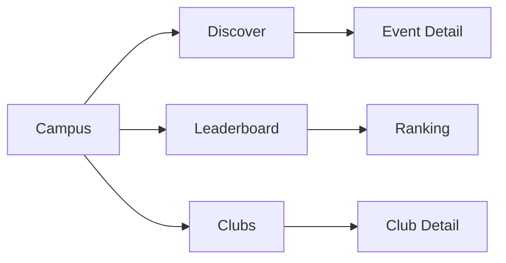
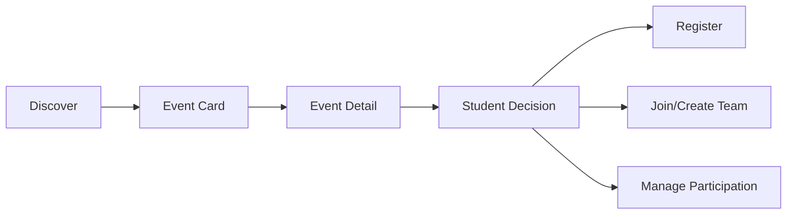
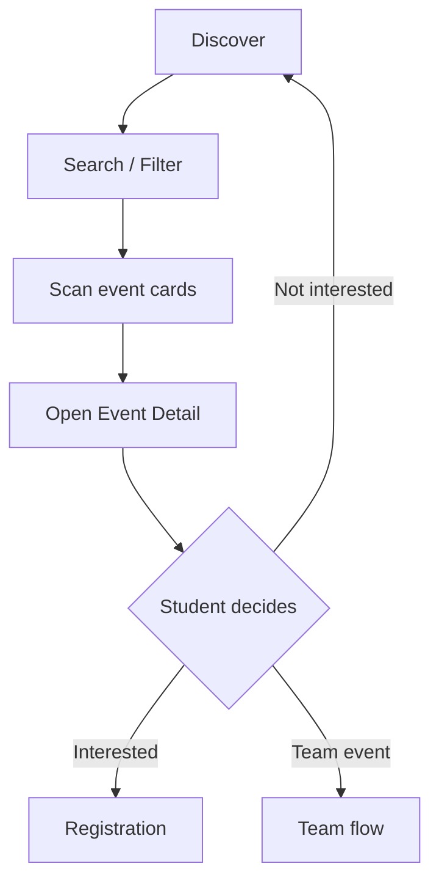
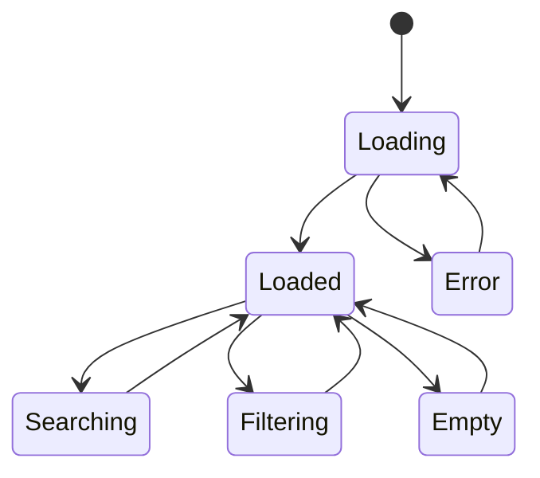

# Student Web UX — Campus → Discover

## 1. Product Job

Discover exists for one job:

> Help a student find the right event to attend with the least possible cognitive effort.

It is not:

* an event database
* a marketing homepage
* a second Home page
* an admin table
* a registration-management screen

The student should be able to scan the page, understand what is happening, narrow the results when needed, and open an event with confidence.

The core interaction is:

```text
DISCOVER
↓
SCAN
↓
NARROW
↓
COMPARE
↓
OPEN
↓
DECIDE
```

---

# 2. Mental Model

Home answers:

```text
"What matters to me?"
```

Discover answers:

```text
"What is available?"
```

Event Detail answers:

```text
"Should I commit to this?"
```

This distinction should drive the entire information architecture.

---

# 3. Overall Screen

The desktop experience should be intentionally restrained.

```text
┌─────────────────────────────────────────────────────────────────────────────┐
│ Campus                                                                      │
│                                                                             │
│ Discover              Leaderboard              Clubs                       │
│ ────────                                                                     │
│                                                                             │
│ Discover events                                                             │
│ Find something worth attending.                                             │
│                                                                             │
│ ┌─────────────────────────────────────────────────────────────────────────┐ │
│ │ 🔍  Search events, clubs, topics                              ⌘ K      │ │
│ └─────────────────────────────────────────────────────────────────────────┘ │
│                                                                             │
│ [All] [This Week] [Competitions] [Workshops] [Talks]       Filters ▾       │
│                                                                             │
│ 24 events                                                   Sort ▾          │
│                                                                             │
│ ┌──────────────────────┐ ┌──────────────────────┐ ┌──────────────────────┐ │
│ │                      │ │                      │ │                      │ │
│ │ Hackathon            │ │ AI Workshop          │ │ Guest Speaker        │ │
│ │ Coding Club          │ │ ML Club              │ │ Tech Club             │ │
│ │                      │ │                      │ │                      │ │
│ │ Tomorrow · 10:00 AM  │ │ Fri · 4:00 PM        │ │ Sep 10 · 5:00 PM      │ │
│ │ Main Auditorium      │ │ Lab 3                │ │ Seminar Hall          │ │
│ │                      │ │                      │ │                      │ │
│ │ 32 spots left        │ │ FULL · WAITLIST      │ │ OPEN                  │ │
│ └──────────────────────┘ └──────────────────────┘ └──────────────────────┘ │
│                                                                             │
│ ┌──────────────────────┐ ┌──────────────────────┐ ┌──────────────────────┐ │
│ │ Event                 │ │ Event                │ │ Event                │ │
│ └──────────────────────┘ └──────────────────────┘ └──────────────────────┘ │
│                                                                             │
│                         Load more                                          │
└─────────────────────────────────────────────────────────────────────────────┘
```

The page should not visually compete with the global shell.

The content itself is the product.

---

# 4. Top-Level Campus Navigation

Campus contains:

```text
Discover
Leaderboard
Clubs
```

These should behave like three destinations within the same conceptual campus area.



The active destination must always be visually obvious.

---

# 5. Header Design

The Discover header should be compact.

```text
Discover events
Find something worth attending.
```

Avoid:

```text
hero image
large promotional banner
giant statistic
marketing copy
```

The student came here to explore, not read an announcement.

---

# 6. Search

Search is the highest-value utility on this page.

It should be visually prominent.

```text
┌─────────────────────────────────────────────────────────────┐
│ 🔍  Search events, clubs, or topics                         │
└─────────────────────────────────────────────────────────────┘
```

The placeholder should describe the actual searchable concepts supported by the backend.

Do not claim the student can search something the backend doesn't support.

---

# 7. Search Behavior

The search experience should be:

```text
Type
↓
Debounce
↓
Update query
↓
Fetch results
↓
Replace result set
```

No "Search" button should be necessary if backend latency permits live search.

The query should persist in the URL if supported.

Example:

```text
/campus/discover?q=hackathon
```

This provides:

* refresh persistence
* browser back/forward
* shareable state
* recoverability

---

# 8. Search Results State

When searching:

```text
Search results for "hackathon"
```

could replace the generic heading.

The result count can be displayed:

```text
8 events
```

Do not add unnecessary explanatory copy.

---

# 9. Filter Architecture

Filters must be layered.

Do not place every possible filter permanently on the page.

### Primary filters

Use a small number of high-value chips:

```text
All
This Week
Competitions
Workshops
Talks
```

The exact categories must come from the actual event taxonomy.

### Secondary filters

Everything less frequently used belongs behind:

```text
Filters ▾
```

Possible dimensions, only if backend-supported:

```text
Date
Club
Event type
Registration availability
Registration type
```

---

# 10. Filter Drawer

The secondary filter interface should use a drawer/popover rather than a full navigation page.

Example:

```text
┌───────────────────────────────────┐
│ Filters                       ✕   │
│                                   │
│ Date                              │
│ ○ Today                           │
│ ○ This week                       │
│ ○ This month                      │
│                                   │
│ Club                              │
│ [ Select clubs ▾ ]                │
│                                   │
│ Event type                        │
│ [ Select types ▾ ]                │
│                                   │
│ Availability                      │
│ ○ Any                             │
│ ○ Spots available                 │
│ ○ Waitlist available              │
│                                   │
│ [ Clear ]           [ Apply ]     │
└───────────────────────────────────┘
```

The actual dimensions must follow backend support.

---

# 11. Active Filter Model

Once filters are active:

```text
[All] [This Week] [Competitions]
                     [Filters (2)]
```

Do not hide the fact that filtering is active.

The student should always understand why they are seeing the current result set.

---

# 12. Event Count + Sort

Immediately above the result grid:

```text
24 events                                      Sort ▾
```

The count provides orientation.

Sorting should remain secondary.

Default sort should be soonest-first unless product/backend evidence strongly suggests another order.

Potential alternatives only if supported:

```text
Soonest
Newest
```

Avoid ranking events using opaque "recommended" algorithms unless such a system actually exists.

---

# 13. Event Card

The Event Card is the main unit of Discover.

It should be optimized for comparison.

The hierarchy should be:

```text
Event name
Club
Date/time
Location
Availability / student state
```

Example:

```text
┌─────────────────────────────┐
│ Hackathon                   │
│ Coding Club                 │
│                             │
│ Tomorrow · 10:00 AM         │
│ Main Auditorium             │
│                             │
│ 32 spots left               │
└─────────────────────────────┘
```

---

# 14. What the Event Card Does NOT Show

Avoid:

```text
long description
full audience rules
team rules
large point totals
attendance rules
admin states
approval states
multiple paragraphs
```

Those belong elsewhere.

Discover should allow rapid comparison.

---

# 15. Student-Aware Event Cards

Cards must understand the student's relationship with the event.

For example:

### Not registered

```text
OPEN
```

### Registered

```text
✓ REGISTERED
```

### Waitlisted

```text
◐ WAITLISTED
```

### Full but waitlist available

```text
FULL · JOIN WAITLIST
```

### Attendance active

```text
● ATTENDANCE OPEN
```

Only use states actually supported by the backend.

The student should never be shown raw administrative lifecycle states such as:

```text
PENDING_APPROVAL
```

unless that somehow becomes relevant to student visibility.

---

# 16. Card Click Behavior

A card has one primary interaction:

```text
Click
↓
Event Detail
```

Do not put multiple competing CTAs inside every card.

This creates a cleaner scanning experience.



---

# 17. Registration Actions Stay Out of Discover

Do not put:

```text
[Register]
```

on every event card by default.

The card should primarily be a discovery object.

The student needs the Event Detail screen to understand the commitment before taking the action.

This also protects against accidental registration.

Registration already has deliberate confirmation as a product rule.

---

# 18. Availability Presentation

Availability should be concise.

Use concepts such as:

```text
Open
32 spots left
Almost full
Full
Waitlist available
```

Avoid exposing raw counts when they provide no decision value.

For example:

```text
0 / 100
```

is less useful than:

```text
Full · Join waitlist
```

The backend remains the authority for actual capacity.

---

# 19. Date Strategy

Use a consistent temporal hierarchy.

Card:

```text
Tomorrow · 10:00 AM
```

rather than:

```text
2026-09-02T10:00:00+05:30
```

For distant events:

```text
Sep 12 · 10:00 AM
```

The card should make time understandable at a glance.

---

# 20. Event Density

Do not overload the initial viewport.

Target:

```text
Desktop:
3 cards per row

Large desktop:
3–4 cards per row depending on content width

Tablet:
2 cards per row

Mobile web:
1 card per row
```

The exact grid should adapt without changing information hierarchy.

---

# 21. Results Ordering

Default ordering:

```text
Soonest upcoming event first
```

Within equivalent timestamps:

```text
stable ordering
```

Avoid surprising reordering while the student is reading.

If realtime updates change an event's state, prefer updating the card rather than violently moving the entire page unless ordering genuinely requires it.

---

# 22. Loading UX

Initial loading:

```text
Search
Filter controls
Skeleton grid
```

Example:

```text
┌──────────────┐ ┌──────────────┐ ┌──────────────┐
│              │ │              │ │              │
│ █████████    │ │ █████████    │ │ █████████    │
│ █████        │ │ █████        │ │ █████        │
│              │ │              │ │              │
│ ███████      │ │ ███████      │ │ ███████      │
└──────────────┘ └──────────────┘ └──────────────┘
```

Keep search/filter controls usable while results load where possible.

---

# 23. Empty State

There are different empty states and they should not be merged.

### No events exist

```text
Nothing is happening yet.

Check back soon or explore clubs.
```

### Search produced no results

```text
No events found

Try a different search or remove a filter.

[ Clear filters ]
```

### Filter produced no results

```text
No events match these filters.

[ Clear filters ]
```

These are different user problems.

---

# 24. Error State

A data-fetch failure is not the same as an empty result.

```text
Couldn't load events.

Something went wrong while loading campus events.

[ Retry ]
```

The shell, navigation, search, and other available content should remain usable whenever possible.

---

# 25. Pagination

Use cursor-based progressive loading when supported.

```text
Initial results
↓
Load More
↓
Append
↓
Load More
```

Do not replace the existing list when more results are loaded.

The user should maintain their position.

If the backend uses cursor pagination, the cursor should remain an implementation detail.

---

# 26. Search + Pagination

When search changes:

```text
old results
↓
clear existing result set
↓
reset cursor
↓
fetch new results
```

When filter changes:

```text
old results
↓
reset cursor
↓
fetch filtered result set
```

Never append results from two different query states.

---

# 27. URL State

Meaningful discovery state should survive browser navigation.

For example:

```text
/campus/discover?q=ai&type=WORKSHOP&club=ml
```

The URL should represent only state that needs persistence.

Do not encode transient UI state such as:

```text
hover
card expanded
tooltip open
```

---

# 28. Browser Back Behavior

A strong web UX should make browser navigation predictable.

Example:

```text
Discover
→ apply filters
→ open Event Detail
→ browser back
```

should return to the same discovery state.

The student should not unexpectedly lose their search/filter context.

---

# 29. Event Detail Return Path

Event Detail should understand where the student came from.

For example:

```text
Discover
    ↓
Event Detail
    ↓
Back
    ↓
same Discover query/filter position
```

Where technically appropriate, preserve the discovery URL as the navigation origin.

---

# 30. Realtime Behavior

Do not automatically reorder the whole discovery grid for every event update.

Instead:

```text
Event changes
↓
Update affected card state
```

Examples:

```text
OPEN
→ FULL

WAITLISTED
→ REGISTERED

Normal
→ ATTENDANCE OPEN
```

Only reorder if the changed state genuinely affects the selected sort criteria.

---

# 31. Responsive UX

### Desktop

```text
Persistent sidebar
3-card grid
Wide search
Horizontal filter controls
```

### Tablet

```text
Collapsed/reduced navigation
2-card grid
Filters remain accessible
```

### Mobile Web

```text
Compact header/navigation
1-card grid
Search full-width
Horizontal scroll filter chips
Secondary Filters in drawer
```

The interaction model remains the same.

---

# 32. Keyboard UX

For web:

```text
Tab
Enter
Escape
Arrow keys where appropriate
```

Search should be keyboard accessible.

Dialogs/drawers must trap focus appropriately.

Event cards should have clear keyboard focus.

Do not rely solely on hover.

---

# 33. Accessibility

Important requirements:

```text
Visible focus
48px-equivalent interaction targets
Status not communicated by color alone
Semantic headings
Accessible card links
Accessible filter controls
Keyboard navigation
Screen-reader-readable status
```

The status:

```text
REGISTERED
WAITLISTED
FULL
```

should remain understandable without color.

---

# 34. Mobile/Responsive Information Priority

When width decreases, remove secondary metadata before removing primary information.

Priority:

```text
1. Event name
2. Date/time
3. Club
4. Availability/state
5. Location
```

Do not hide the event's core commitment state to make the card smaller.

---

# 35. Discover → Event Detail Relationship

The Discover screen should intentionally stop before commitment.



Discover is where the student compares.

Event Detail is where the student commits.

---

# 36. Discover State Model

The Discover screen itself has a simple state machine:



The exact implementation may use framework-specific query states, but the UX states should remain conceptually understandable.

---

# 37. The "Do Not Add" List

Do not add these merely because they are available elsewhere in the system:

```text
Leaderboard widget
Club leaderboard
Attendance statistics
Personal participation statistics
Notification feed
Team management
Registration management
Admin analytics
Announcements dashboard
Gamification dashboard
```

Discover should remain focused.

---

# 38. Final Screen Architecture

The final Discover screen should be:

```text
CAMPUS
│
├── Discover | Leaderboard | Clubs
│
└── DISCOVER
    │
    ├── Page heading
    │
    ├── Search
    │
    ├── Primary filters
    │
    ├── Secondary filters
    │
    ├── Result count + sort
    │
    ├── Event grid
    │
    └── Load More
```

The page should feel deliberately simple because the underlying event system is complex.

---

# 39. Design Principle

The quality bar is not:

> "How much information can we show?"

It is:

> "How quickly can a student identify something worth attending?"

The student should be able to:

```text
open Campus
→ search/filter
→ scan several events
→ understand availability
→ open one
```

without needing to decode the system.

---

# 40. Data Contract Before Implementation

Before implementing this screen, verify the exact student-facing backend contract for:

```text
Event list
Event search
Event filtering
Club filtering
Event type filtering
Date filtering
Availability
Student registration state
Pagination
Sorting
Published visibility
Realtime updates
```

For every UI field, identify its backend source.

For every filter, verify backend support.

For every state badge, verify the actual status/derivation rule.

If something cannot be represented cleanly from the existing backend, record it as a `Backend Gap` rather than silently inventing frontend logic.
