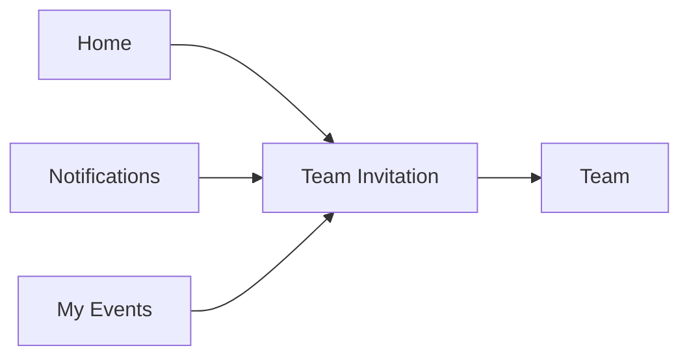
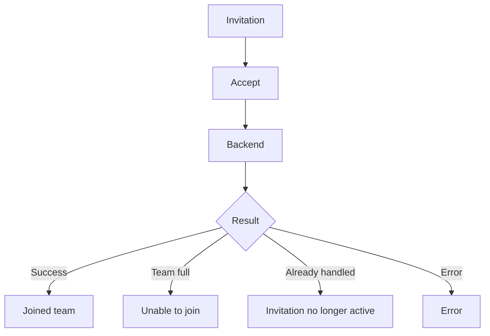
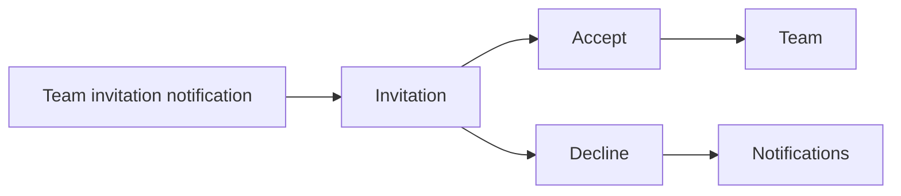
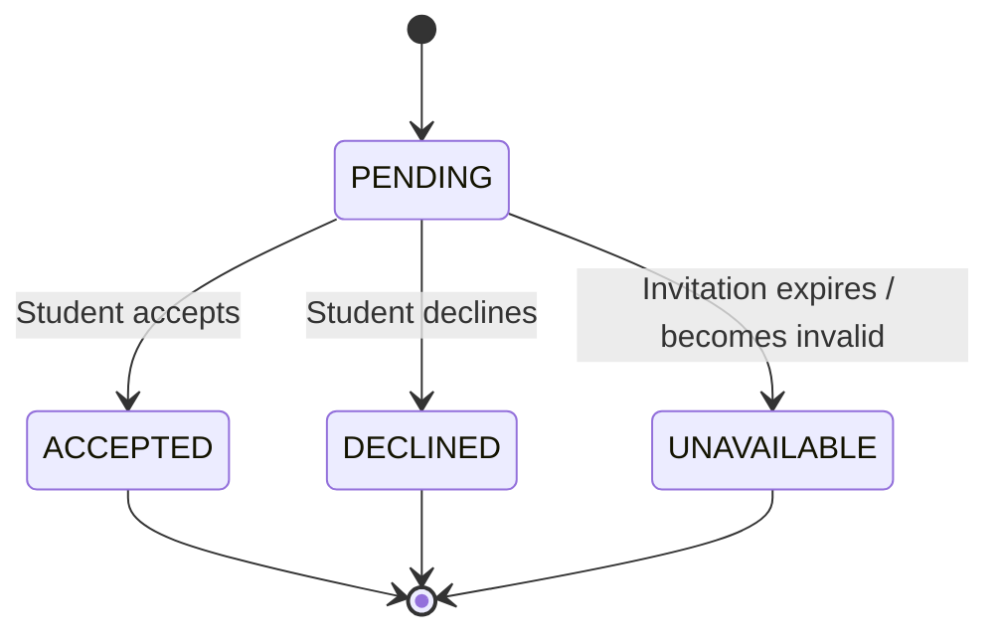
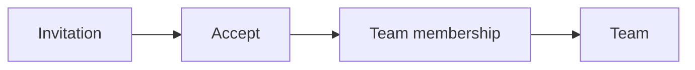

# Student Web UX — Team Invitation

## 1. Product Job

A Team Invitation is a small, high-intent interaction.

Its job is to let the student quickly understand:

```text
Who invited me?
Which team?
For which event?
What happens if I accept?
```

Then make one decision:

```text
ACCEPT
or
DECLINE
```

The ideal experience is:

```text
Notification / Home
↓
Invitation
↓
Understand
↓
Accept / Decline
↓
Done
```

Do not turn invitation acceptance into a multi-step workflow.

---

# 2. Entry Points

The invitation can be reached from:

```text
Notifications
Home
My Events
```

Primary discovery should happen through Notifications and Home.



---

# 3. Student Mental Model

The student should immediately understand:

```text
WHO?
Riya Patel

WHAT TEAM?
Merge Conflicts

FOR WHAT?
Hackathon

WHAT HAPPENS IF I ACCEPT?
I become a team member.
```

No additional information should be required before making the decision.

---

# 4. Invitation Presentation

Prefer a compact contextual screen/dialog.

```text
┌────────────────────────────────────────────────────────────┐
│ Team Invitation                                        ✕  │
│                                                            │
│                 👥                                         │
│                                                            │
│ Riya Patel invited you                                     │
│ to join                                                     │
│                                                            │
│ Merge Conflicts                                             │
│ Hackathon                                                   │
│ Sep 12 · 10:00 AM                                          │
│                                                            │
│ 3 / 4 members                                              │
│                                                            │
│ If you accept, you'll join this team for the event.       │
│                                                            │
│ [ DECLINE ]                         [ ACCEPT ]             │
└────────────────────────────────────────────────────────────┘
```

The invitation should contain enough context to eliminate uncertainty.

---

# 5. Information Hierarchy

The order should be:

```text
INVITATION
↓
PERSON
↓
TEAM
↓
EVENT
↓
TEAM CONTEXT
↓
DECISION
```

Do not lead with technical invitation metadata.

---

# 6. Inviter

Show the person who sent the invitation when the backend provides that information.

Example:

```text
Riya Patel invited you
```

This establishes trust and context.

Do not show:

```text
user_id
membership_id
invitation_id
```

---

# 7. Team

The team name should be prominent.

```text
Merge Conflicts
```

The student should know exactly which group they are being asked to join.

---

# 8. Event Context

Always associate the team with its event where available.

```text
Hackathon
Sep 12 · 10:00 AM
```

This prevents ambiguity when students receive invitations to multiple teams.

---

# 9. Team Size

Show current team size if available and useful:

```text
3 / 4 members
```

This tells the student how established the team is.

If the team is already full:

```text
4 / 4 members

This invitation can no longer be accepted.
```

Do not let the student discover this only after clicking Accept.

---

# 10. Primary Action

There should be one visually dominant action:

```text
[ ACCEPT ]
```

The secondary action is:

```text
[ DECLINE ]
```

Accept should visually dominate because it is the action that creates the student's team membership.

Neither action should be hidden behind another menu.

---

# 11. Accept Flow

Keep it to one decision.



Do not add a confirmation dialog unless the actual product rules require one.

For a straightforward invitation, `Accept` is already the deliberate decision.

---

# 12. Accept Success

After acceptance:

```text
✓ You're in

You've joined Merge Conflicts.

[ VIEW TEAM ]
```

The preferred next destination is the Team screen.

This lets the student immediately understand:

```text
Who else is on my team?
Are we ready?
What happens next?
```

---

# 13. Team Membership Update

After successful acceptance:

```text
Invitation
↓
Membership created
↓
Team count increases
↓
Student appears in Members
↓
Team screen
```

Do not require manual page refresh if the response already provides enough information to update the UI.

---

# 14. Decline Flow

Declining is a simple decision.

Prefer:

```text
[ DECLINE ]
```

If the product requires confirmation:

```text
Decline this invitation?

You won't join Merge Conflicts.

[ Keep invitation ]      [ Decline ]
```

Do not create extra friction without a reason.

---

# 15. Decline Success

```text
Invitation declined.

```

Then return the student to the originating context:

```text
Notifications
```

or:

```text
My Events
```

depending on where the invitation was opened.

---

# 16. Invitation Expired

If the invitation is no longer actionable:

```text
Invitation unavailable

This invitation is no longer active.
```

Possible reasons may include:

```text
expired
withdrawn
team cancelled
team full
event no longer accepting changes
```

Only explain a specific reason when the backend actually provides one.

---

# 17. Team Full

This is an important failure state.

```text
Team full

This team has reached its maximum size.
You can't join it now.
```

Do not show `ACCEPT` if the system already knows the team is full.

If the team becomes full between opening and accepting, the backend result is authoritative.

---

# 18. Concurrent Accept

Example:

```text
Student opens invitation
↓
3 / 4 members

Another student joins
↓
4 / 4

Student clicks Accept
↓
Backend rejects
```

The UX should explain:

```text
This team is now full.

The invitation couldn't be accepted.
```

Provide:

```text
[ BACK ]
```

or another relevant navigation action.

Do not pretend the student joined.

---

# 19. Already Handled

If the student has already accepted or declined:

```text
This invitation has already been handled.
```

The app can offer:

```text
[ VIEW TEAM ]
```

if they accepted.

Otherwise return them to the originating context.

---

# 20. Student Already in Another Team

If backend rules prohibit simultaneous team membership:

```text
You can't join this team.

You're already on another team for this event.
```

Do not expose internal conflict codes.

Only include this state if the backend actually enforces it.

---

# 21. Authentication / Session Failure

If the student session expires while handling an invitation:

```text
Your session has expired.

Please sign in again.
```

After authentication, preserve the invitation destination where technically possible.

---

# 22. Notification Integration

A team invitation notification should deep-link directly here.



The student should not have to hunt through My Events to find the invitation.

---

# 23. Home Integration

Home can surface invitations as immediate actions:

```text
NOW

Team invitation
Riya invited you to join Merge Conflicts.

[ REVIEW ]
```

The `REVIEW` action opens the same invitation experience.

---

# 24. Notification Card vs Invitation Screen

These are different levels of detail.

Notification:

```text
Riya invited you to join Merge Conflicts.

[ REVIEW ]
```

Invitation:

```text
Who?
Riya Patel

Team?
Merge Conflicts

Event?
Hackathon

Size?
3 / 4

[ DECLINE ]   [ ACCEPT ]
```

The notification creates awareness.

The invitation enables the decision.

Do not put the entire decision flow inside the notification itself.

---

# 25. Invitation Lifecycle



Use the actual backend invitation states when finalizing.

---

# 26. Accept → Team

After successful acceptance:



The student should land on Team because that is now their new participation context.

---

# 27. No Unnecessary Confirmation

Do not use:

```text
Invitation
→ Accept
→ Are you sure?
→ Yes
→ Joined
```

unless the action has unusual consequences.

Normally:

```text
Invitation
→ Accept
→ Joined
```

is sufficient.

The student has already been explicitly asked to make the decision.

---

# 28. Minimal Interaction

The ideal interaction is:

```text
Notification
↓
Review
↓
Accept
↓
Team
```

or:

```text
Home
↓
Review
↓
Decline
↓
Done
```

Four or fewer meaningful interactions.

---

# 29. Mobile Web

The invitation should work particularly well on mobile web because students may respond from a notification.

```text
Team Invitation

Riya Patel invited you

Merge Conflicts
Hackathon
Sep 12

3 / 4 members

[ ACCEPT ]

[ DECLINE ]
```

The primary decision should remain above the fold.

---

# 30. Desktop

Use a compact centered dialog or focused detail card.

Do not create a large dashboard for one invitation.

```text
┌──────────────────────────────────────────┐
│ Team Invitation                          │
│                                          │
│ Riya Patel invited you                   │
│                                          │
│ Merge Conflicts                          │
│ Hackathon · Sep 12                       │
│ 3 / 4 members                            │
│                                          │
│ [ DECLINE ]          [ ACCEPT ]          │
└──────────────────────────────────────────┘
```

---

# 31. Accessibility

The invitation must clearly communicate:

```text
Inviter
Team
Event
Team size
Current state
Available actions
```

Buttons must have clear accessible names.

Focus must move into the dialog when opened.

Escape should close the dialog when closing is safe.

---

# 32. What We Deliberately Avoid

Do not add:

```text
Invitation inbox
Social chat
Team messaging
Team preview analytics
Complex team comparison
Public team profile
Invite-code flow
Multi-step acceptance wizard
```

The invitation exists for one decision.

---

# 33. Final Screen Architecture

```text
TEAM INVITATION
│
├── Inviter
├── Team
├── Event
├── Team Size
│
└── Decision
    ├── Accept
    │   └── Team
    │
    └── Decline
        └── Origin
```

---

# 34. Core UX Principle

The student should be able to answer:

```text
Who invited me?
        ↓
What am I joining?
        ↓
What's the event?
        ↓
Do I want in?
```

in seconds.

Then:

```text
ACCEPT
↓
You're in
↓
Team
```

or:

```text
DECLINE
↓
Done
```

No unnecessary screens.

---

# 35. Backend Contract

Before implementation, verify:

```text
Invitation retrieval
Inviter information
Team information
Event information
Team capacity
Accept invitation
Decline invitation
Duplicate handling
Expired/invalid invitation
Concurrent team-full behavior
Existing team membership conflicts
Notification deep-link target
Realtime invitation updates
```

Every invitation state and action displayed in the UI must correspond to an actual backend capability.

# Student Web UX — Team Invitation

## 1. Product Job

A Team Invitation is a small, high-intent interaction.

Its job is to let the student quickly understand:

```text
Who invited me?
Which team?
For which event?
What happens if I accept?
```

Then make one decision:

```text
ACCEPT
or
DECLINE
```

The ideal experience is:

```text
Notification / Home
↓
Invitation
↓
Understand
↓
Accept / Decline
↓
Done
```

Do not turn invitation acceptance into a multi-step workflow.

---

# 2. Entry Points

The invitation can be reached from:

```text
Notifications
Home
My Events
```

Primary discovery should happen through Notifications and Home.


---

# 3. Student Mental Model

The student should immediately understand:

```text
WHO?
Riya Patel

WHAT TEAM?
Merge Conflicts

FOR WHAT?
Hackathon

WHAT HAPPENS IF I ACCEPT?
I become a team member.
```

No additional information should be required before making the decision.

---

# 4. Invitation Presentation

Prefer a compact contextual screen/dialog.

```text
┌────────────────────────────────────────────────────────────┐
│ Team Invitation                                        ✕  │
│                                                            │
│                 👥                                         │
│                                                            │
│ Riya Patel invited you                                     │
│ to join                                                     │
│                                                            │
│ Merge Conflicts                                             │
│ Hackathon                                                   │
│ Sep 12 · 10:00 AM                                          │
│                                                            │
│ 3 / 4 members                                              │
│                                                            │
│ If you accept, you'll join this team for the event.       │
│                                                            │
│ [ DECLINE ]                         [ ACCEPT ]             │
└────────────────────────────────────────────────────────────┘
```

The invitation should contain enough context to eliminate uncertainty.

---

# 5. Information Hierarchy

The order should be:

```text
INVITATION
↓
PERSON
↓
TEAM
↓
EVENT
↓
TEAM CONTEXT
↓
DECISION
```

Do not lead with technical invitation metadata.

---

# 6. Inviter

Show the person who sent the invitation when the backend provides that information.

Example:

```text
Riya Patel invited you
```

This establishes trust and context.

Do not show:

```text
user_id
membership_id
invitation_id
```

---

# 7. Team

The team name should be prominent.

```text
Merge Conflicts
```

The student should know exactly which group they are being asked to join.

---

# 8. Event Context

Always associate the team with its event where available.

```text
Hackathon
Sep 12 · 10:00 AM
```

This prevents ambiguity when students receive invitations to multiple teams.

---

# 9. Team Size

Show current team size if available and useful:

```text
3 / 4 members
```

This tells the student how established the team is.

If the team is already full:

```text
4 / 4 members

This invitation can no longer be accepted.
```

Do not let the student discover this only after clicking Accept.

---

# 10. Primary Action

There should be one visually dominant action:

```text
[ ACCEPT ]
```

The secondary action is:

```text
[ DECLINE ]
```

Accept should visually dominate because it is the action that creates the student's team membership.

Neither action should be hidden behind another menu.

---

# 11. Accept Flow

Keep it to one decision.


Do not add a confirmation dialog unless the actual product rules require one.

For a straightforward invitation, `Accept` is already the deliberate decision.

---

# 12. Accept Success

After acceptance:

```text
✓ You're in

You've joined Merge Conflicts.

[ VIEW TEAM ]
```

The preferred next destination is the Team screen.

This lets the student immediately understand:

```text
Who else is on my team?
Are we ready?
What happens next?
```

---

# 13. Team Membership Update

After successful acceptance:

```text
Invitation
↓
Membership created
↓
Team count increases
↓
Student appears in Members
↓
Team screen
```

Do not require manual page refresh if the response already provides enough information to update the UI.

---

# 14. Decline Flow

Declining is a simple decision.

Prefer:

```text
[ DECLINE ]
```

If the product requires confirmation:

```text
Decline this invitation?

You won't join Merge Conflicts.

[ Keep invitation ]      [ Decline ]
```

Do not create extra friction without a reason.

---

# 15. Decline Success

```text
Invitation declined.

```

Then return the student to the originating context:

```text
Notifications
```

or:

```text
My Events
```

depending on where the invitation was opened.

---

# 16. Invitation Expired

If the invitation is no longer actionable:

```text
Invitation unavailable

This invitation is no longer active.
```

Possible reasons may include:

```text
expired
withdrawn
team cancelled
team full
event no longer accepting changes
```

Only explain a specific reason when the backend actually provides one.

---

# 17. Team Full

This is an important failure state.

```text
Team full

This team has reached its maximum size.
You can't join it now.
```

Do not show `ACCEPT` if the system already knows the team is full.

If the team becomes full between opening and accepting, the backend result is authoritative.

---

# 18. Concurrent Accept

Example:

```text
Student opens invitation
↓
3 / 4 members

Another student joins
↓
4 / 4

Student clicks Accept
↓
Backend rejects
```

The UX should explain:

```text
This team is now full.

The invitation couldn't be accepted.
```

Provide:

```text
[ BACK ]
```

or another relevant navigation action.

Do not pretend the student joined.

---

# 19. Already Handled

If the student has already accepted or declined:

```text
This invitation has already been handled.
```

The app can offer:

```text
[ VIEW TEAM ]
```

if they accepted.

Otherwise return them to the originating context.

---

# 20. Student Already in Another Team

If backend rules prohibit simultaneous team membership:

```text
You can't join this team.

You're already on another team for this event.
```

Do not expose internal conflict codes.

Only include this state if the backend actually enforces it.

---

# 21. Authentication / Session Failure

If the student session expires while handling an invitation:

```text
Your session has expired.

Please sign in again.
```

After authentication, preserve the invitation destination where technically possible.

---

# 22. Notification Integration

A team invitation notification should deep-link directly here.


The student should not have to hunt through My Events to find the invitation.

---

# 23. Home Integration

Home can surface invitations as immediate actions:

```text
NOW

Team invitation
Riya invited you to join Merge Conflicts.

[ REVIEW ]
```

The `REVIEW` action opens the same invitation experience.

---

# 24. Notification Card vs Invitation Screen

These are different levels of detail.

Notification:

```text
Riya invited you to join Merge Conflicts.

[ REVIEW ]
```

Invitation:

```text
Who?
Riya Patel

Team?
Merge Conflicts

Event?
Hackathon

Size?
3 / 4

[ DECLINE ]   [ ACCEPT ]
```

The notification creates awareness.

The invitation enables the decision.

Do not put the entire decision flow inside the notification itself.

---

# 25. Invitation Lifecycle


Use the actual backend invitation states when finalizing.

---

# 26. Accept → Team

After successful acceptance:


The student should land on Team because that is now their new participation context.

---

# 27. No Unnecessary Confirmation

Do not use:

```text
Invitation
→ Accept
→ Are you sure?
→ Yes
→ Joined
```

unless the action has unusual consequences.

Normally:

```text
Invitation
→ Accept
→ Joined
```

is sufficient.

The student has already been explicitly asked to make the decision.

---

# 28. Minimal Interaction

The ideal interaction is:

```text
Notification
↓
Review
↓
Accept
↓
Team
```

or:

```text
Home
↓
Review
↓
Decline
↓
Done
```

Four or fewer meaningful interactions.

---

# 29. Mobile Web

The invitation should work particularly well on mobile web because students may respond from a notification.

```text
Team Invitation

Riya Patel invited you

Merge Conflicts
Hackathon
Sep 12

3 / 4 members

[ ACCEPT ]

[ DECLINE ]
```

The primary decision should remain above the fold.

---

# 30. Desktop

Use a compact centered dialog or focused detail card.

Do not create a large dashboard for one invitation.

```text
┌──────────────────────────────────────────┐
│ Team Invitation                          │
│                                          │
│ Riya Patel invited you                   │
│                                          │
│ Merge Conflicts                          │
│ Hackathon · Sep 12                       │
│ 3 / 4 members                            │
│                                          │
│ [ DECLINE ]          [ ACCEPT ]          │
└──────────────────────────────────────────┘
```

---

# 31. Accessibility

The invitation must clearly communicate:

```text
Inviter
Team
Event
Team size
Current state
Available actions
```

Buttons must have clear accessible names.

Focus must move into the dialog when opened.

Escape should close the dialog when closing is safe.

---

# 32. What We Deliberately Avoid

Do not add:

```text
Invitation inbox
Social chat
Team messaging
Team preview analytics
Complex team comparison
Public team profile
Invite-code flow
Multi-step acceptance wizard
```

The invitation exists for one decision.

---

# 33. Final Screen Architecture

```text
TEAM INVITATION
│
├── Inviter
├── Team
├── Event
├── Team Size
│
└── Decision
    ├── Accept
    │   └── Team
    │
    └── Decline
        └── Origin
```

---

# 34. Core UX Principle

The student should be able to answer:

```text
Who invited me?
        ↓
What am I joining?
        ↓
What's the event?
        ↓
Do I want in?
```

in seconds.

Then:

```text
ACCEPT
↓
You're in
↓
Team
```

or:

```text
DECLINE
↓
Done
```

No unnecessary screens.

---

# 35. Backend Contract

Before implementation, verify:

```text
Invitation retrieval
Inviter information
Team information
Event information
Team capacity
Accept invitation
Decline invitation
Duplicate handling
Expired/invalid invitation
Concurrent team-full behavior
Existing team membership conflicts
Notification deep-link target
Realtime invitation updates
```

Every invitation state and action displayed in the UI must correspond to an actual backend capability.

# Student Web UX — Team Invitation

## 1. Product Job

A Team Invitation is a small, high-intent interaction.

Its job is to let the student quickly understand:

```text
Who invited me?
Which team?
For which event?
What happens if I accept?
```

Then make one decision:

```text
ACCEPT
or
DECLINE
```

The ideal experience is:

```text
Notification / Home
↓
Invitation
↓
Understand
↓
Accept / Decline
↓
Done
```

Do not turn invitation acceptance into a multi-step workflow.

---

# 2. Entry Points

The invitation can be reached from:

```text
Notifications
Home
My Events
```

Primary discovery should happen through Notifications and Home.


---

# 3. Student Mental Model

The student should immediately understand:

```text
WHO?
Riya Patel

WHAT TEAM?
Merge Conflicts

FOR WHAT?
Hackathon

WHAT HAPPENS IF I ACCEPT?
I become a team member.
```

No additional information should be required before making the decision.

---

# 4. Invitation Presentation

Prefer a compact contextual screen/dialog.

```text
┌────────────────────────────────────────────────────────────┐
│ Team Invitation                                        ✕  │
│                                                            │
│                 👥                                         │
│                                                            │
│ Riya Patel invited you                                     │
│ to join                                                     │
│                                                            │
│ Merge Conflicts                                             │
│ Hackathon                                                   │
│ Sep 12 · 10:00 AM                                          │
│                                                            │
│ 3 / 4 members                                              │
│                                                            │
│ If you accept, you'll join this team for the event.       │
│                                                            │
│ [ DECLINE ]                         [ ACCEPT ]             │
└────────────────────────────────────────────────────────────┘
```

The invitation should contain enough context to eliminate uncertainty.

---

# 5. Information Hierarchy

The order should be:

```text
INVITATION
↓
PERSON
↓
TEAM
↓
EVENT
↓
TEAM CONTEXT
↓
DECISION
```

Do not lead with technical invitation metadata.

---

# 6. Inviter

Show the person who sent the invitation when the backend provides that information.

Example:

```text
Riya Patel invited you
```

This establishes trust and context.

Do not show:

```text
user_id
membership_id
invitation_id
```

---

# 7. Team

The team name should be prominent.

```text
Merge Conflicts
```

The student should know exactly which group they are being asked to join.

---

# 8. Event Context

Always associate the team with its event where available.

```text
Hackathon
Sep 12 · 10:00 AM
```

This prevents ambiguity when students receive invitations to multiple teams.

---

# 9. Team Size

Show current team size if available and useful:

```text
3 / 4 members
```

This tells the student how established the team is.

If the team is already full:

```text
4 / 4 members

This invitation can no longer be accepted.
```

Do not let the student discover this only after clicking Accept.

---

# 10. Primary Action

There should be one visually dominant action:

```text
[ ACCEPT ]
```

The secondary action is:

```text
[ DECLINE ]
```

Accept should visually dominate because it is the action that creates the student's team membership.

Neither action should be hidden behind another menu.

---

# 11. Accept Flow

Keep it to one decision.


Do not add a confirmation dialog unless the actual product rules require one.

For a straightforward invitation, `Accept` is already the deliberate decision.

---

# 12. Accept Success

After acceptance:

```text
✓ You're in

You've joined Merge Conflicts.

[ VIEW TEAM ]
```

The preferred next destination is the Team screen.

This lets the student immediately understand:

```text
Who else is on my team?
Are we ready?
What happens next?
```

---

# 13. Team Membership Update

After successful acceptance:

```text
Invitation
↓
Membership created
↓
Team count increases
↓
Student appears in Members
↓
Team screen
```

Do not require manual page refresh if the response already provides enough information to update the UI.

---

# 14. Decline Flow

Declining is a simple decision.

Prefer:

```text
[ DECLINE ]
```

If the product requires confirmation:

```text
Decline this invitation?

You won't join Merge Conflicts.

[ Keep invitation ]      [ Decline ]
```

Do not create extra friction without a reason.

---

# 15. Decline Success

```text
Invitation declined.

```

Then return the student to the originating context:

```text
Notifications
```

or:

```text
My Events
```

depending on where the invitation was opened.

---

# 16. Invitation Expired

If the invitation is no longer actionable:

```text
Invitation unavailable

This invitation is no longer active.
```

Possible reasons may include:

```text
expired
withdrawn
team cancelled
team full
event no longer accepting changes
```

Only explain a specific reason when the backend actually provides one.

---

# 17. Team Full

This is an important failure state.

```text
Team full

This team has reached its maximum size.
You can't join it now.
```

Do not show `ACCEPT` if the system already knows the team is full.

If the team becomes full between opening and accepting, the backend result is authoritative.

---

# 18. Concurrent Accept

Example:

```text
Student opens invitation
↓
3 / 4 members

Another student joins
↓
4 / 4

Student clicks Accept
↓
Backend rejects
```

The UX should explain:

```text
This team is now full.

The invitation couldn't be accepted.
```

Provide:

```text
[ BACK ]
```

or another relevant navigation action.

Do not pretend the student joined.

---

# 19. Already Handled

If the student has already accepted or declined:

```text
This invitation has already been handled.
```

The app can offer:

```text
[ VIEW TEAM ]
```

if they accepted.

Otherwise return them to the originating context.

---

# 20. Student Already in Another Team

If backend rules prohibit simultaneous team membership:

```text
You can't join this team.

You're already on another team for this event.
```

Do not expose internal conflict codes.

Only include this state if the backend actually enforces it.

---

# 21. Authentication / Session Failure

If the student session expires while handling an invitation:

```text
Your session has expired.

Please sign in again.
```

After authentication, preserve the invitation destination where technically possible.

---

# 22. Notification Integration

A team invitation notification should deep-link directly here.


The student should not have to hunt through My Events to find the invitation.

---

# 23. Home Integration

Home can surface invitations as immediate actions:

```text
NOW

Team invitation
Riya invited you to join Merge Conflicts.

[ REVIEW ]
```

The `REVIEW` action opens the same invitation experience.

---

# 24. Notification Card vs Invitation Screen

These are different levels of detail.

Notification:

```text
Riya invited you to join Merge Conflicts.

[ REVIEW ]
```

Invitation:

```text
Who?
Riya Patel

Team?
Merge Conflicts

Event?
Hackathon

Size?
3 / 4

[ DECLINE ]   [ ACCEPT ]
```

The notification creates awareness.

The invitation enables the decision.

Do not put the entire decision flow inside the notification itself.

---

# 25. Invitation Lifecycle


Use the actual backend invitation states when finalizing.

---

# 26. Accept → Team

After successful acceptance:


The student should land on Team because that is now their new participation context.

---

# 27. No Unnecessary Confirmation

Do not use:

```text
Invitation
→ Accept
→ Are you sure?
→ Yes
→ Joined
```

unless the action has unusual consequences.

Normally:

```text
Invitation
→ Accept
→ Joined
```

is sufficient.

The student has already been explicitly asked to make the decision.

---

# 28. Minimal Interaction

The ideal interaction is:

```text
Notification
↓
Review
↓
Accept
↓
Team
```

or:

```text
Home
↓
Review
↓
Decline
↓
Done
```

Four or fewer meaningful interactions.

---

# 29. Mobile Web

The invitation should work particularly well on mobile web because students may respond from a notification.

```text
Team Invitation

Riya Patel invited you

Merge Conflicts
Hackathon
Sep 12

3 / 4 members

[ ACCEPT ]

[ DECLINE ]
```

The primary decision should remain above the fold.

---

# 30. Desktop

Use a compact centered dialog or focused detail card.

Do not create a large dashboard for one invitation.

```text
┌──────────────────────────────────────────┐
│ Team Invitation                          │
│                                          │
│ Riya Patel invited you                   │
│                                          │
│ Merge Conflicts                          │
│ Hackathon · Sep 12                       │
│ 3 / 4 members                            │
│                                          │
│ [ DECLINE ]          [ ACCEPT ]          │
└──────────────────────────────────────────┘
```

---

# 31. Accessibility

The invitation must clearly communicate:

```text
Inviter
Team
Event
Team size
Current state
Available actions
```

Buttons must have clear accessible names.

Focus must move into the dialog when opened.

Escape should close the dialog when closing is safe.

---

# 32. What We Deliberately Avoid

Do not add:

```text
Invitation inbox
Social chat
Team messaging
Team preview analytics
Complex team comparison
Public team profile
Invite-code flow
Multi-step acceptance wizard
```

The invitation exists for one decision.

---

# 33. Final Screen Architecture

```text
TEAM INVITATION
│
├── Inviter
├── Team
├── Event
├── Team Size
│
└── Decision
    ├── Accept
    │   └── Team
    │
    └── Decline
        └── Origin
```

---

# 34. Core UX Principle

The student should be able to answer:

```text
Who invited me?
        ↓
What am I joining?
        ↓
What's the event?
        ↓
Do I want in?
```

in seconds.

Then:

```text
ACCEPT
↓
You're in
↓
Team
```

or:

```text
DECLINE
↓
Done
```

No unnecessary screens.

---

# 35. Backend Contract

Before implementation, verify:

```text
Invitation retrieval
Inviter information
Team information
Event information
Team capacity
Accept invitation
Decline invitation
Duplicate handling
Expired/invalid invitation
Concurrent team-full behavior
Existing team membership conflicts
Notification deep-link target
Realtime invitation updates
```

Every invitation state and action displayed in the UI must correspond to an actual backend capability.

# Student Web UX — Team Invitation

## 1. Product Job

A Team Invitation is a small, high-intent interaction.

Its job is to let the student quickly understand:

```text
Who invited me?
Which team?
For which event?
What happens if I accept?
```

Then make one decision:

```text
ACCEPT
or
DECLINE
```

The ideal experience is:

```text
Notification / Home
↓
Invitation
↓
Understand
↓
Accept / Decline
↓
Done
```

Do not turn invitation acceptance into a multi-step workflow.

---

# 2. Entry Points

The invitation can be reached from:

```text
Notifications
Home
My Events
```

Primary discovery should happen through Notifications and Home.


---

# 3. Student Mental Model

The student should immediately understand:

```text
WHO?
Riya Patel

WHAT TEAM?
Merge Conflicts

FOR WHAT?
Hackathon

WHAT HAPPENS IF I ACCEPT?
I become a team member.
```

No additional information should be required before making the decision.

---

# 4. Invitation Presentation

Prefer a compact contextual screen/dialog.

```text
┌────────────────────────────────────────────────────────────┐
│ Team Invitation                                        ✕  │
│                                                            │
│                 👥                                         │
│                                                            │
│ Riya Patel invited you                                     │
│ to join                                                     │
│                                                            │
│ Merge Conflicts                                             │
│ Hackathon                                                   │
│ Sep 12 · 10:00 AM                                          │
│                                                            │
│ 3 / 4 members                                              │
│                                                            │
│ If you accept, you'll join this team for the event.       │
│                                                            │
│ [ DECLINE ]                         [ ACCEPT ]             │
└────────────────────────────────────────────────────────────┘
```

The invitation should contain enough context to eliminate uncertainty.

---

# 5. Information Hierarchy

The order should be:

```text
INVITATION
↓
PERSON
↓
TEAM
↓
EVENT
↓
TEAM CONTEXT
↓
DECISION
```

Do not lead with technical invitation metadata.

---

# 6. Inviter

Show the person who sent the invitation when the backend provides that information.

Example:

```text
Riya Patel invited you
```

This establishes trust and context.

Do not show:

```text
user_id
membership_id
invitation_id
```

---

# 7. Team

The team name should be prominent.

```text
Merge Conflicts
```

The student should know exactly which group they are being asked to join.

---

# 8. Event Context

Always associate the team with its event where available.

```text
Hackathon
Sep 12 · 10:00 AM
```

This prevents ambiguity when students receive invitations to multiple teams.

---

# 9. Team Size

Show current team size if available and useful:

```text
3 / 4 members
```

This tells the student how established the team is.

If the team is already full:

```text
4 / 4 members

This invitation can no longer be accepted.
```

Do not let the student discover this only after clicking Accept.

---

# 10. Primary Action

There should be one visually dominant action:

```text
[ ACCEPT ]
```

The secondary action is:

```text
[ DECLINE ]
```

Accept should visually dominate because it is the action that creates the student's team membership.

Neither action should be hidden behind another menu.

---

# 11. Accept Flow

Keep it to one decision.


Do not add a confirmation dialog unless the actual product rules require one.

For a straightforward invitation, `Accept` is already the deliberate decision.

---

# 12. Accept Success

After acceptance:

```text
✓ You're in

You've joined Merge Conflicts.

[ VIEW TEAM ]
```

The preferred next destination is the Team screen.

This lets the student immediately understand:

```text
Who else is on my team?
Are we ready?
What happens next?
```

---

# 13. Team Membership Update

After successful acceptance:

```text
Invitation
↓
Membership created
↓
Team count increases
↓
Student appears in Members
↓
Team screen
```

Do not require manual page refresh if the response already provides enough information to update the UI.

---

# 14. Decline Flow

Declining is a simple decision.

Prefer:

```text
[ DECLINE ]
```

If the product requires confirmation:

```text
Decline this invitation?

You won't join Merge Conflicts.

[ Keep invitation ]      [ Decline ]
```

Do not create extra friction without a reason.

---

# 15. Decline Success

```text
Invitation declined.

```

Then return the student to the originating context:

```text
Notifications
```

or:

```text
My Events
```

depending on where the invitation was opened.

---

# 16. Invitation Expired

If the invitation is no longer actionable:

```text
Invitation unavailable

This invitation is no longer active.
```

Possible reasons may include:

```text
expired
withdrawn
team cancelled
team full
event no longer accepting changes
```

Only explain a specific reason when the backend actually provides one.

---

# 17. Team Full

This is an important failure state.

```text
Team full

This team has reached its maximum size.
You can't join it now.
```

Do not show `ACCEPT` if the system already knows the team is full.

If the team becomes full between opening and accepting, the backend result is authoritative.

---

# 18. Concurrent Accept

Example:

```text
Student opens invitation
↓
3 / 4 members

Another student joins
↓
4 / 4

Student clicks Accept
↓
Backend rejects
```

The UX should explain:

```text
This team is now full.

The invitation couldn't be accepted.
```

Provide:

```text
[ BACK ]
```

or another relevant navigation action.

Do not pretend the student joined.

---

# 19. Already Handled

If the student has already accepted or declined:

```text
This invitation has already been handled.
```

The app can offer:

```text
[ VIEW TEAM ]
```

if they accepted.

Otherwise return them to the originating context.

---

# 20. Student Already in Another Team

If backend rules prohibit simultaneous team membership:

```text
You can't join this team.

You're already on another team for this event.
```

Do not expose internal conflict codes.

Only include this state if the backend actually enforces it.

---

# 21. Authentication / Session Failure

If the student session expires while handling an invitation:

```text
Your session has expired.

Please sign in again.
```

After authentication, preserve the invitation destination where technically possible.

---

# 22. Notification Integration

A team invitation notification should deep-link directly here.


The student should not have to hunt through My Events to find the invitation.

---

# 23. Home Integration

Home can surface invitations as immediate actions:

```text
NOW

Team invitation
Riya invited you to join Merge Conflicts.

[ REVIEW ]
```

The `REVIEW` action opens the same invitation experience.

---

# 24. Notification Card vs Invitation Screen

These are different levels of detail.

Notification:

```text
Riya invited you to join Merge Conflicts.

[ REVIEW ]
```

Invitation:

```text
Who?
Riya Patel

Team?
Merge Conflicts

Event?
Hackathon

Size?
3 / 4

[ DECLINE ]   [ ACCEPT ]
```

The notification creates awareness.

The invitation enables the decision.

Do not put the entire decision flow inside the notification itself.

---

# 25. Invitation Lifecycle


Use the actual backend invitation states when finalizing.

---

# 26. Accept → Team

After successful acceptance:


The student should land on Team because that is now their new participation context.

---

# 27. No Unnecessary Confirmation

Do not use:

```text
Invitation
→ Accept
→ Are you sure?
→ Yes
→ Joined
```

unless the action has unusual consequences.

Normally:

```text
Invitation
→ Accept
→ Joined
```

is sufficient.

The student has already been explicitly asked to make the decision.

---

# 28. Minimal Interaction

The ideal interaction is:

```text
Notification
↓
Review
↓
Accept
↓
Team
```

or:

```text
Home
↓
Review
↓
Decline
↓
Done
```

Four or fewer meaningful interactions.

---

# 29. Mobile Web

The invitation should work particularly well on mobile web because students may respond from a notification.

```text
Team Invitation

Riya Patel invited you

Merge Conflicts
Hackathon
Sep 12

3 / 4 members

[ ACCEPT ]

[ DECLINE ]
```

The primary decision should remain above the fold.

---

# 30. Desktop

Use a compact centered dialog or focused detail card.

Do not create a large dashboard for one invitation.

```text
┌──────────────────────────────────────────┐
│ Team Invitation                          │
│                                          │
│ Riya Patel invited you                   │
│                                          │
│ Merge Conflicts                          │
│ Hackathon · Sep 12                       │
│ 3 / 4 members                            │
│                                          │
│ [ DECLINE ]          [ ACCEPT ]          │
└──────────────────────────────────────────┘
```

---

# 31. Accessibility

The invitation must clearly communicate:

```text
Inviter
Team
Event
Team size
Current state
Available actions
```

Buttons must have clear accessible names.

Focus must move into the dialog when opened.

Escape should close the dialog when closing is safe.

---

# 32. What We Deliberately Avoid

Do not add:

```text
Invitation inbox
Social chat
Team messaging
Team preview analytics
Complex team comparison
Public team profile
Invite-code flow
Multi-step acceptance wizard
```

The invitation exists for one decision.

---

# 33. Final Screen Architecture

```text
TEAM INVITATION
│
├── Inviter
├── Team
├── Event
├── Team Size
│
└── Decision
    ├── Accept
    │   └── Team
    │
    └── Decline
        └── Origin
```

---

# 34. Core UX Principle

The student should be able to answer:

```text
Who invited me?
        ↓
What am I joining?
        ↓
What's the event?
        ↓
Do I want in?
```

in seconds.

Then:

```text
ACCEPT
↓
You're in
↓
Team
```

or:

```text
DECLINE
↓
Done
```

No unnecessary screens.

---

# 35. Backend Contract

Before implementation, verify:

```text
Invitation retrieval
Inviter information
Team information
Event information
Team capacity
Accept invitation
Decline invitation
Duplicate handling
Expired/invalid invitation
Concurrent team-full behavior
Existing team membership conflicts
Notification deep-link target
Realtime invitation updates
```

Every invitation state and action displayed in the UI must correspond to an actual backend capability.

# Student Web UX — Team Invitation

## 1. Product Job

A Team Invitation is a small, high-intent interaction.

Its job is to let the student quickly understand:

```text
Who invited me?
Which team?
For which event?
What happens if I accept?
```

Then make one decision:

```text
ACCEPT
or
DECLINE
```

The ideal experience is:

```text
Notification / Home
↓
Invitation
↓
Understand
↓
Accept / Decline
↓
Done
```

Do not turn invitation acceptance into a multi-step workflow.

---

# 2. Entry Points

The invitation can be reached from:

```text
Notifications
Home
My Events
```

Primary discovery should happen through Notifications and Home.

```mermaid
flowchart LR
    Home["Home"] --> Invitation["Team Invitation"]
    Notifications["Notifications"] --> Invitation
    MyEvents["My Events"] --> Invitation

    Invitation --> Team["Team"]
```

---

# 3. Student Mental Model

The student should immediately understand:

```text
WHO?
Riya Patel

WHAT TEAM?
Merge Conflicts

FOR WHAT?
Hackathon

WHAT HAPPENS IF I ACCEPT?
I become a team member.
```

No additional information should be required before making the decision.

---

# 4. Invitation Presentation

Prefer a compact contextual screen/dialog.

```text
┌────────────────────────────────────────────────────────────┐
│ Team Invitation                                        ✕  │
│                                                            │
│                 👥                                         │
│                                                            │
│ Riya Patel invited you                                     │
│ to join                                                     │
│                                                            │
│ Merge Conflicts                                             │
│ Hackathon                                                   │
│ Sep 12 · 10:00 AM                                          │
│                                                            │
│ 3 / 4 members                                              │
│                                                            │
│ If you accept, you'll join this team for the event.       │
│                                                            │
│ [ DECLINE ]                         [ ACCEPT ]             │
└────────────────────────────────────────────────────────────┘
```

The invitation should contain enough context to eliminate uncertainty.

---

# 5. Information Hierarchy

The order should be:

```text
INVITATION
↓
PERSON
↓
TEAM
↓
EVENT
↓
TEAM CONTEXT
↓
DECISION
```

Do not lead with technical invitation metadata.

---

# 6. Inviter

Show the person who sent the invitation when the backend provides that information.

Example:

```text
Riya Patel invited you
```

This establishes trust and context.

Do not show:

```text
user_id
membership_id
invitation_id
```

---

# 7. Team

The team name should be prominent.

```text
Merge Conflicts
```

The student should know exactly which group they are being asked to join.

---

# 8. Event Context

Always associate the team with its event where available.

```text
Hackathon
Sep 12 · 10:00 AM
```

This prevents ambiguity when students receive invitations to multiple teams.

---

# 9. Team Size

Show current team size if available and useful:

```text
3 / 4 members
```

This tells the student how established the team is.

If the team is already full:

```text
4 / 4 members

This invitation can no longer be accepted.
```

Do not let the student discover this only after clicking Accept.

---

# 10. Primary Action

There should be one visually dominant action:

```text
[ ACCEPT ]
```

The secondary action is:

```text
[ DECLINE ]
```

Accept should visually dominate because it is the action that creates the student's team membership.

Neither action should be hidden behind another menu.

---

# 11. Accept Flow

Keep it to one decision.

```mermaid
flowchart TD
    A["Invitation"] --> B["Accept"]
    B --> C["Backend"]
    C --> D{"Result"}

    D -->|Success| E["Joined team"]
    D -->|Team full| F["Unable to join"]
    D -->|Already handled| G["Invitation no longer active"]
    D -->|Error| H["Error"]
```

Do not add a confirmation dialog unless the actual product rules require one.

For a straightforward invitation, `Accept` is already the deliberate decision.

---

# 12. Accept Success

After acceptance:

```text
✓ You're in

You've joined Merge Conflicts.

[ VIEW TEAM ]
```

The preferred next destination is the Team screen.

This lets the student immediately understand:

```text
Who else is on my team?
Are we ready?
What happens next?
```

---

# 13. Team Membership Update

After successful acceptance:

```text
Invitation
↓
Membership created
↓
Team count increases
↓
Student appears in Members
↓
Team screen
```

Do not require manual page refresh if the response already provides enough information to update the UI.

---

# 14. Decline Flow

Declining is a simple decision.

Prefer:

```text
[ DECLINE ]
```

If the product requires confirmation:

```text
Decline this invitation?

You won't join Merge Conflicts.

[ Keep invitation ]      [ Decline ]
```

Do not create extra friction without a reason.

---

# 15. Decline Success

```text
Invitation declined.

```

Then return the student to the originating context:

```text
Notifications
```

or:

```text
My Events
```

depending on where the invitation was opened.

---

# 16. Invitation Expired

If the invitation is no longer actionable:

```text
Invitation unavailable

This invitation is no longer active.
```

Possible reasons may include:

```text
expired
withdrawn
team cancelled
team full
event no longer accepting changes
```

Only explain a specific reason when the backend actually provides one.

---

# 17. Team Full

This is an important failure state.

```text
Team full

This team has reached its maximum size.
You can't join it now.
```

Do not show `ACCEPT` if the system already knows the team is full.

If the team becomes full between opening and accepting, the backend result is authoritative.

---

# 18. Concurrent Accept

Example:

```text
Student opens invitation
↓
3 / 4 members

Another student joins
↓
4 / 4

Student clicks Accept
↓
Backend rejects
```

The UX should explain:

```text
This team is now full.

The invitation couldn't be accepted.
```

Provide:

```text
[ BACK ]
```

or another relevant navigation action.

Do not pretend the student joined.

---

# 19. Already Handled

If the student has already accepted or declined:

```text
This invitation has already been handled.
```

The app can offer:

```text
[ VIEW TEAM ]
```

if they accepted.

Otherwise return them to the originating context.

---

# 20. Student Already in Another Team

If backend rules prohibit simultaneous team membership:

```text
You can't join this team.

You're already on another team for this event.
```

Do not expose internal conflict codes.

Only include this state if the backend actually enforces it.

---

# 21. Authentication / Session Failure

If the student session expires while handling an invitation:

```text
Your session has expired.

Please sign in again.
```

After authentication, preserve the invitation destination where technically possible.

---

# 22. Notification Integration

A team invitation notification should deep-link directly here.

```mermaid
flowchart LR
    Notification["Team invitation notification"] --> Invitation["Invitation"]
    Invitation --> Accept["Accept"]
    Invitation --> Decline["Decline"]

    Accept --> Team["Team"]
    Decline --> Notifications["Notifications"]
```

The student should not have to hunt through My Events to find the invitation.

---

# 23. Home Integration

Home can surface invitations as immediate actions:

```text
NOW

Team invitation
Riya invited you to join Merge Conflicts.

[ REVIEW ]
```

The `REVIEW` action opens the same invitation experience.

---

# 24. Notification Card vs Invitation Screen

These are different levels of detail.

Notification:

```text
Riya invited you to join Merge Conflicts.

[ REVIEW ]
```

Invitation:

```text
Who?
Riya Patel

Team?
Merge Conflicts

Event?
Hackathon

Size?
3 / 4

[ DECLINE ]   [ ACCEPT ]
```

The notification creates awareness.

The invitation enables the decision.

Do not put the entire decision flow inside the notification itself.

---

# 25. Invitation Lifecycle

```mermaid
stateDiagram-v2
    [*] --> PENDING

    PENDING --> ACCEPTED : Student accepts
    PENDING --> DECLINED : Student declines
    PENDING --> UNAVAILABLE : Invitation expires / becomes invalid

    ACCEPTED --> [*]
    DECLINED --> [*]
    UNAVAILABLE --> [*]
```

Use the actual backend invitation states when finalizing.

---

# 26. Accept → Team

After successful acceptance:

```mermaid
flowchart LR
    Invitation["Invitation"] --> Accept["Accept"]
    Accept --> Membership["Team membership"]
    Membership --> Team["Team"]
```

The student should land on Team because that is now their new participation context.

---

# 27. No Unnecessary Confirmation

Do not use:

```text
Invitation
→ Accept
→ Are you sure?
→ Yes
→ Joined
```

unless the action has unusual consequences.

Normally:

```text
Invitation
→ Accept
→ Joined
```

is sufficient.

The student has already been explicitly asked to make the decision.

---

# 28. Minimal Interaction

The ideal interaction is:

```text
Notification
↓
Review
↓
Accept
↓
Team
```

or:

```text
Home
↓
Review
↓
Decline
↓
Done
```

Four or fewer meaningful interactions.

---

# 29. Mobile Web

The invitation should work particularly well on mobile web because students may respond from a notification.

```text
Team Invitation

Riya Patel invited you

Merge Conflicts
Hackathon
Sep 12

3 / 4 members

[ ACCEPT ]

[ DECLINE ]
```

The primary decision should remain above the fold.

---

# 30. Desktop

Use a compact centered dialog or focused detail card.

Do not create a large dashboard for one invitation.

```text
┌──────────────────────────────────────────┐
│ Team Invitation                          │
│                                          │
│ Riya Patel invited you                   │
│                                          │
│ Merge Conflicts                          │
│ Hackathon · Sep 12                       │
│ 3 / 4 members                            │
│                                          │
│ [ DECLINE ]          [ ACCEPT ]          │
└──────────────────────────────────────────┘
```

---

# 31. Accessibility

The invitation must clearly communicate:

```text
Inviter
Team
Event
Team size
Current state
Available actions
```

Buttons must have clear accessible names.

Focus must move into the dialog when opened.

Escape should close the dialog when closing is safe.

---

# 32. What We Deliberately Avoid

Do not add:

```text
Invitation inbox
Social chat
Team messaging
Team preview analytics
Complex team comparison
Public team profile
Invite-code flow
Multi-step acceptance wizard
```

The invitation exists for one decision.

---

# 33. Final Screen Architecture

```text
TEAM INVITATION
│
├── Inviter
├── Team
├── Event
├── Team Size
│
└── Decision
    ├── Accept
    │   └── Team
    │
    └── Decline
        └── Origin
```

---

# 34. Core UX Principle

The student should be able to answer:

```text
Who invited me?
        ↓
What am I joining?
        ↓
What's the event?
        ↓
Do I want in?
```

in seconds.

Then:

```text
ACCEPT
↓
You're in
↓
Team
```

or:

```text
DECLINE
↓
Done
```

No unnecessary screens.

---

# 35. Backend Contract

Before implementation, verify:

```text
Invitation retrieval
Inviter information
Team information
Event information
Team capacity
Accept invitation
Decline invitation
Duplicate handling
Expired/invalid invitation
Concurrent team-full behavior
Existing team membership conflicts
Notification deep-link target
Realtime invitation updates
```

Every invitation state and action displayed in the UI must correspond to an actual backend capability.

# Student Web UX — Attendance Dispute

## 1. Product Job

Attendance Dispute is the student's exception-resolution experience.

It exists only when the student believes their attendance record is incorrect or missing.

The experience should answer:

```text
Can I report this?
↓
What do I need to provide?
↓
Did my request go through?
↓
What is its current status?
↓
What was the final outcome?
```

The goal is:

```text
IDENTIFY
↓
REPORT
↓
TRACK
↓
RESOLVE
```

---

# 2. Core Student Mental Model

The student should think:

> “I attended, but my record looks wrong. I can report it here.”

They should not need to understand:

```text
review queues
faculty workflow
backend authorization
audit records
attendance overrides
database state
```

Those are administrative concerns.

---

# 3. Where the Student Discovers a Dispute

Do not create a prominent standalone “Disputes” section in primary navigation.

The student should encounter the dispute action in context.

Primary entry points:

```text
Event Detail
My Events
Attendance History
Notification
```

Example:

```text
AI/ML Workshop

Attendance

No attendance record

[ REPORT AN ISSUE ]
```

or:

```text
Attendance History

AI/ML Workshop
No attendance record

[ REPORT AN ISSUE ]
```

This keeps the dispute tied to the actual attendance problem.

---

# 4. Eligibility Comes Before the Form

The student should not see a form unless the backend says they can submit a dispute.

Conceptually:

```mermaid
flowchart TD
    A["Attendance issue"] --> B["Check dispute eligibility"]

    B -->|Eligible| C["Report an issue"]
    B -->|Already disputed| D["View existing dispute"]
    B -->|Window expired| E["Dispute unavailable"]
    B -->|No eligible attendance issue| F["No dispute action"]
```

The backend must remain authoritative.

Do not duplicate complicated eligibility logic in the frontend unless the product architecture explicitly requires it.

---

# 5. REPORT AN ISSUE

Use human language.

Prefer:

```text
Report an attendance issue
```

rather than:

```text
Create attendance dispute
```

The student is reporting a problem, not managing a legal case.

---

# 6. Dispute Form

The form should ask for only information that the backend actually accepts.

Recommended conceptual structure:

```text
┌──────────────────────────────────────────────────────────┐
│ Report an attendance issue                           ✕  │
│                                                          │
│ AI/ML Workshop                                           │
│ Sep 12 · 4:00 PM · Lab 3                                │
│                                                          │
│ What happened?                                           │
│                                                          │
│ [ Select a reason ▾ ]                                    │
│                                                          │
│ Tell us more                                             │
│ ┌──────────────────────────────────────────────────────┐ │
│ │ Describe what happened...                            │ │
│ └──────────────────────────────────────────────────────┘ │
│                                                          │
│ Evidence                                                 │
│ [ Add evidence ]                                         │
│                                                          │
│ [ Cancel ]                          [ Submit issue ]      │
└──────────────────────────────────────────────────────────┘
```

The exact fields must be derived from backend validation.

---

# 7. Reason Selection

If the backend supports enumerated dispute reasons, present them as understandable student-facing options.

Do not expose raw enums.

For example:

```text
Attendance wasn't recorded
Attendance time looks incorrect
Other
```

Use the actual supported reasons.

---

# 8. Description

The student should have a clear place to explain the issue.

Example:

```text
Tell us what happened

I attended the workshop, but my attendance
doesn't appear in my records.
```

Do not ask for information the system already knows.

The event, student identity, and attendance record should be supplied automatically.

---

# 9. Evidence

If evidence URLs/files are supported, present them as supporting evidence.

Example:

```text
Evidence

Add supporting evidence if you have any.

[ Add evidence ]
```

Do not expose technical concepts such as:

```text
evidence_url
```

The exact upload/link behavior must follow backend support.

---

# 10. Submission

The submission should clearly communicate that the request is being sent for review.

Flow:

```text
Fill form
↓
Submit issue
↓
Submitting
↓
Backend
↓
Dispute created
↓
PENDING
```

Do not optimistically display `PENDING` before server confirmation.

---

# 11. Submission Button

Primary CTA:

```text
Submit issue
```

During submission:

```text
Submitting...
```

Prevent duplicate submissions.

---

# 12. Successful Submission

After successful creation:

```text
┌──────────────────────────────────────────────────────────┐
│ ✓ Issue submitted                                        │
│                                                          │
│ Your attendance issue has been sent for review.         │
│                                                          │
│ Status                                                   │
│ PENDING                                                  │
│                                                          │
│ [ VIEW DISPUTE ]                                         │
└──────────────────────────────────────────────────────────┘
```

The student should immediately know:

```text
The request exists.
It is being reviewed.
I don't need to submit it again.
```

---

# 13. Pending State

The dispute detail should be very calm.

```text
ATTENDANCE ISSUE

AI/ML Workshop

PENDING

Your issue has been submitted
and is currently under review.

Submitted Sep 12 · 5:02 PM
```

Do not expose reviewer identity or internal queue status.

---

# 14. Student Action During Pending

There is normally no action required.

The interface should make that obvious:

```text
Nothing else is needed right now.
```

Avoid giving the student controls that cannot change the backend state.

---

# 15. Approved

When the dispute is approved:

```text
✓ ISSUE RESOLVED

Your attendance issue for AI/ML Workshop
was approved.

Your attendance record has been updated.
```

If the backend actually changes the attendance record, show:

```text
✓ PRESENT
```

in Attendance History/Event Detail.

---

# 16. Rejected

When rejected:

```text
ISSUE RESOLVED

Your attendance issue for AI/ML Workshop
was rejected.

[ VIEW DETAILS ]
```

If the backend provides a student-facing reason, display it carefully.

If not, do not invent one.

---

# 17. Resolution Detail

A resolved dispute should show:

```text
Event
Issue submitted
Status
Resolution
Resolution date
```

Example:

```text
AI/ML Workshop

Attendance issue
✓ APPROVED

Submitted
Sep 12 · 5:02 PM

Resolved
Sep 13 · 9:15 AM
```

Keep this informational.

Do not reproduce the admin review workflow.

---

# 18. Expired Dispute Window

If the student tries to report an issue after the allowed window:

```text
Attendance issue

This issue can no longer be reported because
the reporting window has ended.
```

No form.

No disabled submit button as the only explanation.

The student should understand why the action isn't available.

---

# 19. Existing Dispute

If the student already submitted a dispute:

```text
Attendance issue

A report has already been submitted for this attendance record.

Status: PENDING

[ VIEW DISPUTE ]
```

Do not present another `Report an issue` CTA.

---

# 20. Dispute Lifecycle

```mermaid
stateDiagram-v2
    [*] --> Eligible

    Eligible --> Pending : Submit issue

    Pending --> Approved : Review approved
    Pending --> Rejected : Review rejected

    Approved --> [*]
    Rejected --> [*]
```

The exact backend status names must be used as the authoritative source.

---

# 21. Attendance → Dispute Relationship

The dispute should always remain tied to one attendance context.

```mermaid
flowchart LR
    Event["Event"] --> Attendance["Attendance"]
    Attendance --> Problem["Attendance issue"]
    Problem --> Dispute["Dispute"]
    Dispute --> Resolution["Resolution"]
```

The student should never have to manually specify:

```text
student ID
event ID
attendance ID
```

unless the backend UX genuinely requires information unavailable through context.

---

# 22. Notification Integration

The dispute lifecycle can generate notifications where supported.

```text
Submitted
→ PENDING

Approved
→ notification
→ Attendance updated

Rejected
→ notification
→ View resolution
```

Example:

```text
✓ Attendance issue resolved

Your dispute for AI/ML Workshop was approved.

[ VIEW DETAILS ]
```

This notification should deep-link into the dispute/attendance context.

---

# 23. Realtime Resolution

Where realtime support exists:

```mermaid
sequenceDiagram
    participant Backend
    participant App
    participant Dispute
    participant Student

    Backend->>App: Dispute status changed
    App->>Dispute: Update status
    Dispute->>Student: Show resolution
```

Do not require the student to repeatedly refresh the page.

---

# 24. Error States

### Validation error

```text
Please complete the required fields.
```

Show the error near the relevant field where possible.

### Submission failure

```text
Couldn't submit your issue.

Your attendance record has not been changed.

[ Try again ]
```

### Conflict

If a dispute was created elsewhere while the student was submitting:

```text
An issue has already been submitted for this attendance record.

[ View dispute ]
```

Use actual backend conflict semantics.

---

# 25. Evidence Failure

If evidence submission fails:

```text
We couldn't add that evidence.

[ Try again ]
```

Do not mark the overall dispute as submitted if required evidence was not successfully persisted.

The exact behavior depends on whether evidence is uploaded before or during dispute creation.

---

# 26. Loading

The dispute form should retain its structure while loading eligibility/data.

The detail screen should use skeletons.

Do not hide the navigation shell.

---

# 27. Accessibility

Forms should provide:

```text
Visible labels
Required-field indicators
Keyboard navigation
Error association
Focus management
Accessible buttons
```

Status must remain understandable without color.

Examples:

```text
PENDING
✓ APPROVED
REJECTED
```

---

# 28. Mobile Web

The dispute form should become a single-column form:

```text
Report an attendance issue

AI/ML Workshop
Sep 12 · 4:00 PM

Reason
[ Select ]

Tell us more
[ Text area ]

Evidence
[ Add ]

[ Submit issue ]
```

Keep the submit action easy to reach.

---

# 29. Desktop

Desktop can use a centered form/dialog width.

Do not turn the dispute page into a two-column administrative interface.

The student only needs:

```text
Context
Form
Submit
Status
```

---

# 30. What Students Should Never See

Do not expose:

```text
Reviewer
Review queue
Internal reason codes
Audit records
Authorization roles
Attendance override
Security checks
Database IDs
Admin notes
```

unless a specific product requirement later requires student visibility.

---

# 31. Final Information Architecture

```text
ATTENDANCE
│
├── Status
│
├── History
│
└── Issue
    │
    ├── Eligibility
    ├── Report
    ├── Pending
    └── Resolution
        ├── Approved
        └── Rejected
```

There is no need for a permanent "Disputes" section in primary navigation.

---

# 32. Primary User Journey

```mermaid
flowchart TD
    A["Student notices attendance issue"]
    A --> B["Attendance History / Event Detail"]

    B --> C{"Eligible?"}

    C -->|No| D["Explain unavailable"]
    C -->|Already submitted| E["View existing dispute"]
    C -->|Yes| F["Report an issue"]

    F --> G["Complete form"]
    G --> H["Submit"]

    H --> I["PENDING"]

    I --> J{"Resolution"}

    J -->|Approved| K["Attendance updated"]
    J -->|Rejected| L["Issue closed"]

    K --> M["Student notified"]
    L --> M
```

---

# 33. Core UX Principle

The student should never feel like they are entering a bureaucratic process.

The experience should feel like:

```text
"I found a problem."
↓
"I reported it."
↓
"It's being handled."
↓
"I know the result."
```

The web application is the student's place to report and understand the issue.

The actual review workflow remains invisible.

---

# 34. Backend Contract

Before implementation, verify:

```text
Attendance record retrieval
Dispute eligibility
Dispute creation
Reason values
Description validation
Evidence support
Duplicate dispute behavior
Dispute statuses
Resolution behavior
Eligibility window
Attendance update after approval
Realtime dispute updates
Notification triggers
```

Every student-facing dispute state must correspond to actual backend behavior.

Do not expose or invent administrative review mechanics.
