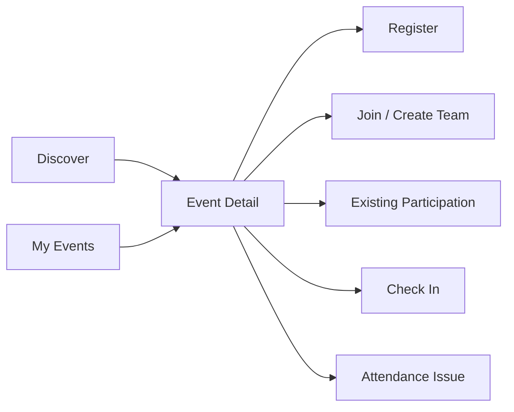
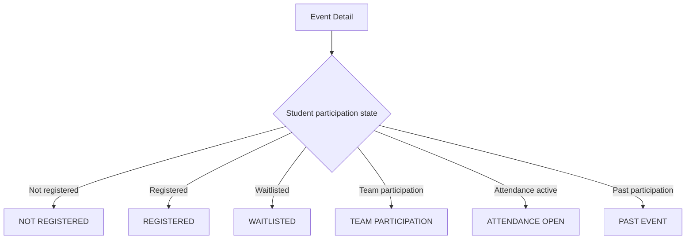
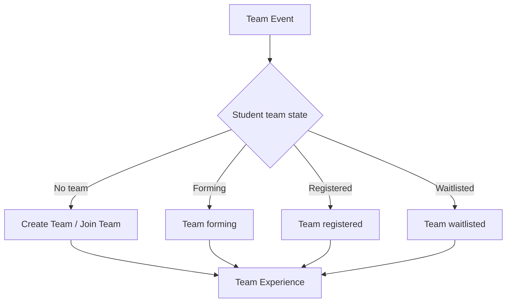
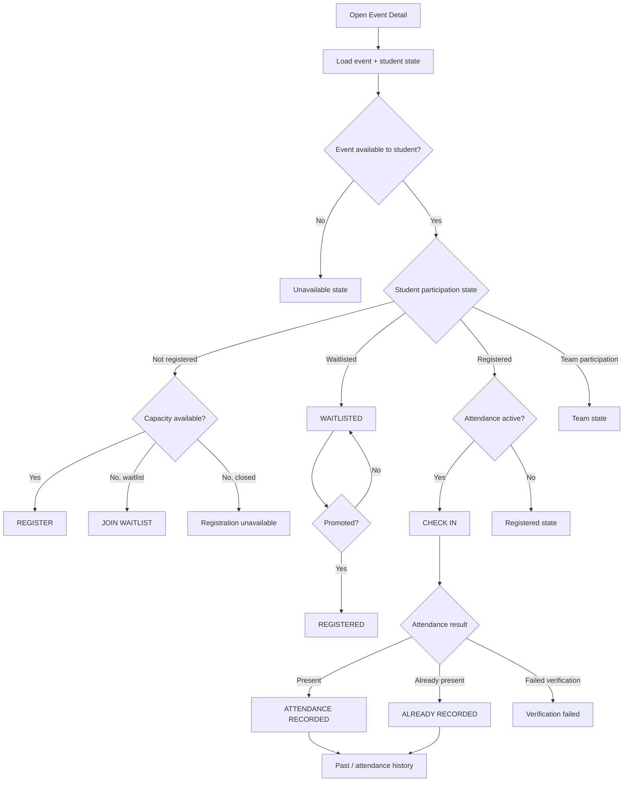
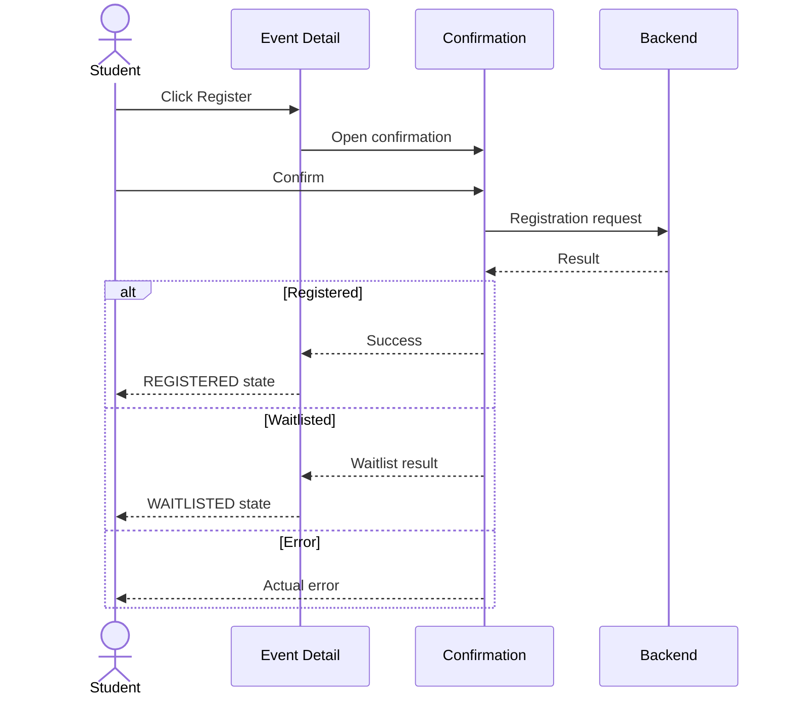
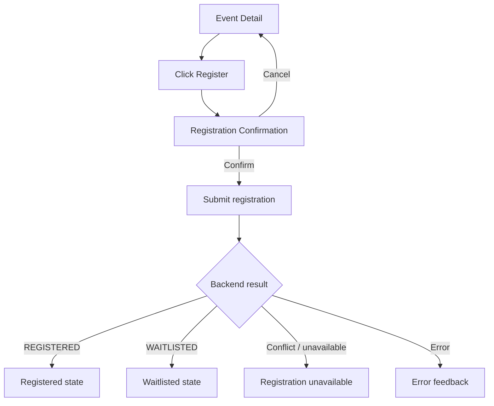
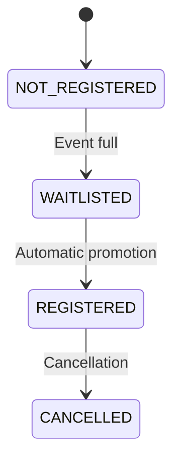
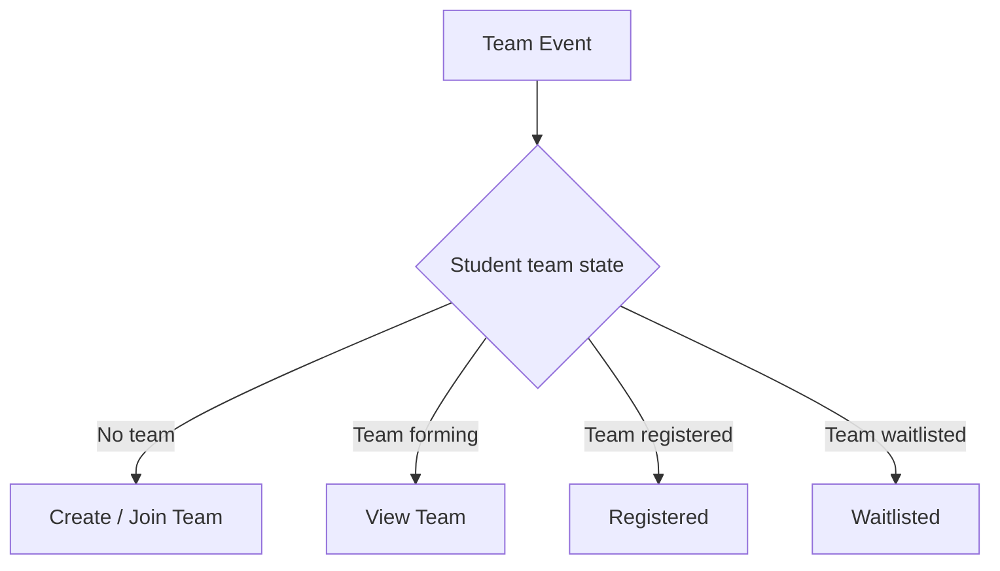
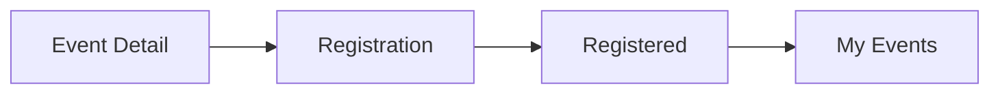
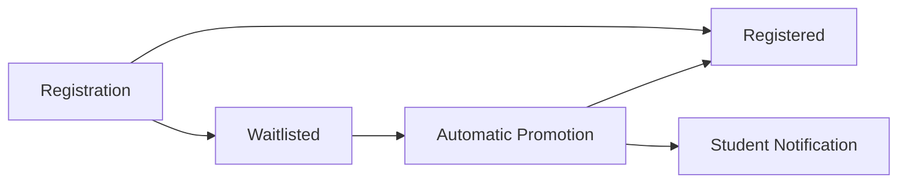

# Student Web UX — Event Detail

## 1. Product Job

Event Detail is the student's decision and participation screen.

It must allow a student to quickly understand:

```text
What is this?
When is it?
Where is it?
Who is it for?
How does participation work?
What is my current state?
What can I do now?
```

The screen should not expose the full administrative lifecycle.

The student should experience a simple participation model rather than backend terminology.

---

# 2. Core Mental Model

Discover answers:

```text
"What is available?"
```

Event Detail answers:

```text
"Should I participate?"
```

My Events answers:

```text
"What have I committed to?"
```

Attendance answers:

```text
"Am I participating right now?"
```

Therefore Event Detail is the bridge between discovery and participation.



---

# 3. Screen Structure

The page should use a strong content hierarchy.

```text
┌──────────────────────────────────────────────────────────────────────┐
│ ← Back to Discover                                                  │
│                                                                      │
│ WORKSHOP                                                             │
│                                                                      │
│ AI/ML Workshop                                                      │
│ Build practical ML systems from scratch.                            │
│                                                                      │
│ ML Club                                                              │
│                                                                      │
├──────────────────────────────────────────────────────────────────────┤
│                                                                      │
│ WHEN                          WHERE                                  │
│ Sep 12 · 4:00 PM             Lab 3                                  │
│ Ends · 6:00 PM               NST Campus                             │
│                                                                      │
├──────────────────────────────────────────────────────────────────────┤
│                                                                      │
│ About this event                                                    │
│                                                                      │
│ Full event description...                                            │
│                                                                      │
├──────────────────────────────────────────────────────────────────────┤
│                                                                      │
│ Participation                                                       │
│                                                                      │
│ Individual / Team                                                   │
│ Capacity / availability                                             │
│ Audience                                                            │
│ Team requirements                                                   │
│                                                                      │
├──────────────────────────────────────────────────────────────────────┤
│                                                                      │
│ Your status                                                         │
│                                                                      │
│ REGISTERED / WAITLISTED / NOT REGISTERED                            │
│                                                                      │
│                               [ PRIMARY ACTION ]                     │
│                                                                      │
└──────────────────────────────────────────────────────────────────────┘
```

The exact fields must be determined from actual event data available to students.

---

# 4. Page Header

The top of the page should establish identity immediately.

Contents:

```text
Event type
Event title
Short description / summary
Primary club
```

Example:

```text
WORKSHOP

AI/ML Workshop

Build practical ML systems from scratch.

ML Club
```

Do not overwhelm the title area with metadata.

Date, location, capacity, and participation information belong in structured sections below.

---

# 5. Back Navigation

Because Event Detail is commonly entered from Discover or My Events, the student should have a clear back affordance.

Preferred behavior:

```text
Discover
→ Event Detail
→ Back
→ Discover with previous state preserved
```

Similarly:

```text
My Events
→ Event Detail
→ Back
→ My Events
```

The browser's normal back behavior should also remain predictable.

---

# 6. Event Metadata

Immediately below the identity section, provide the most decision-critical information.

At minimum:

```text
When
Where
```

Potential additional information:

```text
Registration type
Capacity
Availability
Audience
```

Only show fields supported by the backend.

Example:

```text
WHEN
Sep 12 · 4:00 PM
Ends · 6:00 PM

WHERE
Lab 3
NST Campus
```

Date/time should be human-readable.

Avoid database-style timestamps.

---

# 7. Location

Location should be useful to a student attending physically.

Display:

```text
Venue name
Campus/location context
```

If the backend contains geographic information only for attendance verification, do not expose raw coordinates.

The student needs:

```text
"Lab 3"
```

not:

```text
18.5421, 73.8381
```

---

# 8. About

The description section contains the event's actual student-facing content.

```text
About this event

[Event description]
```

This is where the student decides whether the event is interesting.

Do not bury the description beneath unnecessary system metadata.

---

# 9. Participation Information

Create a compact section explaining the participation mechanics.

Potential information:

```text
Individual / Team
Capacity
Availability
Minimum team size
Maximum team size
Audience
```

Only expose values meaningful to the student.

For example:

```text
Participation
Team event
2–4 members
48 spots available
Open to all students
```

This section should answer:

> "What am I signing up for?"

---

# 10. Student State Is the Most Important Part

The bottom of the page contains the student's current participation state.

The screen should be state-aware.

Conceptually:



The action area changes based on this state.

---

# 11. NOT REGISTERED

The default state for an available event.

Example:

```text
Your participation

You're not registered for this event.

                    [ REGISTER ]
```

The CTA should be visually dominant.

Clicking it does not immediately register the student.

It opens the deliberate registration confirmation.

---

# 12. Registration Confirmation

Registration is a commitment.

Therefore:

```text
Event Detail
→ Register
→ Confirmation
→ Confirm
→ Backend request
```

Example:

```text
┌──────────────────────────────────────────────┐
│ Register for AI/ML Workshop?                 │
│                                              │
│ Sep 12 · 4:00 PM                             │
│ Lab 3                                        │
│                                              │
│ You'll be registered for this event.         │
│                                              │
│ [ Cancel ]                 [ Confirm ]       │
└──────────────────────────────────────────────┘
```

The UI must wait for backend confirmation.

Do not show `REGISTERED` before the request succeeds.

This follows the product's explicit no-optimistic-UI rule.

---

# 13. REGISTERED State

After successful registration:

```text
REGISTERED
```

should replace the registration CTA.

Example:

```text
Your participation

✓ You're registered

[ View in My Events ]
```

The primary action is no longer "Register".

The student is now managing an existing commitment.

---

# 14. WAITLISTED

When capacity is unavailable and the backend places the student on a waitlist:

```text
Your participation

◐ You're on the waitlist.

We'll update you automatically if a place becomes available.
```

Do not ask the student to manually accept later promotion.

The product behavior is automatic promotion.

---

# 15. Waitlist Promotion

When the backend promotes the student:

```text
WAITLISTED
↓
REGISTERED
```

the Event Detail state changes accordingly.

The student may also receive a notification.

The UI should make the transition obvious:

```text
✓ You're registered
```

There should be no:

```text
[ Accept spot ]
```

step.

---

# 16. FULL EVENT

The student may encounter an event where capacity is full.

The action area should distinguish:

```text
FULL
```

from:

```text
WAITLIST AVAILABLE
```

Example:

```text
Registration

This event is currently full.

[ JOIN WAITLIST ]
```

If the backend does not permit waitlisting in the current state:

```text
Registration

Registration is currently closed.
```

Do not fabricate alternative actions.

---

# 17. TEAM EVENT

For team-registration events, the CTA must explain the next step.

The student should not be dropped into a generic registration dialog that does not explain teams.

The state may be:

```text
No team
Team exists but not registered
Member of team
Team registered
Team waitlisted
```

The Event Detail action should reflect the current state.

Examples:

```text
Team event

You aren't part of a team.

[ CREATE TEAM ]   [ JOIN TEAM ]
```

or:

```text
Team event

You're part of:

Merge Conflicts
3 / 4 members

[ VIEW TEAM ]
```

The exact action sequence must correspond to backend semantics.

---

# 18. Team Registration Relationship

The Event Detail page should make team participation understandable.

Conceptually:



Event Detail provides the entry point.

The Team screen manages the details.

---

# 19. ATTENDANCE OPEN

When the student is registered and an attendance session is active, participation changes from registration to action.

The Event Detail page should elevate:

```text
ATTENDANCE OPEN
```

Example:

```text
You're registered

● Attendance is open
Closes in 18 minutes

*Scan the organizer's QR code to check in.*
```

The student should understand check-in is performed externally.

---

# 20. ATTENDANCE COMPLETED

After a successful check-in:

```text
✓ Attendance recorded

Checked in at 4:13 PM
```

Primary action should no longer be `CHECK IN`.

The student can view their attendance details/history where appropriate.

Do not provide another check-in action if the backend is idempotent and already marked the user.

---

# 21. Attendance Already Marked

If the student opens the event after already checking in:

```text
✓ You're marked present

Checked in at 4:13 PM
```

This is confirmation, not an error.

The product explicitly defines the "already marked" result as a neutral/idempotent state.

---

# 22. Event Ended

After the event has ended, the screen changes from participation to history.

Example:

```text
Event ended

Sep 12 · 4:00 PM
Lab 3

Your participation

ATTENDED
```

or, if appropriate:

```text
NOT ATTENDED
```

Only show attendance outcomes supported by the backend.

The student should not see active registration controls for an event that is already completed.

---

# 23. Attendance Dispute Entry

If the student has an attendance issue and is eligible to submit a dispute:

```text
Your attendance

No attendance recorded

[ REPORT AN ISSUE ]
```

If a dispute already exists:

```text
Attendance issue

Your dispute is being reviewed.

[ VIEW DISPUTE ]
```

If resolved:

```text
Attendance issue

Dispute resolved: Approved

[ VIEW DETAILS ]
```

Do not show the dispute action when the student is outside the allowed dispute window.

---

# 24. Event Lifecycle Should Not Be Exposed Directly

Students should not be shown raw administrative event states such as:

```text
PENDING_APPROVAL
```

Instead, the page should only render published/student-visible events.

The student-facing state is about participation.

For example:

```text
Available
Registered
Waitlisted
Attendance Open
Attended
Ended
```

This creates a simpler mental model.

---

# 25. Primary Action Rules

At any moment, the screen should have one dominant action.

Examples:

```text
Not registered
→ REGISTER

Full + waitlist
→ JOIN WAITLIST

Team event + no team
→ CREATE / JOIN TEAM

Registered + attendance active
→ CHECK IN

Registered + no active attendance
→ VIEW PARTICIPATION

Attendance completed
→ VIEW ATTENDANCE

Dispute eligible
→ REPORT AN ISSUE
```

Do not expose five equal-weight buttons.

The student should immediately know what to do next.

---

# 26. Secondary Actions

Secondary actions may include:

```text
Cancel registration
View team
View attendance
View dispute
Back
```

These should remain subordinate to the main participation action.

Cancellation is deliberately frictionful.

Do not hide it permanently, but don't visually compete with the primary action.

---

# 27. Event Detail Layout

Recommended desktop composition:

```text
┌────────────────────────────────────────────────────────────────────────┐
│ ← Back                                                                  │
│                                                                        │
│ WORKSHOP                                                               │
│ AI/ML Workshop                                                        │
│ Build practical ML systems from scratch.                               │
│ ML Club                                                                 │
│                                                                        │
├───────────────────────────────────────────────┬────────────────────────┤
│                                               │ YOUR PARTICIPATION     │
│ WHEN                  WHERE                   │                        │
│ Sep 12 · 4 PM         Lab 3                   │ ✓ REGISTERED           │
│ Ends · 6 PM           NST Campus              │                        │
│                                               │ [ VIEW TEAM ]          │
│ About this event                             │                        │
│                                               │ or                     │
│ Full description...                           │ [ REGISTER ]            │
│                                               │                        │
│ Participation                                 │                        │
│ Team · 2–4 members                            │                        │
│ Open to students                              │                        │
│                                               │                        │
└───────────────────────────────────────────────┴────────────────────────┘
```

The right-side participation panel should remain visible while reading the event.

On narrower screens, it moves below the primary content and can become sticky near the bottom where appropriate.

---

# 28. Sticky Participation Area

On desktop, the participation panel can remain sticky while the student reads a long event description.

This reduces unnecessary scrolling before the student can act.

On mobile web, use a sticky bottom action bar when appropriate:

```text
┌─────────────────────────────────────────┐
│ REGISTER                    [ button ]  │
└─────────────────────────────────────────┘
```

The sticky action should disappear or change once the student's state changes.

---

# 29. Team Event Participation Panel

Example:

```text
YOUR PARTICIPATION

Team event

You're not part of a team yet.

[ CREATE TEAM ]
[ JOIN TEAM ]
```

If already on a team:

```text
YOUR PARTICIPATION

Merge Conflicts
3 / 4 members

REGISTERED

[ VIEW TEAM ]
```

The Event Detail screen should summarize the team state without duplicating the Team screen.

---

# 30. Capacity Presentation

Keep capacity understandable.

Examples:

```text
32 spots left
Almost full
Full
Waitlist available
```

Avoid raw backend representations.

The action itself should communicate the consequence.

---

# 31. Visibility / Audience

Only show audience restrictions where useful to the student.

Examples:

```text
Open to all students
B.Tech AI/ML
2027 batch
```

Don't expose internal authorization terminology.

---

# 32. Event Detail Loading State

Skeleton the main page structure:

```text
title
metadata
description
participation panel
```

Do not replace the screen with a full-page spinner.

---

# 33. Event Not Found

If the event no longer exists or cannot be accessed:

```text
Event unavailable

This event is no longer available.

[ Back to Discover ]
```

Do not expose backend 404 details.

---

# 34. Registration Conflict

If a registration action fails because the event state changed:

```text
Registration unavailable

This event changed while you were registering.

[ Refresh ]
```

The exact message should match backend error semantics.

Do not display an optimistic registered state and then silently revert it.

---

# 35. Real-Time Changes

Event Detail should react to meaningful changes.

Examples:

```text
OPEN
→ FULL

WAITLISTED
→ REGISTERED

Registered
→ Attendance Open

Attendance Open
→ Attendance Closed

Participation
→ Dispute Resolved
```

The screen should update the relevant state rather than forcing the student to refresh manually where realtime support exists.

---

# 36. Complete Event Detail Decision Tree



The exact state branches must be validated against the backend.

---

# 37. Registration Interaction



No optimistic registration state should appear before API success.

---

# 38. Student Mental Model of the Participation Panel

The panel should always answer:

```text
Where am I?
What can I do?
What happens next?
```

Example:

```text
YOUR PARTICIPATION

✓ Registered

Your next step:
Attend the event on Sep 12.

```

Or:

```text
YOUR PARTICIPATION

◐ Waitlisted

We'll notify you automatically if a place opens.
```

Or:

```text
YOUR PARTICIPATION

● Attendance open

Check in before 4:45 PM.

[ CHECK IN ]
```

This is preferable to exposing technical status terminology.

---

# 39. Screen Responsibilities

Event Detail owns:

```text
Event understanding
Participation state
Primary participation action
Entry into Team flow
Entry into Attendance
Entry into Dispute
```

Event Detail does NOT own:

```text
Full team management
Full attendance records
Full notification inbox
Club management
Leaderboard
```

Those remain dedicated experiences.

---

# 40. Final Screen Architecture

```text
EVENT DETAIL
│
├── Back
│
├── Event Identity
│   ├── Event type
│   ├── Title
│   ├── Summary
│   └── Club
│
├── Event Facts
│   ├── Date/time
│   ├── Location
│   ├── Participation type
│   ├── Capacity/availability
│   └── Audience
│
├── About
│   └── Description
│
├── Participation Panel
│   ├── Current state
│   ├── Primary action
│   └── Secondary action
│
└── Contextual flows
    ├── Registration
    ├── Team
    ├── Attendance
    └── Dispute
```

---

# 41. Design Principle

The Event Detail page should never make the student wonder:

> "What am I supposed to do?"

At every state, there should be one obvious next step.

```text
Not registered
→ Register

Need a team
→ Create / Join

Registered
→ Attend

Attendance open
→ Check in

Already checked in
→ You're done

Attendance problem
→ Report an issue
```

The page should progressively reveal complexity only when that complexity becomes relevant to the student.

---

# 42. Backend Contract Verification

Before implementation, verify every field/action against the backend:

```text
Event availability
Event visibility
Student registration
Waitlist
Team relationship
Team registration
Attendance status
Attendance eligibility
Dispute eligibility
Dispute status
Cancellation eligibility
Realtime event updates
```

Every participation state displayed in the UI must have a deterministic source in the backend.

Every primary action must map to an actual supported backend operation.

Where the backend does not currently support a desired experience, document the gap rather than inventing behavior.

---

# 43. Registration Experience

Registration is a commitment interaction embedded within Event Detail. It is not a separate destination or standalone page.

The student should be able to understand their current participation state and complete the appropriate action without leaving the event context.

---

### 1. Registration State Model

The Event Detail experience must determine the student's current relationship with the event before showing an action.

Conceptually:

```text
EVENT DETAIL
│
├── NOT REGISTERED
│   ├── Register
│   └── Join Waitlist
│
├── REGISTERED
│   ├── View participation
│   └── Cancel registration
│
└── WAITLISTED
    └── View waitlist status
```

For team events, team state is evaluated separately and may change the available actions.

The exact states must be reconciled with the backend implementation before UI implementation.

---

### 2. Individual Event — Register

For an individual event where registration is available:

```text
Event Detail
↓
REGISTER
↓
Confirmation
↓
Confirm
↓
Backend registration
↓
Registered / Waitlisted / Error
```

The `REGISTER` action is the primary CTA.

It should not immediately submit the registration.

---

### 3. Registration Confirmation

Clicking `REGISTER` opens a compact confirmation dialog.

Example:

```text
┌─────────────────────────────────────────────┐
│ Register for Hackathon?                     │
│                                             │
│ Sep 12 · 10:00 AM                           │
│ Main Auditorium                             │
│                                             │
│ You'll be registered for this event.        │
│                                             │
│ [ Cancel ]                 [ Confirm ]      │
└─────────────────────────────────────────────┘
```

The dialog exists because registration is a commitment.

The student should clearly understand what they are confirming.

Do not introduce unnecessary form fields.

---

### 4. Confirmation Interaction



The UI must wait for server confirmation.

Do not display `REGISTERED` before the backend confirms the mutation.

---

### 5. Registered Result

After successful registration, the participation area changes from the registration CTA to the student's committed state.

Example:

```text
YOUR PARTICIPATION

✓ You're registered

Sep 12 · 10:00 AM

[ VIEW IN MY EVENTS ]
```

The student should immediately understand:

```text
The registration succeeded.
The event is now part of my commitments.
```

No extra success page is necessary.

---

### 6. Waitlisted Result

If registration succeeds but capacity is unavailable:

```text
YOUR PARTICIPATION

◐ You're on the waitlist.

We'll notify you automatically if a place becomes available.
```

The student is not asked to perform another action.

The waitlist is a system-managed state.

---

### 7. Waitlist Promotion

The student lifecycle is:



When automatically promoted:

```text
WAITLISTED
↓
REGISTERED
↓
My Events updates
↓
Notification may appear
```

There is no acceptance step.

The product requirement explicitly specifies automatic promotion without an additional student acceptance action.

---

### 8. Full Event

If the event has reached capacity:

```text
Registration

This event is currently full.

[ JOIN WAITLIST ]
```

If waitlisting is unavailable:

```text
Registration

Registration is currently closed.
```

The exact state must come from the backend.

Do not assume that every full event accepts waitlists.

---

### 9. Duplicate Registration

If a student attempts to register for an event they are already registered for, the UI should resolve to the existing participation state rather than presenting a second registration flow.

Preferred conceptual outcome:

```text
✓ You're already registered
```

The exact behavior should follow the backend response.

---

### 10. Registration Conflict

A race condition can occur if the event changes between displaying the CTA and submitting the request.

Example:

```text
Student sees:
32 spots left

Student clicks:
REGISTER

Another registration consumes the last place.

Backend:
WAITLISTED
```

The UI must use the backend result as authoritative.

Never assume the availability shown a moment earlier remains valid.

---

### 11. Registration Failure

If the backend rejects the request:

```text
Couldn't register for this event.

Please try again.
```

Use the actual backend error semantics where available.

The student should remain on Event Detail.

Do not show a fake registered state.

---

### 12. Cancellation

Cancellation is a secondary action available only while the student's registration is cancellable.

The flow is:

```text
Registered
↓
Cancel registration
↓
Confirmation
↓
Backend mutation
↓
Cancelled
```

Example:

```text
Cancel registration?

You'll give up your place in this event.

[ Keep registration ]   [ Cancel registration ]
```

Cancellation must require deliberate confirmation.

The action should not be presented when the backend rules make cancellation unavailable.

---

### 13. Cancellation Result

Successful cancellation:

```text
Registration cancelled.

[ Back to event ]
```

The Event Detail participation state then changes to:

```text
NOT REGISTERED
```

Do not optimistically remove the registration before server confirmation.

---

### 14. Cancellation Failure

If cancellation fails:

```text
Couldn't cancel your registration.

Your registration has not been changed.
```

The current server state remains authoritative.

---

### 15. Team Event Entry

Registration behaves differently for team events.

If the student is not associated with a team:

```text
YOUR PARTICIPATION

Team event

You're not part of a team yet.

[ CREATE TEAM ]
[ JOIN TEAM ]
```

The student should first establish their team relationship.

Do not force a generic individual registration confirmation onto a team event.

---

### 16. Existing Team

If the student is already part of a team:

```text
YOUR PARTICIPATION

Merge Conflicts
3 / 4 members

[ VIEW TEAM ]
```

The student can enter the Team experience to complete or manage participation.

---

### 17. Team Registration State

The Event Detail screen should summarize team participation.

Conceptually:



The exact transitions must be verified against the backend team model.

---

### 18. No Optimistic UI

All registration mutations are server-confirmed.

The interaction must be:

```text
Click
↓
Submitting
↓
Server response
↓
Update UI
```

Never:

```text
Click
↓
Immediately show Registered
↓
Wait for server
```

The product explicitly rejects optimistic registration behavior.

---

### 19. Registration Loading State

While submitting:

```text
Confirm
↓
Submitting...
```

Prevent duplicate submission.

The student should still understand which action is being processed.

---

### 20. Registration State After Success

The final Event Detail state should immediately communicate the new relationship.

Example:

```text
YOUR PARTICIPATION

✓ REGISTERED

You're registered for this event.

[ VIEW IN MY EVENTS ]
```

The student does not need to reload the browser.

---

### 21. Registration → My Events

The relationship between these screens:



`My Events` becomes the persistent record of the student's commitment.

---

### 22. Registration → Notification

Where supported by the notification system:



Do not create duplicate notifications for events that do not generate one.

---

### 23. Student-Facing Language

Use human participation concepts:

```text
Registered
You're on the waitlist
Registration is full
Registration is closed
Attendance is open
```

Avoid exposing:

```text
REGISTERED_ENUM
WAITLISTED_ENUM
CAPACITY_CONFLICT
REGISTRATION_RECORD
```

Backend terminology remains an implementation detail.

---

### 24. Primary Action Rule

The Event Detail page should always have one obvious next step.

Examples:

```text
Not registered
→ REGISTER

Full + waitlist
→ JOIN WAITLIST

Registered + team event
→ VIEW TEAM

Registered + attendance active
→ CHECK IN

Attendance completed
→ VIEW ATTENDANCE
```

Registration should never compete visually with the student's more urgent current action.

---

### 25. What Registration Does Not Need

Do not create:

```text
Registration Dashboard
Registration History page
Separate Registration Wizard
Separate Registration Result page
```

unless backend/product requirements later make one necessary.

The registration interaction belongs inside Event Detail.

---

### 26. Backend Contract

Before UI implementation, verify:

```text
Registration endpoint
Registration state
Capacity behavior
Waitlist behavior
Duplicate registration behavior
Cancellation endpoint
Cancellation eligibility
Event lock behavior
Event end behavior
Team registration semantics
Registration error codes
```

Every UI state must have a deterministic backend source.

---

### 27. Final UX Model

```text
EVENT DETAIL
│
├── Individual
│   ├── Register
│   ├── Registered
│   └── Waitlisted
│
├── Team
│   ├── Create / Join Team
│   ├── Team Participation
│   └── Team Registration
│
└── Existing Registration
    └── Cancel when allowed
```

The student should experience registration as one simple commitment:

```text
Understand event
↓
Decide
↓
Confirm
↓
Know exactly what happened
```
