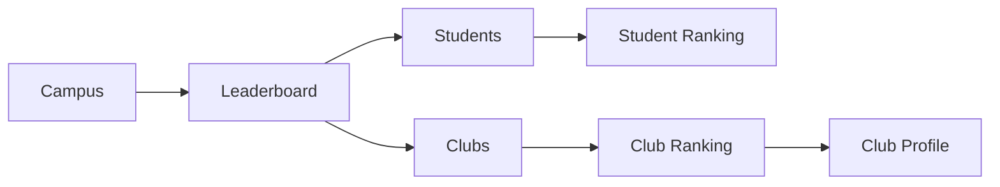
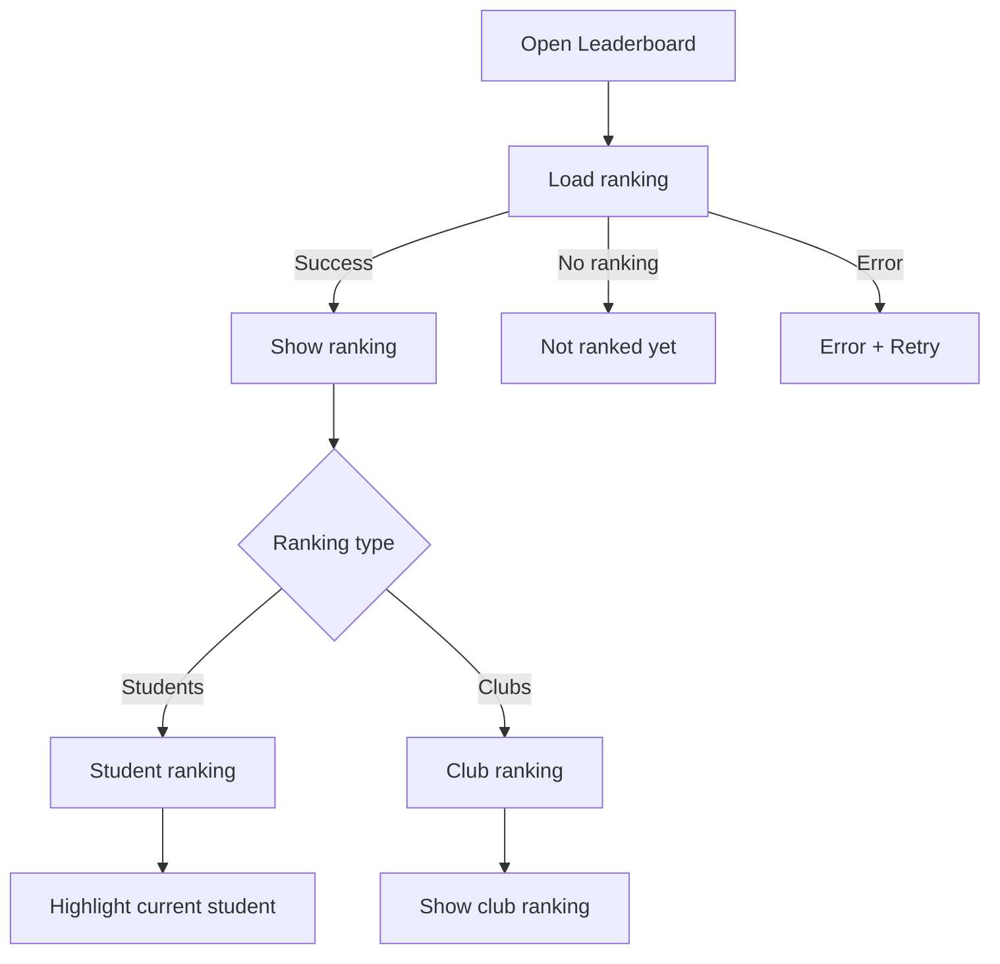

# Student Web UX — Campus → Leaderboard

## 1. Job

The leaderboard exists to answer one question:

> "Where do I stand?"

It should take roughly 2–3 seconds to understand.

The hierarchy is:

```text
YOUR RANK
↓
RANKING
```

Everything else is secondary.

---

## 2. Screen

```text
┌──────────────────────────────────────────────────────────────────────┐
│ Campus                                                               │
│                                                                      │
│ Discover          Leaderboard          Clubs                         │
│                       ───────                                        │
│                                                                      │
│ Leaderboard                                                          │
│                                                                      │
│ ┌──────────────────────────────────────────────────────────────────┐ │
│ │ YOUR RANK                                                        │ │
│ │                                                                  │ │
│ │ #18                                      425 pts                 │ │
│ └──────────────────────────────────────────────────────────────────┘ │
│                                                                      │
│ [ Students ]       [ Clubs ]                                        │
│                                                                      │
│ Rank       Name                                      Points          │
│ ────────────────────────────────────────────────────────────────── │
│ 1          Aarav Sharma                              820             │
│ 2          Riya Patel                                790             │
│ 3          Kabir Shah                                760             │
│                                                                      │
│ ...                                                                  │
│                                                                      │
│ 18         YOU                                        425            │
│ 19         Student                                    418            │
│ 20         Student                                    410            │
│                                                                      │
│                         Load more                                    │
└──────────────────────────────────────────────────────────────────────┘
```

That's it.

---

## 3. Page Structure

```text
Campus
│
├── Discover
├── Leaderboard
│
│   ├── Your Rank
│   ├── Students / Clubs
│   └── Ranking
│
└── Clubs
```

No additional dashboard sections.

---

## 4. Your Rank

This is the only prominent card on the page.

```text
YOUR RANK

#18                  425 pts
```

It exists because the student should never have to find themselves in the ranking.

Do not add large decorative graphics.

Do not add multiple KPIs.

Do not add:

```text
Events attended
Clubs joined
Achievements
Total participation
Percentile
```

unless the backend and product explicitly require them.

---

## 5. Students / Clubs

One segmented control:

```text
[ Students ] [ Clubs ]
```

Students is the default.

Switching changes only the ranking below.

Do not change the entire screen.

---

## 6. Student Ranking

Use a dense, highly readable list.

```text
RANK    STUDENT                         POINTS

1       Aarav Sharma                   820
2       Riya Patel                     790
3       Kabir Shah                     760
...
18      YOU                            425
19      Student                        418
20      Student                        410
```

Prioritize:

```text
rank
name
points
```

Nothing else is necessary.

---

## 7. Current Student

The student's own row must be unmistakable:

```text
18     YOU                              425
```

Use text and/or an accessible semantic indicator.

Do not depend only on background color.

---

## 8. Ranking Context

The ranking should give the student enough context to understand their position.

Preferred initial view:

```text
Top ranks
+
student's nearby ranks
```

For example:

```text
15     Student     431
16     Student     428
17     Student     426
18     YOU         425
19     Student     418
20     Student     410
```

If the backend does not support efficient "around me" retrieval, do not invent a new endpoint.

Use the existing pagination capability.

---

## 9. Club Ranking

When the student selects:

```text
[ Clubs ]
```

the list changes to:

```text
RANK    CLUB                             POINTS

1       Coding Club                     4,850
2       ML Club                         4,420
3       Debate Club                     4,110
...
```

A club row may navigate to the Club Profile if that relationship exists in the student UX.

No additional club analytics should be displayed here.

---

## 10. Points Explanation

Do not make this a permanent section.

If students need an explanation of scoring, use a small text action:

```text
How points work →
```

This opens a lightweight explanation.

The explanation should communicate the student-facing concept:

```text
Points come from verified participation
and competition achievements.
```

Do not expose:

```text
ledger
materialized view
aggregation
audit log
deduplication
```

The backend/product scoring model includes participation roles and competition results, so those are the meaningful concepts to explain.

---

## 11. No Rank

If a student has no points/ranking:

```text
You're not ranked yet.

Start participating in campus events to build your score.

[ Discover events ]
```

This is a motivational onboarding state, not an error.

---

## 12. Loading

Keep the structure visible.

```text
YOUR RANK
████

RANK    ███████████████    ███
RANK    ███████████████    ███
RANK    ███████████████    ███
```

Do not replace the screen with a loading spinner.

---

## 13. Error

```text
Couldn't load the leaderboard.

[ Retry ]
```

Navigation remains usable.

---

## 14. Ranking Freshness

Do not make the leaderboard feel artificially real-time.

The current product architecture refreshes leaderboard materialized views periodically rather than on every individual point event.

Therefore:

```text
Updated recently
```

is sufficient when useful.

No live animations are necessary.

---

## 15. Rank Movement

Only show movement if reliable historical rank data exists.

If supported:

```text
#18
↑ 3
```

Otherwise do not invent it.

---

## 16. Desktop

Use a centered, readable ranking column.

```text
┌─────────────────────────────────────────────────────────────┐
│ Leaderboard                                                 │
│                                                             │
│ ┌─────────────────────────────────────────────────────────┐ │
│ │ YOUR RANK                                                │ │
│ │ #18                                      425 pts         │ │
│ └─────────────────────────────────────────────────────────┘ │
│                                                             │
│ [ Students ] [ Clubs ]                                     │
│                                                             │
│ Rank       Student                              Points      │
│ ────────────────────────────────────────────────────────── │
│ 1          Aarav Sharma                         820         │
│ 2          Riya Patel                           790         │
│ ...                                                         │
│ 18         YOU                                  425         │
│                                                             │
│                         Load more                           │
└─────────────────────────────────────────────────────────────┘
```

No sidebar inside the page.

No secondary analytics column.

---

## 17. Mobile

```text
Leaderboard

YOUR RANK
#18
425 pts

[ Students ] [ Clubs ]

18   YOU                     425
19   Student                 418
20   Student                 410
21   Student                 406
```

Keep the student's rank and points above the fold.

---

## 18. Navigation



Remove the Club Profile relationship if the student experience does not expose it.

---

## 19. Screen States



---

## 20. Interaction Rules

The screen has only a few meaningful interactions:

```text
Students ↔ Clubs
↓
Ranking rows
↓
Load more
↓
How points work
```

Avoid additional controls unless a demonstrated user need or backend capability requires them.

---

## 21. Deliberate Omissions

Do not add:

```text
Leaderboard search
Date filters
Event filters
Points history
Achievement dashboard
Participation analytics
Trophy wall
Large podium
Social reactions
Comments
Sharing
```

The leaderboard is not a social network or analytics product.

---

## 22. Final Model

```text
LEADERBOARD

Your Rank
    ↓
Students / Clubs
    ↓
Ranking
```

The experience should feel calm, credible, and easy to scan.

The student opens it, immediately sees `#18`, understands `425 pts`, looks at the ranking around them, and leaves.

That is the complete job of this screen.
