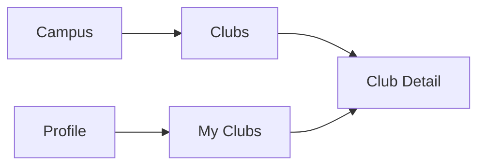
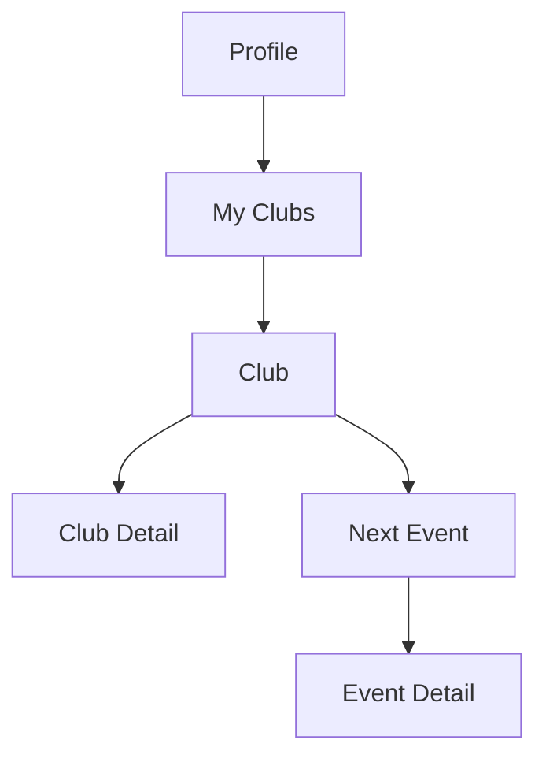
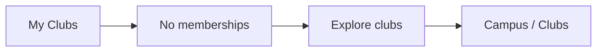
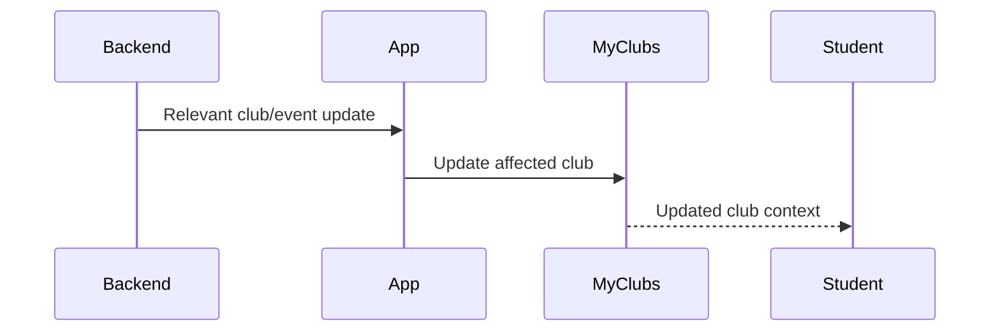

# Student Web UX — Profile → My Clubs

## 1. Product Job

My Clubs is the student's personal view of the communities they belong to.

It answers:

> "Which clubs am I part of, and what are they doing next?"

The screen should be extremely lightweight.

It is not a second Clubs directory.

It is not a club-management screen.

It is not a social feed.

---

## 2. Student Mental Model

The student should think:

```text
"These are my communities."
```

Then immediately:

```text
"What are they doing?"
```

The screen should provide that context without requiring the student to open every club.

---

## 3. Relationship to Campus → Clubs

There are two intentionally different experiences:

```text
Campus → Clubs
= Discover communities

Profile → My Clubs
= My communities
```

They may reuse the same Club Detail screen, but their purpose is different.



---

## 4. Screen Structure

The page should be simple:

```text id="x7m4q1"
┌──────────────────────────────────────────────────────────────┐
│ My Clubs                                                      │
│ Your campus communities.                                      │
│                                                              │
│ ┌──────────────────────────────────────────────────────────┐ │
│ │ Coding Club                                              │ │
│ │ ✓ MEMBER                                                 │ │
│ │                                                          │ │
│ │ Next up                                                  │ │
│ │ Hackathon · Sep 12 · 10:00 AM                           │ │
│ │                                                          │ │
│ │ 42 members                              Open →           │ │
│ └──────────────────────────────────────────────────────────┘ │
│                                                              │
│ ┌──────────────────────────────────────────────────────────┐ │
│ │ ML Club                                                  │ │
│ │ ✓ MEMBER                                                 │ │
│ │                                                          │ │
│ │ Next up                                                  │ │
│ │ AI Workshop · Sep 14 · 4:00 PM                          │ │
│ │                                                          │ │
│ │ 31 members                              Open →           │ │
│ └──────────────────────────────────────────────────────────┘ │
└──────────────────────────────────────────────────────────────┘
```

The goal is recognition + activity, not exhaustive club information.

---

## 5. Header

Use:

```text id="8g2p5m"
My Clubs
Your campus communities.
```

Nothing more is necessary.

Do not add search.

Do not add filters.

The student already knows which clubs they belong to.

---

## 6. Club Item

Each item should communicate:

```text id="c4n8s1"
Club identity
Membership
Next activity
Basic context
```

Example:

```text id="q1m7v6"
Coding Club
✓ MEMBER

Next up
Hackathon
Sep 12 · 10:00 AM

42 members
```

That's enough to establish both belonging and activity.

---

## 7. Why "Next Up" Matters

The strongest value of My Clubs is not repeating the club name.

It's showing:

> "What is happening through the communities I'm already part of?"

For example:

```text id="f8a5x2"
Coding Club
Next up: Hackathon · Sep 12

ML Club
Next up: AI Workshop · Sep 14
```

This makes the page useful rather than merely informational.

---

## 8. Club Ordering

Default ordering should be intentional.

Recommended:

```text id="k3y8v5"
Clubs with upcoming activity
↓
Soonest upcoming activity
↓
Clubs with no upcoming activity
```

This is a UX recommendation.

Implement it only if the available backend data makes this ordering deterministic.

Do not create a popularity ranking.

Do not sort by:

```text id="y5q9m2"
member count
points
leaderboard position
```

unless explicitly required.

---

## 9. Activity Presentation

If a club has an upcoming event:

```text id="w4h2j7"
NEXT UP

Hackathon
Sep 12 · 10:00 AM
```

If it has multiple upcoming events:

```text id="a7j3n9"
NEXT UP

Hackathon
Sep 12 · 10:00 AM

+ 3 more events
```

or:

```text id="c9v5k1"
NEXT UP

Hackathon · Sep 12
```

Do not turn each My Club item into a mini event directory.

---

## 10. Club With No Upcoming Activity

For a club with no upcoming events:

```text id="b6r2w8"
Coding Club
✓ MEMBER

No upcoming events.
```

Do not make the student feel like something is broken.

The club still belongs to them.

---

## 11. Club Item Interaction

The primary interaction should be:

```text id="m1c7p4"
Club item
↓
Club Detail
```

The student can then see:

```text id="s8q4n2"
About
Next event
Upcoming events
```

Do not create separate navigation for every piece of club data.

---

## 12. Optional Direct Event Entry

A `Next Up` event can be clickable directly when this creates a genuinely useful shortcut.

Example:

```text id="n6x1k5"
Coding Club

Next up
Hackathon
Sep 12 · 10:00 AM     →
```

This can lead directly to Event Detail.

However, choose one consistent interaction model:

```text id="d3r8w2"
Option A
Club item → Club Detail

Option B
Club identity → Club Detail
Next event → Event Detail
```

I recommend Option B because it respects the two different intents.

---

## 13. Navigation



The exact interaction should remain consistent across the product.

---

## 14. Membership State

Every item is already a known membership.

Therefore do not repeat:

```text id="g6p2w5"
Join
Follow
Request
```

The membership indicator can simply be:

```text id="0b4n9v"
✓ MEMBER
```

It is contextual confirmation.

---

## 15. No Membership Management

Do not allow the student to:

```text id="3h5j8m"
Leave club
Change role
Join club
Request club membership
Manage members
```

unless those capabilities are explicitly supported by backend/product requirements.

My Clubs is a reflection of the student's current membership state.

---

## 16. Empty State

If the student has no club memberships:

```text id="y8q3p6"
My Clubs

You're not part of any clubs yet.
```

Then provide a discovery path:

```text id="p2m7k5"
[ Explore clubs ]
```

which goes to:

```text id="w6j3n8"
Campus → Clubs
```

Important: this is an exploration CTA, not a membership CTA.

The distinction should be obvious.

---

## 17. Empty State Flow



---

## 18. Loading

Use simple list/card skeletons.

```text id="v7q2m6"
┌──────────────────────────────────────────┐
│ █████████████                           │
│ ███████                                  │
│ █████████████████                        │
└──────────────────────────────────────────┘
```

Keep the final page geometry stable.

Do not use a large loading screen.

---

## 19. Error

```text id="j4r9x2"
Couldn't load your clubs.

[ Retry ]
```

Do not remove the global navigation.

---

## 20. Membership Changes

If the backend reports that the student's membership changed:

```text id="q8n5m3"
Club membership added
↓
My Clubs updates

Club membership removed
↓
My Clubs updates
```

Where realtime support exists, update the list without requiring a full page refresh.

---

## 21. Club Activity Changes

If a club's upcoming event changes:

```text id="v3k7n1"
Club
↓
Next event changes
↓
My Clubs updates
```

Do not animate the entire screen.

Update only the affected item.

---

## 22. Realtime

My Clubs should be lightly dynamic.

The useful updates are:

```text id="u9w4c6"
Membership change
Upcoming event change
Event cancellation
```

Do not create a realtime social feed.



Only implement the events actually supported by the backend.

---

## 23. Do Not Duplicate Campus Clubs

The My Clubs page should NOT contain:

```text id="b9x3m7"
full club descriptions
all clubs
search
filters
large banners
club discovery controls
```

The student is already looking at a known subset.

---

## 24. Do Not Turn It Into a Dashboard

Do not add:

```text id="m2c8v7"
Total clubs
Total events
Club points
Membership statistics
Leaderboard position
Activity graph
```

The screen should remain personal and quiet.

---

## 25. Desktop Layout

Use a compact centered list:

```text id="j7n4p2"
┌──────────────────────────────────────────────────────────────┐
│ My Clubs                                                      │
│ Your campus communities.                                     │
│                                                              │
│ ┌──────────────────────────────────────────────────────────┐ │
│ │ Coding Club                             ✓ MEMBER         │ │
│ │                                                          │ │
│ │ NEXT UP                                                   │ │
│ │ Hackathon · Sep 12 · 10:00 AM             Open →        │ │
│ │                                                          │ │
│ │ 42 members                                               │ │
│ └──────────────────────────────────────────────────────────┘ │
│                                                              │
│ ┌──────────────────────────────────────────────────────────┐ │
│ │ ML Club                                 ✓ MEMBER         │ │
│ │                                                          │ │
│ │ NEXT UP                                                   │ │
│ │ AI Workshop · Sep 14 · 4:00 PM            Open →        │ │
│ │                                                          │ │
│ │ 31 members                                               │ │
│ └──────────────────────────────────────────────────────────┘ │
└──────────────────────────────────────────────────────────────┘
```

Do not use a large three-column grid here.

This is a personal list, not discovery.

---

## 26. Mobile Layout

```text id="t4k8m2"
My Clubs

Coding Club
✓ MEMBER

NEXT UP
Hackathon
Sep 12 · 10:00 AM

42 members

Open →

────────────────────────

ML Club
✓ MEMBER

NEXT UP
AI Workshop
Sep 14 · 4:00 PM

31 members

Open →
```

One club at a time.

---

## 27. Accessibility

Every club item should have a clear accessible name.

Membership must be understandable without color.

Example:

```text id="8m2k5v"
Coding Club — Member — Next event Hackathon September 12 at 10 AM
```

Interactive event links must have clear focus states.

---

## 28. Final Information Architecture

```text id="6h4p9k"
PROFILE
│
└── My Clubs
    │
    ├── Club
    │   ├── Membership
    │   └── Next Event
    │
    └── Club
        ├── Membership
        └── Next Event
```

---

## 29. Core UX Principle

My Clubs should feel like:

> "These are my people and what they're doing next."

Not:

> "Here are some club records."

The ideal interaction is:

```text id="j2v5m8"
Open My Clubs
↓
See my communities
↓
See what's happening next
↓
Open the club or event
```

No unnecessary management layer.

---

## 30. Backend Contract

Before implementation, verify:

```text id="r5m8q1"
Current student's club memberships
Club identity
Membership state
Upcoming club events
Event date/time
Event relationship
Club member count
Membership updates
Relevant realtime updates
```

Only display information that can be reliably derived from the backend.

Do not introduce self-service membership actions.
