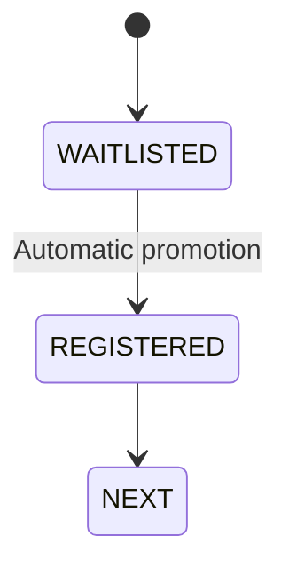
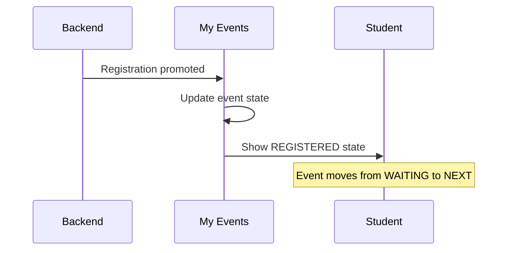
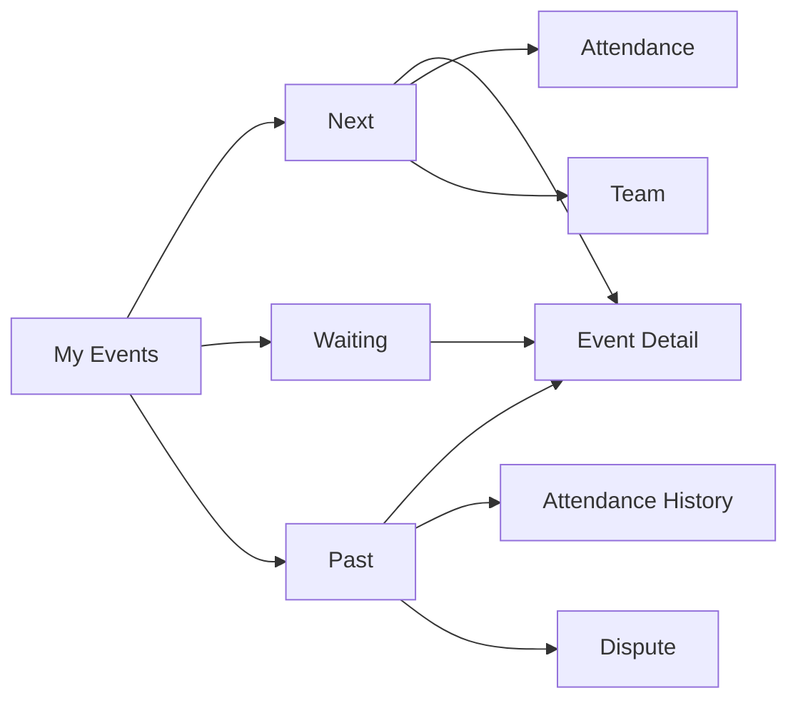

# Student Web UX — My Events

## 1. Product Job

My Events answers one question:

> "What events am I involved in?"

The screen is a personal participation timeline, not an event-management interface.

Its job is to let the student immediately understand:

```text id="6y5f2s"
WHAT am I attending?
WHEN is it?
WHAT is my current state?
WHAT do I need to do?
```

---

# 2. Product Relationship

```text id="v40q8h"
Home
"What matters now?"

Campus
"What's available?"

Event Detail
"Should I join?"

My Events
"What am I committed to?"
```

This distinction should remain strict.

---

# 3. Information Architecture

Use three simple views:

```text id="b8n2hs"
NEXT
WAITING
PAST
```

### NEXT

Confirmed upcoming participation.

Examples:

```text id="xgrk11"
REGISTERED
TEAM REGISTERED
ATTENDANCE OPEN
```

### WAITING

Participation that is not yet confirmed.

Examples:

```text id="37k3o7"
WAITLISTED
PENDING TEAM ACTION
```

Only use the states actually supported by the backend.

### PAST

Completed events with historical participation.

Examples:

```text id="8cl2wt"
ATTENDED
MISSED
CANCELLED
```

---

# 4. Page Layout

The page should be almost entirely content.

```text id="aj4a7y"
┌─────────────────────────────────────────────────────────────────────────┐
│ My Events                                                               │
│ Your commitments.                                                       │
│                                                                         │
│ [ NEXT ]     [ WAITING ]     [ PAST ]                                  │
│                                                                         │
│ ────────────────────────────────────────────────────────────────────── │
│                                                                         │
│ TOMORROW                                                               │
│                                                                         │
│ ┌─────────────────────────────────────────────────────────────────────┐ │
│ │ Hackathon                                                           │ │
│ │ Coding Club · Main Auditorium · 10:00 AM                            │ │
│ │                                                                     │ │
│ │ ✓ REGISTERED                                           View →       │ │
│ └─────────────────────────────────────────────────────────────────────┘ │
│                                                                         │
│ SEP 12                                                                  │
│                                                                         │
│ ┌─────────────────────────────────────────────────────────────────────┐ │
│ │ AI/ML Workshop                                                      │ │
│ │ ML Club · Lab 3 · 4:00 PM                                          │ │
│ │                                                                     │ │
│ │ ● ATTENDANCE OPEN                                  [ CHECK IN ]     │ │
│ └─────────────────────────────────────────────────────────────────────┘ │
└─────────────────────────────────────────────────────────────────────────┘
```

The screen should feel closer to a personal schedule than a data table.

---

# 5. Page Header

Keep the header extremely lightweight:

```text id="6q4k6u"
My Events
Your commitments.
```

Do not use:

```text id="6s3w81"
large hero
statistics
analytics
decorative dashboard widgets
```

There is no reason to visually compete with the events themselves.

---

# 6. Section Navigation

Use a segmented control:

```text id="9aypbr"
NEXT | WAITING | PAST
```

The selected state must be obvious.

Each section can optionally show a compact count:

```text id="2pz0c5"
NEXT 3
WAITING 1
PAST 18
```

Only show counts if they are useful and cheap to obtain.

Do not make counts visually dominant.

---

# 7. NEXT

This is the default view.

The student should see the next commitments first.

Default ordering:

```text id="g6n5un"
soonest event first
```

Use date separators only where they improve scanning.

Example:

```text id="gdg1l7"
TODAY

AI Workshop
ML Club · Lab 3 · 4:00 PM

TOMORROW

Hackathon
Coding Club · Main Auditorium · 10:00 AM

SEP 15

Debate Night
Debate Club · Seminar Hall · 6:00 PM
```

Avoid repeating large date UI inside every item.

---

# 8. Event Item

Each item should contain exactly what is useful for scanning:

```text id="s4x7dy"
Date/time
Event
Club
Location
Current student state
Next action
```

Example:

```text id="6m1qsu"
┌─────────────────────────────────────────────────────────────┐
│ Hackathon                                                   │
│ Coding Club · Main Auditorium                               │
│ Tomorrow · 10:00 AM                                        │
│                                                             │
│ ✓ REGISTERED                                   View event → │
└─────────────────────────────────────────────────────────────┘
```

Do not duplicate the entire Event Detail screen.

---

# 9. The Item's Most Important Property

Every event item must communicate the student's current state.

The state is more important than decorative metadata.

Examples:

```text id="m5xq2a"
✓ REGISTERED
◐ WAITLISTED
● ATTENDANCE OPEN
✓ ATTENDED
```

The visual treatment should make state instantly scannable.

Do not rely on color alone.

---

# 10. Contextual Action

Normally the action is:

```text id="0ak6zj"
View event →
```

The exception is a time-sensitive action.

For example:

```text id="5b0vtp"
● ATTENDANCE OPEN

[ CHECK IN ]
```

or:

```text id="tm9lel"
TEAM ACTION REQUIRED

[ OPEN TEAM ]
```

The goal is to expose the student's next meaningful action, not every possible action.

---

# 11. WAITING

The Waiting view exists because uncertainty is a distinct student state.

Example:

```text id="sv0l1p"
WAITING

┌─────────────────────────────────────────────────────────────┐
│ Hackathon                                                   │
│ Coding Club · Sep 12 · 10:00 AM                            │
│                                                             │
│ ◐ WAITLISTED                                                │
│ We'll notify you automatically if a place becomes available│
│                                                             │
│ View event →                                                │
└─────────────────────────────────────────────────────────────┘
```

The student should understand:

```text id="4i4n1m"
I am not confirmed yet.
The system is handling the next step.
I don't need to repeatedly check.
```

That last point is particularly important because waitlist promotion is automatic.

---

# 12. WAITLIST Promotion

The lifecycle is:



When promotion occurs:

```text id="ag86qr"
WAITING
↓
student becomes REGISTERED
↓
event appears in NEXT
↓
notification may be delivered
```

No acceptance screen.

No manual confirmation.

No separate "claim your place" action.

---

# 13. PAST

Past is intentionally quieter.

The student is no longer deciding what to do.

They are reviewing what happened.

Example:

```text id="g5v5hs"
PAST

SEP 2

AI Workshop
ML Club · Lab 3

✓ ATTENDED                         View attendance →

AUG 27

Hackathon
Coding Club

CANCELLED                         View event →
```

The exact historical states must come from backend data.

---

# 14. Past Event Actions

Only show relevant actions.

```text id="4jz5fs"
Attended
→ View attendance

Dispute pending
→ View dispute

Dispute resolved
→ View resolution

Eligible for dispute
→ Report issue
```

The system should not show every possible action simultaneously.

---

# 15. Attendance Open

Attendance is the strongest contextual state.

When attendance opens for one of the student's upcoming events:

```text id="4s4l2n"
TODAY

AI Workshop
ML Club · Lab 3 · 4:00 PM

● ATTENDANCE OPEN

                         [ CHECK IN ]
```

This item should visually rise above normal registered events without disrupting the entire list.

The student should not need to return to Home to check in.

---

# 16. Team Events

For team events, show the student's team relationship when useful.

Example:

```text id="3v1t1o"
Hackathon

Merge Conflicts · 3/4 members
Coding Club · Sep 12 · 10:00 AM

✓ REGISTERED                         View team →
```

Do not put team management controls directly into the event row.

The row is a gateway to the Team experience.

---

# 17. Team Action Required

If a team-related action genuinely blocks participation:

```text id="6f7kkj"
Hackathon

Merge Conflicts · 2/4 members

TEAM ACTION REQUIRED

                               [ OPEN TEAM ]
```

This state should have higher priority than an ordinary `REGISTERED` state.

---

# 18. Cancellation

Cancellation is secondary.

It should normally live in Event Detail / participation context rather than becoming an always-visible red button.

When the student is allowed to cancel, the action can be exposed through a secondary menu or Event Detail.

The flow must be:

```text id="9f1p8p"
Cancel
→ confirmation
→ backend mutation
→ confirmed cancellation
```

No optimistic removal.

If cancellation is no longer allowed, don't show an actionable cancellation control.

## The product requirements specifically require deliberate confirmation for cancellation and prohibit optimistic UI.

# 19. Empty NEXT

```text id="trz0n7"
Nothing upcoming

You haven't committed to an upcoming event yet.

[ Discover events ]
```

The CTA goes to:

```text id="0i3vca"
Campus → Discover
```

---

# 20. Empty WAITING

```text id="z9xv4a"
Nothing is waiting

You're not currently waitlisted or waiting on a participation action.
```

Keep this extremely simple.

---

# 21. Empty PAST

```text id="rjts72"
No past events yet

Your participation history will appear here.
```

No unnecessary illustration unless the broader design system calls for it.

---

# 22. Loading

Use list skeletons that closely preserve final geometry.

```text id="s81sdv"
┌─────────────────────────────────────────────────────────────┐
│ █████████████                                             │
│ ███████ · █████████ · █████                               │
│ █████████████████████                                     │
└─────────────────────────────────────────────────────────────┘
```

Do not use a full-page loading spinner.

---

# 23. Error

Use a focused recovery state:

```text id="y5d6x5"
Couldn't load your events.

[ Retry ]
```

The global navigation should remain available.

---

# 24. Important State Change

If an event changes while the student is viewing My Events:

```text id="ax4p8w"
WAITLISTED
→ REGISTERED

REGISTERED
→ ATTENDANCE OPEN

ATTENDANCE OPEN
→ ATTENDANCE CLOSED
```

the affected item should update in place.

Avoid unnecessarily reloading or jumping the student around the page.

---

# 25. Realtime Promotion

For a waitlist promotion:



If a notification is supported, the notification system can separately inform the student.

---

# 26. Navigation



Not every item exposes every destination.

Destinations depend on the student's current state.

---

# 27. Event Detail Relationship

The division of responsibility should remain strict.

```text id="5p8wcz"
My Events
→ summarizes

Event Detail
→ explains + lets student act

Team
→ manages team

Attendance
→ performs check-in

Dispute
→ handles attendance issue
```

This prevents My Events from becoming a monolithic screen.

---

# 28. URL Architecture

Recommended conceptual model:

```text id="n5ml7x"
/my-events
/my-events?tab=next
/my-events?tab=waiting
/my-events?tab=past
```

The selected tab should survive browser navigation where practical.

Use the actual application's routing conventions when implementation begins.

---

# 29. Browser Navigation

Example:

```text id="m91i9g"
My Events
→ Waiting
→ Event Detail
→ Back
→ Waiting
```

The student should return to the same logical context.

Do not unexpectedly reset to `Next`.

---

# 30. Desktop Design

Prefer a centered content column rather than spreading events across the entire screen.

Conceptually:

```text id="zyd7v7"
┌─────────────────────────────────────────────────────────────────┐
│ My Events                                                       │
│ Your commitments.                                              │
│                                                                 │
│ NEXT   WAITING   PAST                                          │
│                                                                 │
│ ┌─────────────────────────────────────────────────────────────┐ │
│ │ Event                                                       │ │
│ │ Club · Location · Time                                      │ │
│ │                                             STATUS  View →  │ │
│ └─────────────────────────────────────────────────────────────┘ │
│                                                                 │
│ ┌─────────────────────────────────────────────────────────────┐ │
│ │ Event                                                       │ │
│ │ Club · Location · Time                                      │ │
│ │                                    ATTENDANCE OPEN [CHECK IN]│ │
│ └─────────────────────────────────────────────────────────────┘ │
└─────────────────────────────────────────────────────────────────┘
```

Do not force a 3-column card grid here.

Discover benefits from grids.

My Events benefits from scanning rows.

---

# 31. Responsive Design

Desktop:

```text id="6xwks3"
Wide horizontal event rows
```

Tablet:

```text id="i3l1wo"
Compressed rows
```

Mobile:

```text id="5mb65w"
Stacked event cards
Full-width contextual action
```

The conceptual order stays unchanged.

---

# 32. Accessibility

Status must never depend exclusively on color.

For example:

```text id="quibgy"
✓ REGISTERED
◐ WAITLISTED
● ATTENDANCE OPEN
```

also needs semantic/accessibility text.

All event rows and actions should have keyboard focus states.

---

# 33. Do Not Add

Do not add:

```text id="e0j0yv"
Event search
Club discovery
Leaderboard
Analytics
Registration tables
Team administration
Attendance records embedded in every card
Notifications inbox
```

Those belong elsewhere.

---

# 34. Final Screen Model

```text id="4kvopb"
MY EVENTS

Header
│
├── NEXT
│   └── Confirmed upcoming commitments
│
├── WAITING
│   └── Unconfirmed participation
│
└── PAST
    └── Participation history
```

Each event item communicates:

```text id="3e3t1g"
EVENT
+
WHEN
+
WHERE
+
MY STATE
+
NEXT ACTION
```

Nothing else needs to compete for attention.

---

# 35. Product Principle

The page should feel like:

> "My commitments"

not:

> "A database of registrations."

The student should be able to open My Events and understand their participation status in seconds.

```text id="hr9k2b"
NEXT
→ What am I doing?

WAITING
→ What am I waiting for?

PAST
→ What happened?
```

That is the entire job of the screen.
