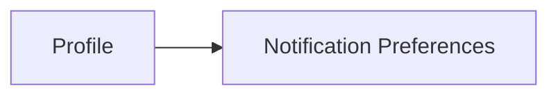
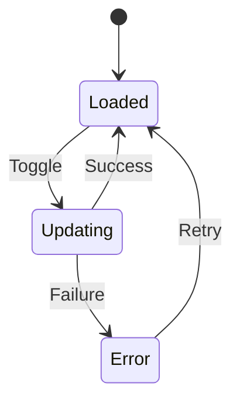

# Student Web UX — Profile → Notification Preferences

## 1. Product Job

Notification Preferences gives the student control over what notifications they receive.

It answers:

> “What do I want NST Events to notify me about?”

The screen should be extremely simple:

```text id="e6kq3p"
SEE WHAT I WANT
↓
TURN IT ON / OFF
↓
DONE
```

There should be no complicated settings hierarchy.

---

## 2. Entry Point

The primary path is:

```text id="1x7m8c"
Profile
↓
Notification Preferences
```

The screen should not be exposed as a primary navigation destination.



---

## 3. Screen

```text id="p7m3k1"
┌──────────────────────────────────────────────────────────────┐
│ ← Profile                                                    │
│                                                              │
│ Notifications                                                │
│ Choose what you want to hear about.                         │
│                                                              │
│ ──────────────────────────────────────────────────────────── │
│                                                              │
│ Push notifications                              [ ON ]       │
│ Receive notifications from NST Events.                      │
│                                                              │
│ Event reminders                                 [ ON ]       │
│ Reminders for events you're registered for.                  │
│                                                              │
│ Club announcements                              [ ON ]       │
│ Updates from clubs you're part of.                           │
│                                                              │
│ Attendance alerts                               [ ON ]       │
│ Attendance and attendance-related updates.                   │
│                                                              │
└──────────────────────────────────────────────────────────────┘
```

That is intentionally almost the entire screen.

---

## 4. Mental Model

The student should think:

```text id="r4k9q2"
Do I want notifications?
        ↓
What kinds?
        ↓
Set them once
```

Not:

```text id="b7m3w1"
Configure notification delivery architecture
```

---

## 5. Settings

The current product model defines four independent notification controls:

```text id="e7c2p5"
pushEnabled
eventReminders
clubAnnouncements
attendanceAlerts
```

These should be presented using student-facing labels rather than backend field names.

---

## 6. Push Notifications

```text id="z7k2m3"
Push notifications                         [ ON ]
Receive notifications from NST Events.
```

This is the broad delivery control.

The exact relationship between this setting and the category toggles must follow backend behavior.

Do not invent precedence rules if they are not defined.

---

## 7. Event Reminders

```text id="q5m8x2"
Event reminders                           [ ON ]

Reminders for events you're registered for.
```

This allows the student to decide whether they want reminders around their commitments.

---

## 8. Club Announcements

```text id="v3n7k1"
Club announcements                        [ ON ]

Updates from clubs you're part of.
```

Use the actual notification semantics supported by the backend.

If the backend does not generate club announcement notifications, do not create this control merely because the product concept sounds useful.

---

## 9. Attendance Alerts

```text id="m2q6w8"
Attendance alerts                         [ ON ]

Attendance and attendance-related updates.
```

This can cover student-relevant attendance notifications where supported.

---

## 10. No Save Button by Default

Use immediate persistence.

Preferred interaction:

```text id="x9k4p7"
Student changes toggle
↓
Save automatically
↓
Server confirms
↓
Done
```

The student should not have to:

```text id="h2p7n5"
change setting
→ scroll
→ find Save
→ confirm
```

unless the backend specifically requires a batch-save model.

---

## 11. Update Feedback

The screen should give lightweight feedback.

For example:

```text id="c8m3y6"
Saved
```

or simply reflect the confirmed state without creating unnecessary toast notifications.

The student should not be interrupted every time they toggle a setting.

---

## 12. Failed Update

If an update fails:

```text id="g6k1p9"
Couldn't save this setting.

Please try again.
```

The control must return to the actual persisted state if the backend rejects the mutation.

Do not leave an incorrect toggle state on screen.

---

## 13. No Optimistic Persistence

The interaction should follow:

```text id="q5x8r2"
Toggle
↓
Updating
↓
Server confirmation
↓
Saved state
```

The product's broader no-optimistic-UI principle should remain consistent here.

If the architecture deliberately uses optimistic local preference updates, document that separately rather than assuming it.

---

## 14. Push Permission vs Preference

Do not confuse:

```text id="4k9m2p"
NST Events notification preference
```

with:

```text id="u7x1q3"
Browser/device notification permission
```

The Profile screen controls the application's preference.

Browser permission is controlled by the browser/platform.

If browser permission is required, explain it only when relevant.

Do not create a permanent browser-permission wizard.

---

## 15. Push Disabled State

If `pushEnabled` is off, category settings may still technically retain their values.

Do not invent UI behavior such as automatically turning every category off unless the backend actually defines that relationship.

The screen should reflect the real stored state.

If the backend treats categories as ineffective while push is disabled, explain that subtly:

```text id="n4q7w2"
Push notifications are off.
Notification category preferences will remain saved.
```

Only add this if supported by actual semantics.

---

## 16. Notification Preference States

Conceptually:



The individual controls remain independent.

---

## 17. Loading

Show the preference structure immediately with skeleton values.

```text id="f5q8m2"
Notifications

████████████████████

Push notifications                    ███
████████████████                    ███

Event reminders                       ███
████████████████                    ███

Club announcements                    ███
████████████████                    ███

Attendance alerts                     ███
████████████████                    ███
```

Do not block the entire Profile experience unnecessarily.

---

## 18. Error

If preferences cannot be loaded:

```text id="y3k7p1"
Couldn't load your notification preferences.

[ Retry ]
```

Do not show switches with fake/default states.

---

## 19. Accessibility

Every control must communicate:

```text id="m8x2c5"
Setting name
Current state
```

For example:

```text id="v7n3q9"
Event reminders
On
```

The toggle must not rely only on color.

Keyboard users should be able to move through every setting and toggle it.

---

## 20. Mobile

The mobile version should simply stack the settings:

```text id="p3x7n5"
← Profile

Notifications
Choose what you want to hear about.

Push notifications                      ON

Event reminders                          ON
Reminders for registered events.

Club announcements                       ON

Attendance alerts                        ON
Attendance and related updates.
```

No nested screens are necessary.

---

## 21. Desktop

Use a constrained settings column.

```text id="m5q9v2"
┌────────────────────────────────────────────────────────────┐
│ Notifications                                              │
│ Choose what you want to hear about.                        │
│                                                            │
│ Push notifications                            [ ON ]       │
│ Receive notifications from NST Events.                    │
│                                                            │
│ Event reminders                               [ ON ]       │
│ Reminders for events you're registered for.                │
│                                                            │
│ Club announcements                            [ ON ]       │
│ Updates from clubs you're part of.                         │
│                                                            │
│ Attendance alerts                             [ ON ]       │
│ Attendance and attendance-related updates.                │
└────────────────────────────────────────────────────────────┘
```

Do not spread controls across multiple columns.

---

## 22. Return Navigation

The back action should return to Profile.

```text id="q4m8s2"
Profile
→ Notification Preferences
→ Back
→ Profile
```

Browser back should behave naturally as well.

---

## 23. Notification Inbox Relationship

Keep the distinction:

```text id="g2p7n4"
Notifications
= What happened?

Notification Preferences
= What do I want to receive?
```

Do not duplicate the inbox inside Preferences.

---

## 24. No Notification History

Do not add:

```text id="z3y8m1"
Notification history
Notification analytics
Notification delivery logs
Read statistics
```

The inbox owns history.

---

## 25. No Complex Categorization

Do not turn preferences into:

```text id="k4p9x3"
Events
├── reminders
├── registration
├── capacity
├── cancellation
└── changes

Teams
├── invites
├── members
└── registration

Attendance
├── open
├── checked in
└── disputes
```

unless the backend explicitly supports that granularity.

The current product model calls for four broad controls.

---

## 26. Final Architecture

```text id="x8m3q6"
PROFILE
│
└── Notification Preferences
    │
    ├── Push Notifications
    ├── Event Reminders
    ├── Club Announcements
    └── Attendance Alerts
```

---

## 27. Core UX Principle

The student should be able to configure notifications in under ten seconds.

The ideal experience:

```text id="p7q2w5"
Open
↓
Read four options
↓
Toggle what they don't want
↓
Leave
```

There should be no save workflow, no notification taxonomy, and no configuration maze unless the backend requires it.

---

## 28. Backend Contract

Before implementation, verify:

```text id="f9m2k8"
Notification preference retrieval
pushEnabled
eventReminders
clubAnnouncements
attendanceAlerts
Preference update mutation
Update validation
Current persisted state
Browser/device permission interaction
```

The final UI must reflect actual backend semantics, especially the relationship between the master push setting and individual notification categories.
