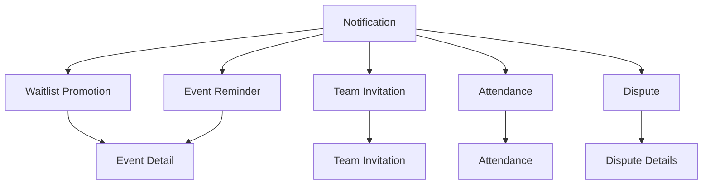
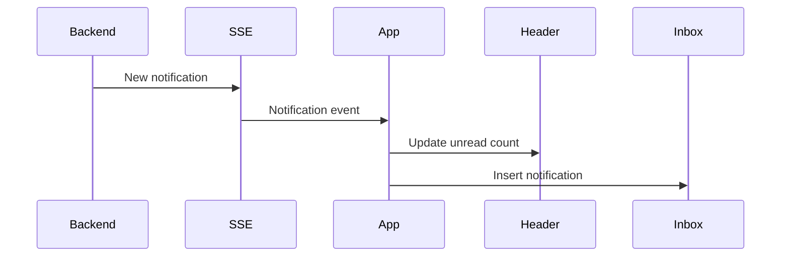
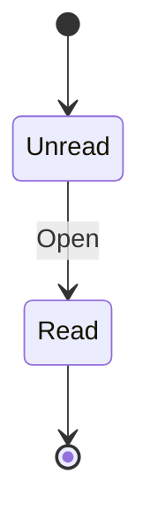

# Student Web UX — Notifications

## 1. Product Job

Notifications are the student's live activity center.

The screen should answer:

> "What just happened to me, and what can I do about it?"

It should feel dynamic, useful, and contextual.

The student should be able to glance at the screen and immediately recognize:

```text
WHAT HAPPENED
↓
WHY IT MATTERS
↓
WHAT I CAN DO
```

Unlike a traditional notification inbox, notifications should behave as mini entry points into the product.

---

## 2. Product Personality

The experience should feel closer to:

```text
Zomato
Swiggy
Spotify
Google Calendar
```

than:

```text
Email inbox
System notification log
Admin audit table
```

The notification should feel written for the student.

Bad:

```text
WAITLIST_PROMOTED
Registration ID: 82f3...
```

Good:

```text
You're in! 🎉

A spot opened up for Hackathon and you're now registered.

Sep 12 · 10:00 AM
[ VIEW EVENT ]
```

The backend event type should never leak into the UX.

---

## 3. Screen Structure

```text
┌─────────────────────────────────────────────────────────────────────────────┐
│ Notifications                                      Mark all as read        │
│                                                                             │
│ [ All ] [ Unread ]                                                         │
│                                                                             │
│ TODAY                                                                       │
│                                                                             │
│ ┌─────────────────────────────────────────────────────────────────────────┐ │
│ │ 🎉 YOU'RE IN                                                             │ │
│ │                                                                         │ │
│ │ A spot opened up for Hackathon.                                         │ │
│ │ You're now registered.                                                   │ │
│ │                                                                         │ │
│ │ Sep 12 · 10:00 AM · Main Auditorium                                   │ │
│ │                                                                         │ │
│ │                              [ VIEW EVENT ]                             │ │
│ │                                                                         │ │
│ │ 8 min ago                                                               │ │
│ └─────────────────────────────────────────────────────────────────────────┘ │
│                                                                             │
│ ┌─────────────────────────────────────────────────────────────────────────┐ │
│ │ 👥 TEAM INVITATION                                                       │ │
│ │                                                                         │ │
│ │ Riya invited you to join "Merge Conflicts".                             │ │
│ │                                                                         │ │
│ │ Hackathon · Sep 12                                                      │ │
│ │                                                                         │ │
│ │ [ DECLINE ]                         [ VIEW INVITATION ]                 │ │
│ │                                                                         │ │
│ │ 1h ago                                                                  │ │
│ └─────────────────────────────────────────────────────────────────────────┘ │
│                                                                             │
│ ┌─────────────────────────────────────────────────────────────────────────┐ │
│ │ 📍 ATTENDANCE IS OPEN                                                    │ │
│ │                                                                         │ │
│ │ AI/ML Workshop is ready for check-in.                                  │ │
│ │ Closes in 24 min.                                                       │ │
│ │                                                                         │ │
│ │                              [ CHECK IN ]                               │ │
│ │                                                                         │ │
│ │ 2h ago                                                                  │ │
│ └─────────────────────────────────────────────────────────────────────────┘ │
│                                                                             │
│ YESTERDAY                                                                   │
│                                                                             │
│ ┌─────────────────────────────────────────────────────────────────────────┐ │
│ │ ✓ DISPUTE APPROVED                                                      │ │
│ │                                                                         │ │
│ │ Your attendance issue for AI Workshop was approved.                    │ │
│ │                                                                         │ │
│ │                              [ VIEW DETAILS ]                           │ │
│ │                                                                         │ │
│ │ Yesterday                                                               │ │
│ └─────────────────────────────────────────────────────────────────────────┘ │
└─────────────────────────────────────────────────────────────────────────────┘
```

The key difference is that each notification is a contextual interaction card.

---

## 4. Notification Card Anatomy

Every important notification should follow:

```text
id="happen"
        ↓
context
        ↓
consequence
        ↓
action
```

Example:

```text
🎉 YOU'RE IN

A spot opened up for Hackathon.
You're now registered.

Sep 12 · 10:00 AM

[ VIEW EVENT ]
```

This is much stronger than:

```text
Waitlist promotion
2h ago
```

---

## 5. Notification Types

Represent notifications according to student intent.

Examples:

```text
🎉 YOU'RE IN
Team invitation
📍 Attendance is open
✓ Attendance recorded
✓ Dispute approved
✕ Dispute rejected
⏰ Event reminder
```

These labels should be generated from actual notification types.

Do not invent notification categories the backend doesn't produce.

---

## 6. High-Value Notifications

Not all notifications deserve the same interaction.

### Action-required

These should contain an obvious CTA:

```text
Team invitation
[ VIEW INVITATION ]

Attendance open
[ CHECK IN ]

Upcoming event reminder
[ VIEW EVENT ]
```

### State change

These explain what changed:

```text
You're in!
You were moved from the waitlist.
```

CTA:

```text
[ VIEW EVENT ]
```

### Informational

These can simply open a destination:

```text
Your dispute was approved.
[ VIEW DETAILS ]
```

---

## 7. Notification Priority

The inbox should visually prioritize actionable notifications without destroying chronological order.

Conceptually:

```text
ACTION REQUIRED
↓
IMPORTANT STATE CHANGE
↓
INFORMATIONAL
```

But within the same priority level, maintain chronological ordering.

Do not reorder a week-old notification above a newer notification merely because it is technically "important."

---

## 8. Notification Card Density

A notification should be glanceable.

Target:

```text
1–2 sentence message
1 context line
1 CTA
timestamp
```

Avoid:

```text
long paragraphs
technical metadata
multiple secondary links
five buttons
```

---

## 9. Action Design

The CTA should reflect the actual next step.

Examples:

```text
Team invitation
→ VIEW INVITATION

Waitlist promotion
→ VIEW EVENT

Attendance open
→ CHECK IN

Dispute approved
→ VIEW DETAILS

Event reminder
→ VIEW EVENT
```

The student should never have to figure out where to go next.

---

## 10. Multiple Actions

Only workflows that genuinely require two decisions should expose two actions.

Example:

```text
TEAM INVITATION

Riya invited you to join "Merge Conflicts".

[ DECLINE ]       [ VIEW INVITATION ]
```

Prefer opening the invitation rather than putting `Accept` directly in the notification unless the backend/API and interaction model support direct acceptance cleanly.

The notification is an entry point, not necessarily the entire workflow.

---

## 11. Unread State

Unread notifications should feel alive but not noisy.

Example:

```text
● 🎉 YOU'RE IN
```

or subtle background emphasis.

Use multiple cues:

```text
unread indicator
font weight
background treatment
```

Do not rely only on color.

---

## 12. Read Transition

Preferred behavior:

```text
Unread
↓
Student opens/clicks
↓
Marked as read
↓
Destination opens
```

The unread indicator disappears.

Where backend semantics require confirmation, wait for the server result instead of pretending the operation succeeded.

---

## 13. Mark All as Read

If backend support exists:

```text
Mark all as read
```

should be a low-emphasis header action.

After success:

```text
All notifications
↓
Read state
```

Do not show a large confirmation dialog for this.

---

## 14. Notification Grouping

Use human time groups:

```text
TODAY
YESTERDAY
EARLIER
```

This makes the inbox feel more like an activity timeline.

Avoid grouping into:

```text
Attendance
Teams
Disputes
Events
```

because those are backend/product categories rather than how users naturally remember notifications.

---

## 15. Rich Context

A notification should contain enough context so the student does not always need to open the destination.

For example:

```text
🎉 YOU'RE IN

Hackathon
Coding Club

A spot opened up and you're now registered.

Sep 12 · 10:00 AM
Main Auditorium

[ VIEW EVENT ]
```

Versus:

```text
Waitlist promotion
[ View ]
```

The first makes the notification useful even without opening it.

---

## 16. Event Reminder

An event reminder should feel like a useful nudge.

Example:

```text
⏰ STARTING SOON

Your AI/ML Workshop starts in 30 minutes.

4:00 PM · Lab 3

[ VIEW EVENT ]
```

Only generate this kind of notification if the backend actually produces event reminders.

---

## 17. Attendance Notification

Attendance should be highly actionable.

Example:

```text
📍 ATTENDANCE IS OPEN

AI/ML Workshop
Lab 3

Check in before 4:45 PM.

[ CHECK IN ]
```

This should deep-link directly into the attendance experience.

No intermediate screen unless the technical architecture requires one.

---

## 18. Team Invitation

Example:

```text
👥 TEAM INVITATION

Riya invited you to join:

Merge Conflicts

Hackathon · Sep 12

[ VIEW INVITATION ]
```

The notification should identify the person, team, and relevant event when those values are available.

---

## 19. Waitlist Promotion

This should be one of the most satisfying notifications.

Example:

```text
🎉 YOU'RE IN

A spot opened up for Hackathon.

You're now registered.

Sep 12 · 10:00 AM

[ VIEW EVENT ]
```

The copy communicates consequence immediately.

There is no additional acceptance step because promotion is automatic.

The product explicitly defines automatic promotion and immediate notification when a place becomes available.

---

## 20. Dispute Resolution

Approved:

```text
✓ ATTENDANCE ISSUE RESOLVED

Your attendance dispute for AI/ML Workshop
was approved.

[ VIEW DETAILS ]
```

Rejected:

```text
ATTENDANCE ISSUE RESOLVED

Your dispute for AI/ML Workshop was rejected.

[ VIEW DETAILS ]
```

Use neutral language.

Do not expose reviewer internals.

---

## 21. Notification → Destination Map



Each notification should have an explicit destination.

---

## 22. Realtime New Notification

When a notification arrives while the student is using the app:



The student should not be interrupted by a modal for every event.

Use:

```text
unread badge
+
subtle in-app indication
```

A high-priority attendance notification can be reflected on Home as well.

---

## 23. Notification Interaction States

Each notification can conceptually move through:



For action-required notifications, the workflow itself may have a separate state.

Example:

```text
Unread notification
→ Open invitation
→ Invitation accepted
→ Notification remains historical
```

Do not mutate the notification into a completed task unless backend semantics explicitly support that.

---

## 24. Empty State

A good empty state should feel positive:

```text
You're all caught up.

New campus updates will appear here.
```

Avoid:

```text
No records found.
```

The student isn't searching a database.

---

## 25. All / Unread

Keep only:

```text
[ ALL ] [ UNREAD ]
```

No filters by notification type.

If a student wants to find a particular event, the relevant destination should contain that information.

---

## 26. Notification Persistence

The inbox should preserve notifications as a useful timeline.

Don't automatically delete them once opened.

Opening should primarily transition:

```text
Unread
→ Read
```

not:

```text
Unread
→ disappear
```

---

## 27. Notification Expiration

Some notifications become stale.

For example:

```text
Attendance is open
```

after the session closes.

The notification should remain as history but its CTA can change/disappear if the destination is no longer actionable.

Example:

```text
📍 Attendance was open

AI/ML Workshop

The attendance window has ended.
```

Only implement this if the backend provides enough state information.

---

## 28. Failed Destination

If a notification points to something the student can no longer access:

```text
This item is no longer available.

The notification has been kept in your activity history.
```

Do not leave the user on a broken page.

---

## 29. Loading

Use notification skeletons.

Keep:

```text
Header
Tabs
```

visible during loading.

---

## 30. Error

```text
Couldn't load your notifications.

[ Retry ]
```

No full-screen failure if only the notification list failed.

---

## 31. Desktop

Keep the notification content centered and readable.

```text
┌───────────────────────────────────────────────────────────────┐
│ Notifications                       Mark all as read         │
│                                                               │
│ [ All ] [ Unread ]                                           │
│                                                               │
│ TODAY                                                         │
│                                                               │
│ ┌───────────────────────────────────────────────────────────┐ │
│ │ 🎉 YOU'RE IN                                             │ │
│ │                                                         │ │
│ │ A spot opened up for Hackathon.                         │ │
│ │ You're now registered.                                  │ │
│ │                                                         │ │
│ │ Sep 12 · 10:00 AM                         [ VIEW EVENT ]│ │
│ │ 8 min ago                                                │ │
│ └───────────────────────────────────────────────────────────┘ │
│                                                               │
│ ┌───────────────────────────────────────────────────────────┐ │
│ │ 👥 TEAM INVITATION                                       │ │
│ │                                                         │ │
│ │ Riya invited you to join "Merge Conflicts".             │ │
│ │                                                         │ │
│ │ Hackathon · Sep 12                       [ OPEN ]       │ │
│ │ 1h ago                                                    │ │
│ └───────────────────────────────────────────────────────────┘ │
└───────────────────────────────────────────────────────────────┘
```

---

## 32. Mobile

Use full-width cards.

```text
Notifications

[ All ] [ Unread ]

TODAY

🎉 YOU'RE IN
A spot opened up for Hackathon.
You're now registered.

[ VIEW EVENT ]
8 min ago

👥 TEAM INVITATION
Riya invited you to join
"Merge Conflicts".

[ VIEW INVITATION ]
1h ago
```

The CTA should remain easy to tap.

---

## 33. What We Do Not Add

Do not add:

```text
Likes
Comments
Replies
Notification reactions
Social feed
Notification categories as tabs
Complex filtering
Priority management by student
Email-style folders
```

Interactive does not mean complicated.

The interactivity should come from meaningful actions.

---

## 34. Product Principle

A notification is not merely a message.

It is:

```text
EVENT
↓
CONTEXT
↓
CONSEQUENCE
↓
ACTION
```

For example:

```text
WAITLIST PROMOTION

A spot opened.
↓
You're now registered.
↓
Hackathon is Sep 12.
↓
VIEW EVENT
```

That is why the experience can feel significantly more alive without introducing unnecessary social features.

---

## 35. Final Screen Architecture

```text
NOTIFICATIONS
│
├── All | Unread
│
├── Today
│   ├── Action notification
│   ├── State-change notification
│   └── Reminder
│
├── Yesterday
│   └── Historical notifications
│
└── Earlier
    └── Historical notifications
```

Every important notification contains:

```text
TYPE
+
CONTEXT
+
CONSEQUENCE
+
ACTION
+
TIME
```

The screen should feel like the campus is communicating with the student, while every interaction leads directly into the relevant part of NST Events.

---

## Backend Data

- `GET /notifications`
- `PATCH /notifications/:id/read`
- `PATCH /notifications/read-all`
