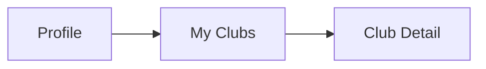
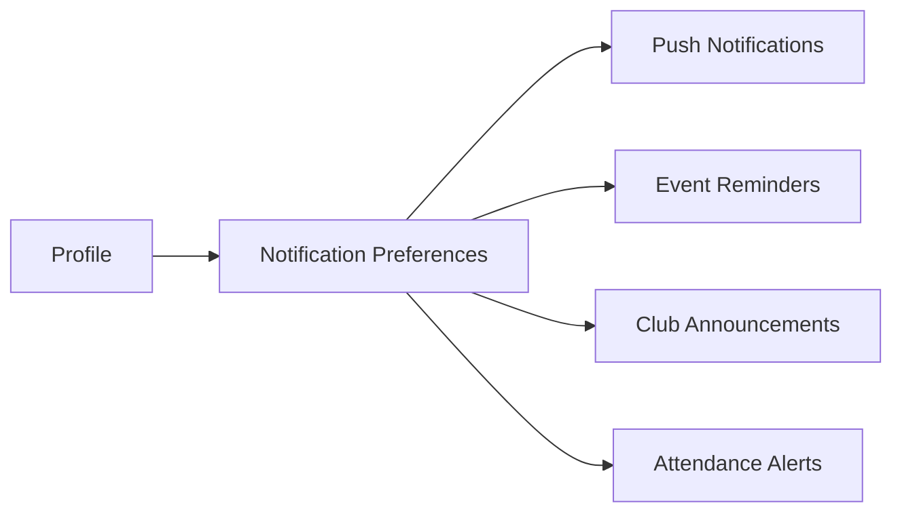
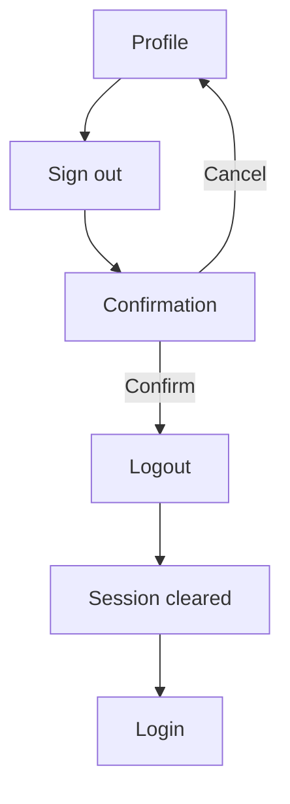
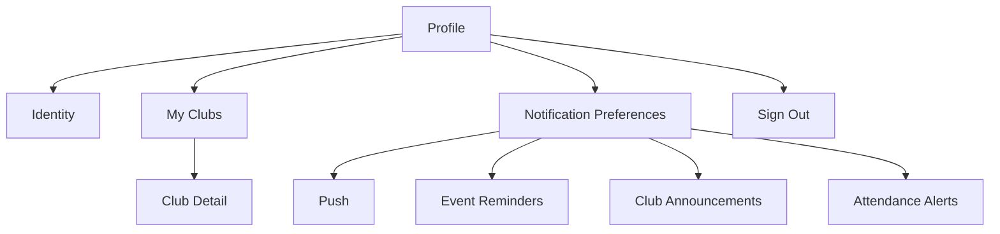

# Student Web UX — Profile

## 1. Product Job

Profile is the student's personal identity and control space.

It answers:

```text
Who am I here?
Where do I belong?
What notifications do I receive?
How do I control my account?
```

Profile should be intentionally quiet.

It is not another dashboard and should not duplicate Home, My Events, Campus, or Leaderboard.

---

## 2. Student Mental Model

The student should feel:

```text
"This is me."
```

The experience should move through:

```text
IDENTITY
↓
BELONGING
↓
CONTROL
↓
ACCOUNT
```

This creates a natural psychological progression:

```text
Who I am
→
Where I belong
→
What I receive
→
What I control
```

---

## 3. Screen Structure

```text
PROFILE

┌──────────────────────────────────────────────────────┐
│                                                      │
│                     Avatar                           │
│                                                      │
│                 Soham Dhande                         │
│               soham@adypu.edu.in                    │
│                    Student                           │
│                                                      │
└──────────────────────────────────────────────────────┘

YOUR CAMPUS

┌──────────────────────────────────────────────────────┐
│ My Clubs                                      2 →   │
│ Coding Club · ML Club                              │
└──────────────────────────────────────────────────────┘

STAY IN THE LOOP

┌──────────────────────────────────────────────────────┐
│ Notification preferences                       →   │
│ Choose what you want to hear about.                │
└──────────────────────────────────────────────────────┘

ACCOUNT

┌──────────────────────────────────────────────────────┐
│ Sign out                                        →   │
└──────────────────────────────────────────────────────┘
```

There should be no additional dashboard content.

---

## 4. Global Navigation

The student remains inside the global application shell:

```text
Home
Campus
My Events
Profile
```

Profile is the active destination.

The header should not duplicate the full navigation.

---

## 5. Page Header

Use:

```text
Profile
```

Optionally:

```text
Manage your account and preferences.
```

Keep this subtle.

The identity card should carry most of the visual weight.

---

## 6. Identity Card

The identity card is the first thing the student sees.

It should answer:

```text
Who am I?
Which account is this?
```

Display:

```text
Avatar
Name
Institutional email
Student identity
```

Example:

```text
┌──────────────────────────────────────────────┐
│                                              │
│                  ◉                           │
│                                              │
│             Soham Dhande                     │
│             soham@adypu.edu.in               │
│             Student                           │
│                                              │
└──────────────────────────────────────────────┘
```

---

## 7. Identity Psychology

The identity card is primarily reassurance.

The student should immediately recognize:

```text
This is my account.
```

Do not overload it with:

```text
Points
Rank
Events attended
Attendance percentage
Club count
Activity statistics
```

Those belong in other product areas.

---

## 8. Profile Editing

Do not imply that institutional identity can be edited unless the backend explicitly supports it.

Avoid:

```text
Edit Name
Change Email
Edit Student ID
Change Academic Program
```

unless these capabilities actually exist.

The profile should represent authoritative institutional identity.

---

## 9. YOUR CAMPUS

This section represents belonging.

```text
YOUR CAMPUS

My Clubs
Coding Club · ML Club
2 clubs →
```

The goal is to answer:

> "Where do I belong on campus?"

This is more emotionally relevant than displaying generic account settings.

---

## 10. My Clubs Row

The row should summarize rather than duplicate the Clubs screen.

Example:

```text
┌──────────────────────────────────────────────────────┐
│ My Clubs                                     2 →    │
│ Coding Club · ML Club                              │
└──────────────────────────────────────────────────────┘
```

The student gets immediate recognition without opening another page.

---

## 11. My Clubs Navigation



The same Club Detail experience can be reused from:

```text
Campus → Clubs
```

and:

```text
Profile → My Clubs
```

The difference is the entry context.

---

## 12. No Club Membership

If the student has no memberships:

```text
YOUR CAMPUS

My Clubs
You're not part of any clubs yet.
```

Do not create a fake membership action.

Since club membership is administratively assigned, the student should not see:

```text
Join a club
Request membership
Follow club
```

unless those capabilities are later supported.

The current product requirements explicitly define club membership as admin-granted rather than self-service.

---

## 13. STAY IN THE LOOP

Notification settings belong under Profile because they represent personal control.

Use human language:

```text
STAY IN THE LOOP

Notification preferences
Choose what you want to hear about.
```

Do not expose technical names such as:

```text
pushEnabled
eventReminders
attendanceAlerts
```

on the Profile landing page.

---

## 14. Notification Preferences Navigation



The underlying product model has four independent notification controls.

---

## 15. Notification Preferences Screen

The detailed settings screen should contain the actual controls:

```text
Notifications

Choose what you want to hear about.

Push notifications                         ON/OFF

Event reminders                            ON/OFF
Reminders for registered events.

Club announcements                         ON/OFF

Attendance alerts                          ON/OFF
Attendance windows and dispute updates.
```

Each setting should clearly communicate its current state.

---

## 16. Preference Interaction

The conceptual interaction:

```text
Student changes setting
↓
Backend update
↓
Server confirms
↓
UI reflects saved state
```

Do not leave a visually successful toggle if the backend update failed.

The product's no-optimistic-UI principle should be respected for these mutations as well.

---

## 17. Preference Failure

If a setting update fails:

```text
Couldn't update your preferences.

Please try again.
```

The control should return to or remain at the actual persisted state.

---

## 18. ACCOUNT

Account should be the smallest section.

Example:

```text
ACCOUNT

Sign out                                      →
```

The student generally has no reason to spend time here.

---

## 19. Sign Out

Because sign out ends the current authenticated session, use deliberate confirmation.



The exact session behavior must follow the application's authentication implementation.

---

## 20. Profile Does Not Need a Dashboard

Do not add:

```text
Activity
Statistics
Leaderboard Rank
Events Attended
Points
Recent Notifications
Upcoming Events
```

The student already has dedicated surfaces for these.

The profile screen should remain personal and calm.

---

## 21. Complete Information Hierarchy

```text
PROFILE
│
├── IDENTITY
│   ├── Avatar
│   ├── Name
│   ├── Email
│   └── Student identity
│
├── YOUR CAMPUS
│   └── My Clubs
│
├── STAY IN THE LOOP
│   └── Notification Preferences
│
└── ACCOUNT
    └── Sign Out
```

---

## 22. Screen Navigation



---

## 23. Loading State

Use structural skeletons.

Identity:

```text
████████████
████████████
████████
```

Settings:

```text
████████████████────────
████████████████────────
```

Maintain the final page structure while loading.

---

## 24. Error State

For profile data:

```text
Couldn't load your profile.

[ Retry ]
```

Do not remove navigation.

For preferences:

```text
Couldn't load notification preferences.

[ Retry ]
```

Keep the rest of Profile usable.

---

## 25. Session Expiration

If the student's session expires:

```text
Profile
↓
Session invalid
↓
Normal authentication flow
```

Do not leave the user on a partially functioning authenticated screen.

---

## 26. Responsive Design

### Desktop

Use a constrained content column.

```text
Identity card
↓
Settings rows
```

Avoid filling the entire available width.

### Mobile Web

Use full-width stacked sections.

```text
Identity
My Clubs
Notification Preferences
Sign Out
```

The information hierarchy remains unchanged.

---

## 27. Accessibility

Identity:

```text
Name
Email
Role
```

must be semantically readable.

Navigation rows should have clear accessible labels.

Notification controls should communicate:

```text
Setting name
Current state
```

Sign out should be keyboard accessible.

Focus states must remain visible.

---

## 28. Microcopy Philosophy

Use human concepts.

Prefer:

```text
My Clubs
Notification preferences
Sign out
```

Avoid:

```text
Membership records
Push configuration
Session termination
```

The student should never feel like they are operating an administrative system.

---

## 29. Visual Hierarchy

The screen should visually communicate:

```text
ME
↓
MY COMMUNITY
↓
MY PREFERENCES
↓
MY ACCOUNT
```

Identity gets the strongest visual treatment.

Settings remain secondary.

Sign out remains visually quiet.

---

## 30. Final UX Principle

Profile should feel like the one place in NST Events that belongs entirely to the student.

The emotional progression is:

```text
This is me.
        ↓
These are my communities.
        ↓
These are my preferences.
        ↓
This is my account.
```

Nothing should compete with that.

---

## 31. Backend Contract

Before implementation, verify:

```text
Current user/profile data
Student identity fields
My club memberships
Notification preferences
Preference mutation
Logout/session behavior
```

Every displayed field must have a known backend source.

Every editable setting must have a supported mutation.

Do not introduce profile functionality merely because it would be visually useful.

---

## Technical Details

**Route**
`/profile`

**Backend Mutations**
- `PATCH /notifications/preferences`
- *Note: User name, email, and batch are not editable by the student.*
