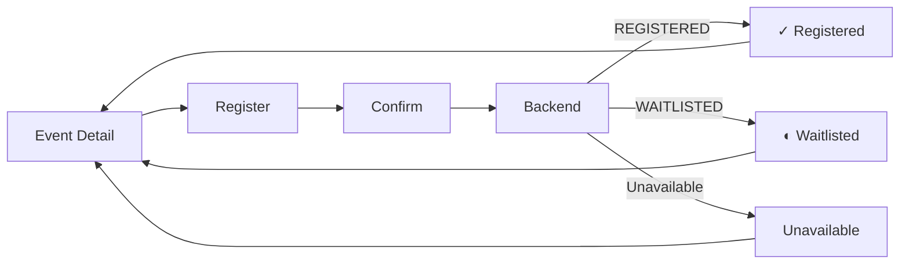

# Student UX — Registration Interaction

## Product Decision

Registration is not a standalone screen.

It is an interaction embedded directly within Event Detail.

The student's experience is:

```text
Event Detail
↓
Register
↓
Confirm
↓
Server response
↓
Registered / Waitlisted / Unavailable
```

There is no separate registration page.

---

## Individual Event

### Before registration

```text
YOUR PARTICIPATION

You're not registered.

[ REGISTER ]
```

### Register interaction

Clicking `REGISTER` opens a compact confirmation dialog.

```text
┌──────────────────────────────────────────────┐
│ Register for Hackathon?                     │
│                                              │
│ Sep 12 · 10:00 AM                            │
│ Main Auditorium                              │
│                                              │
│ [ Cancel ]                 [ Confirm ]       │
└──────────────────────────────────────────────┘
```

No additional form fields are required when the backend already knows the student's identity.

---

## Submission

After confirmation:

```text
Confirm
↓
Submitting
↓
Backend response
```

The frontend must not assume success.

---

## Registered Result

The Event Detail state updates in place:

```text
YOUR PARTICIPATION

✓ REGISTERED

You're registered for this event.

[ VIEW IN MY EVENTS ]
```

The student remains on Event Detail.

`View in My Events` is optional navigation, not an automatic redirect.

---

## Waitlisted Result

If capacity is unavailable and the backend returns a waitlist result:

```text
YOUR PARTICIPATION

◐ WAITLISTED

We'll notify you automatically if a place becomes available.
```

The state updates in place.

There is no separate waitlist page.

---

## Registration Unavailable

If the backend rejects registration because the event is unavailable, locked, closed, or otherwise not registrable:

```text
Registration is currently unavailable.
```

The exact message should follow the backend error/state semantics.

---

## Duplicate Registration

If the backend reports that the student is already registered, resolve the UI to the existing state:

```text
✓ REGISTERED
```

Do not open another registration flow.

---

## Capacity Race

If the event changes between viewing Event Detail and submitting registration, the backend result is authoritative.

Example:

```text
Event Detail
→ Register
→ Confirm
→ Backend
→ WAITLISTED
```

The frontend must not assume that previously displayed capacity is still available.

---

## Cancellation

Cancellation remains part of Event Detail.

Flow:

```text
Registered
↓
Cancel registration
↓
Confirmation
↓
Backend
↓
Cancelled
```

There is no separate cancellation page.

Confirmation:

```text
Cancel registration?

You'll give up your place in this event.

[ Keep registration ]   [ Cancel registration ]
```

After successful server confirmation:

```text
NOT REGISTERED
```

The UI must not optimistically remove the registration.

---

## Team Event

Team events do not use the individual registration interaction blindly.

The first question is the student's team relationship:

```text
Team Event
↓
Do I have a team?
```

If no team:

```text
[ CREATE TEAM ]
[ JOIN TEAM ]
```

If already on a team:

```text
Merge Conflicts
3 / 4 members

[ VIEW TEAM ]
```

The detailed team lifecycle is documented separately in the Team UX specification.

---

## Deliberate UX Rules

Remove:

```text
Separate registration page
Separate registration form
Separate registration success page
Separate waitlist page
Automatic redirect to My Events
Repeated identity fields
Registration-type selection for an already-defined individual event
```

Use:

```text
Event Detail
↓
Register
↓
Confirm
↓
Result appears in place
```

---

## Final Interaction



---

## Core Principle

Registration should feel like one deliberate commitment, not a workflow the student has to navigate.

The student experience is:

```text
Understand
↓
Decide
↓
Confirm
↓
Know the result
```
