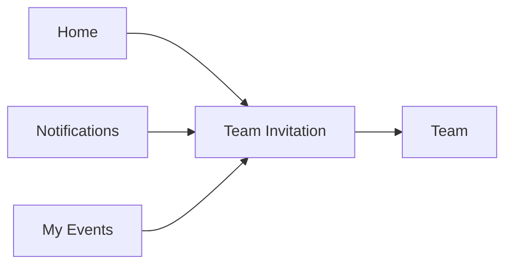
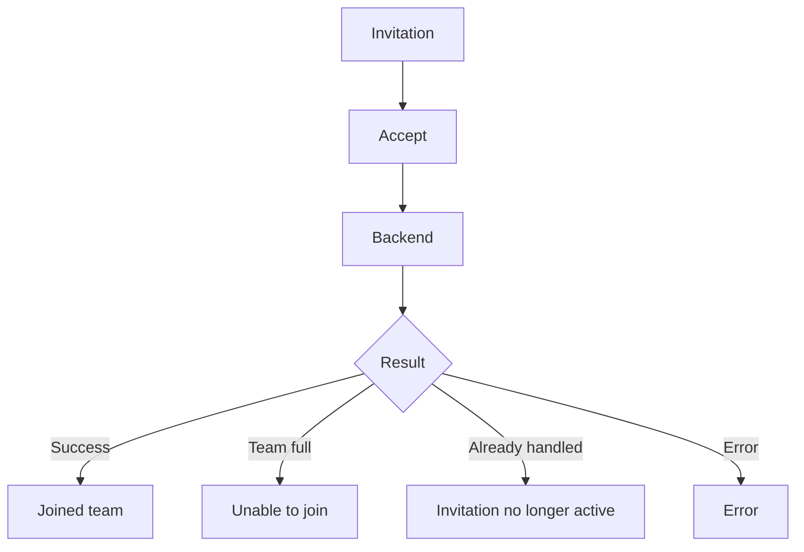
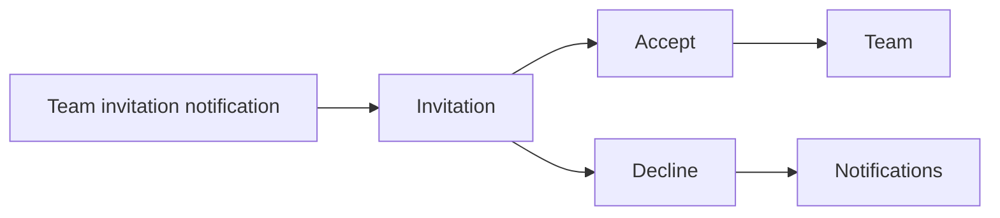
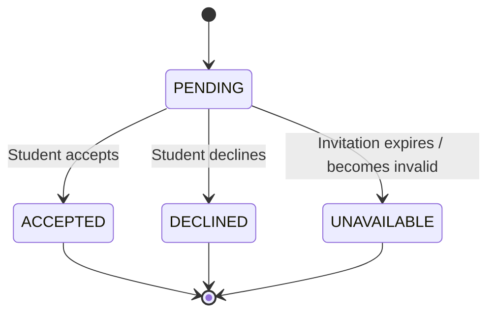
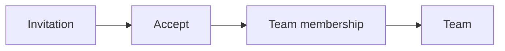

# Student Web UX — Team Invitation

## 1. Product Job

A Team Invitation is a small, high-intent interaction.

Its job is to let the student quickly understand:

Who invited me?
Which team?
For which event?
What happens if I accept?

Then make one decision:

ACCEPT
or
DECLINE

The ideal experience is:

Notification / Home
↓
Invitation
↓
Understand
↓
Accept / Decline
↓
Done

Do not turn invitation acceptance into a multi-step workflow.

## 2. Entry Points

The invitation can be reached from:

Notifications
Home
My Events

Primary discovery should happen through Notifications and Home.



## 3. Student Mental Model

The student should immediately understand:

WHO?
Riya Patel

WHAT TEAM?
Merge Conflicts

FOR WHAT?
Hackathon

WHAT HAPPENS IF I ACCEPT?
I become a team member.

No additional information should be required before making the decision.

## 4. Invitation Presentation

Prefer a compact contextual screen/dialog.

```text
┌────────────────────────────────────────────────────────────┐
│ Team Invitation                                        ✕  │
│                                                            │
│                 👥                                         │
│                                                            │
│ Riya Patel invited you                                     │
│ to join                                                     │
│                                                            │
│ Merge Conflicts                                             │
│ Hackathon                                                   │
│ Sep 12 · 10:00 AM                                          │
│                                                            │
│ 3 / 4 members                                              │
│                                                            │
│ If you accept, you'll join this team for the event.       │
│                                                            │
│ [ DECLINE ]                         [ ACCEPT ]             │
└────────────────────────────────────────────────────────────┘
```

The invitation should contain enough context to eliminate uncertainty.

## 5. Information Hierarchy

The order should be:

INVITATION
↓
PERSON
↓
TEAM
↓
EVENT
↓
TEAM CONTEXT
↓
DECISION

Do not lead with technical invitation metadata.

## 6. Inviter

Show the person who sent the invitation when the backend provides that information.

Example:

Riya Patel invited you

This establishes trust and context.

Do not show:

user_id
membership_id
invitation_id

## 7. Team

The team name should be prominent.

Merge Conflicts

The student should know exactly which group they are being asked to join.

## 8. Event Context

Always associate the team with its event where available.

Hackathon
Sep 12 · 10:00 AM

This prevents ambiguity when students receive invitations to multiple teams.

## 9. Team Size

Show current team size if available and useful:

3 / 4 members

This tells the student how established the team is.

If the team is already full:

4 / 4 members

This invitation can no longer be accepted.

Do not let the student discover this only after clicking Accept.

## 10. Primary Action

There should be one visually dominant action:

[ ACCEPT ]

The secondary action is:

[ DECLINE ]

Accept should visually dominate because it is the action that creates the student's team membership.

Neither action should be hidden behind another menu.

## 11. Accept Flow

Keep it to one decision.



Do not add a confirmation dialog unless the actual product rules require one.

For a straightforward invitation, Accept is already the deliberate decision.

## 12. Accept Success

After acceptance:

✓ You're in

You've joined Merge Conflicts.

[ VIEW TEAM ]

The preferred next destination is the Team screen.

This lets the student immediately understand:

Who else is on my team?
Are we ready?
What happens next?

## 13. Team Membership Update

After successful acceptance:

Invitation
↓
Membership created
↓
Team count increases
↓
Student appears in Members
↓
Team screen

Do not require manual page refresh if the response already provides enough information to update the UI.

## 14. Decline Flow

Declining is a simple decision.

Prefer:

[ DECLINE ]

If the product requires confirmation:

Decline this invitation?

You won't join Merge Conflicts.

[ Keep invitation ]      [ Decline ]

Do not create extra friction without a reason.

## 15. Decline Success

Invitation declined.

Then return the student to the originating context:

Notifications

or:

My Events

depending on where the invitation was opened.

## 16. Invitation Expired

If the invitation is no longer actionable:

Invitation unavailable

This invitation is no longer active.

Possible reasons may include:

expired
withdrawn
team cancelled
team full
event no longer accepting changes

Only explain a specific reason when the backend actually provides one.

## 17. Team Full

This is an important failure state.

Team full

This team has reached its maximum size.
You can't join it now.

Do not show ACCEPT if the system already knows the team is full.

If the team becomes full between opening and accepting, the backend result is authoritative.

## 18. Concurrent Accept

Example:

Student opens invitation
↓
3 / 4 members

Another student joins
↓
4 / 4

Student clicks Accept
↓
Backend rejects

The UX should explain:

This team is now full.

The invitation couldn't be accepted.

Provide:

[ BACK ]

or another relevant navigation action.

Do not pretend the student joined.

## 19. Already Handled

If the student has already accepted or declined:

This invitation has already been handled.

The app can offer:

[ VIEW TEAM ]

if they accepted.

Otherwise return them to the originating context.

## 20. Student Already in Another Team

If backend rules prohibit simultaneous team membership:

You can't join this team.

You're already on another team for this event.

Do not expose internal conflict codes.

Only include this state if the backend actually enforces it.

## 21. Authentication / Session Failure

If the student session expires while handling an invitation:

Your session has expired.

Please sign in again.

After authentication, preserve the invitation destination where technically possible.

## 22. Notification Integration

A team invitation notification should deep-link directly here.



The student should not have to hunt through My Events to find the invitation.

## 23. Home Integration

Home can surface invitations as immediate actions:

NOW

Team invitation
Riya invited you to join Merge Conflicts.

[ REVIEW ]

The REVIEW action opens the same invitation experience.

## 24. Notification Card vs Invitation Screen

These are different levels of detail.

Notification:

Riya invited you to join Merge Conflicts.

[ REVIEW ]

Invitation:

Who?
Riya Patel

Team?
Merge Conflicts

Event?
Hackathon

Size?
3 / 4

[ DECLINE ]   [ ACCEPT ]

The notification creates awareness.

The invitation enables the decision.

Do not put the entire decision flow inside the notification itself.

## 25. Invitation Lifecycle



Use the actual backend invitation states when finalizing.

## 26. Accept → Team

After successful acceptance:



The student should land on Team because that is now their new participation context.

## 27. No Unnecessary Confirmation

Do not use:

Invitation
→ Accept
→ Are you sure?
→ Yes
→ Joined

unless the action has unusual consequences.

Normally:

Invitation
→ Accept
→ Joined

is sufficient.

The student has already been explicitly asked to make the decision.

## 28. Minimal Interaction

The ideal interaction is:

Notification
↓
Review
↓
Accept
↓
Team

or:

Home
↓
Review
↓
Decline
↓
Done

Four or fewer meaningful interactions.

## 29. Mobile Web

The invitation should work particularly well on mobile web because students may respond from a notification.

Team Invitation

Riya Patel invited you

Merge Conflicts
Hackathon
Sep 12

3 / 4 members

[ ACCEPT ]

[ DECLINE ]

The primary decision should remain above the fold.

## 30. Desktop

Use a compact centered dialog or focused detail card.

Do not create a large dashboard for one invitation.

```text
┌──────────────────────────────────────────┐
│ Team Invitation                          │
│                                          │
│ Riya Patel invited you                   │
│                                          │
│ Merge Conflicts                          │
│ Hackathon · Sep 12                       │
│ 3 / 4 members                            │
│                                          │
│ [ DECLINE ]          [ ACCEPT ]          │
└──────────────────────────────────────────┘
```

## 31. Accessibility

The invitation must clearly communicate:

Inviter
Team
Event
Team size
Current state
Available actions

Buttons must have clear accessible names.

Focus must move into the dialog when opened.

Escape should close the dialog when closing is safe.

## 32. What We Deliberately Avoid

Do not add:

Invitation inbox
Social chat
Team messaging
Team preview analytics
Complex team comparison
Public team profile
Invite-code flow
Multi-step acceptance wizard

The invitation exists for one decision.

## 33. Final Screen Architecture

```text
TEAM INVITATION
│
├── Inviter
├── Team
├── Event
├── Team Size
│
└── Decision
    ├── Accept
    │   └── Team
    │
    └── Decline
        └── Origin
```

## 34. Core UX Principle

The student should be able to answer:

Who invited me?
        ↓
What am I joining?
        ↓
What's the event?
        ↓
Do I want in?

in seconds.

Then:

ACCEPT
↓
You're in
↓
Team

or:

DECLINE
↓
Done

No unnecessary screens.

## 35. Backend Contract

Before implementation, verify:

Invitation retrieval
Inviter information
Team information
Event information
Team capacity
Accept invitation
Decline invitation
Duplicate handling
Expired/invalid invitation
Concurrent team-full behavior
Existing team membership conflicts
Notification deep-link target
Realtime invitation updates

Every invitation state and action displayed in the UI must correspond to an actual backend capability.
