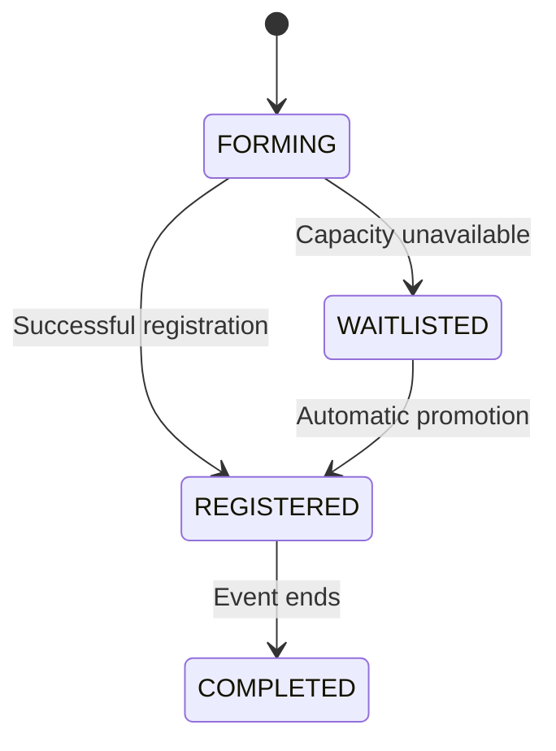
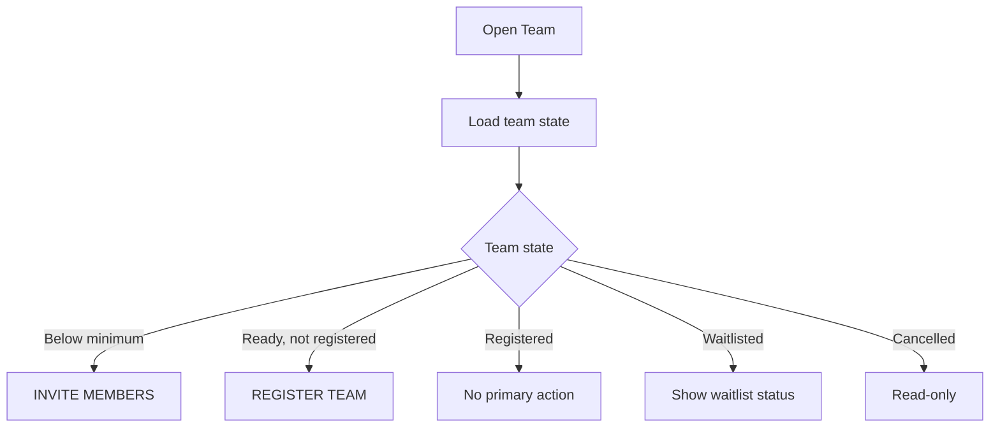
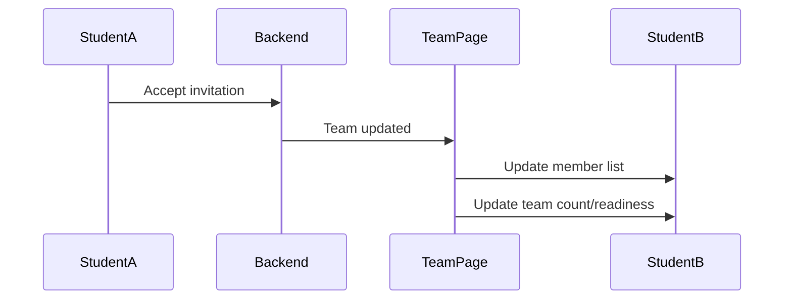

# Student Web UX — Team

## 1. Product Job

The Team screen is the single place where a student understands and manages their participation in a team event.

It should provide enough information to answer:

```text
Who is on my team?
What is our team size requirement?
Are we ready?
Are we registered or waitlisted?
Is anyone's invitation pending?
What can I do next?
```

The student should not need to visit multiple screens to understand their team status.

The design principle is:

```text
MAXIMUM INFORMATION
+
MINIMUM INTERACTION
```

---

## 2. Core Student Mental Model

The student should see:

```text
MY TEAM

Team identity
↓
Team readiness
↓
Members
↓
One relevant next action
```

The interface should progressively expose complexity only when the student needs it.

---

## 3. Primary Screen

```text
┌─────────────────────────────────────────────────────────────────────────────┐
│ ← Hackathon                                                               │
│                                                                             │
│ MY TEAM                                                                    │
│ Merge Conflicts                                                            │
│ 3 / 4 members                                             ✓ REGISTERED     │
│                                                                             │
├─────────────────────────────────────────────────────────────────────────────┤
│                                                                             │
│ ✓ TEAM READY                                                               │
│ Minimum 2 members · Maximum 4 members                                     │
│                                                                             │
│ MEMBERS                                                                     │
│                                                                             │
│ ┌─────────────────────────────────────────────────────────────────────────┐ │
│ │ ◉ Soham Dhande                                      YOU · LEADER        │ │
│ ├─────────────────────────────────────────────────────────────────────────┤ │
│ │ ◉ Riya Patel                                            MEMBER          │ │
│ ├─────────────────────────────────────────────────────────────────────────┤ │
│ │ ◉ Aarav Sharma                                          MEMBER          │ │
│ └─────────────────────────────────────────────────────────────────────────┘ │
│                                                                             │
│ ┌─────────────────────────────────────────────────────────────────────────┐ │
│ │ Team is registered.                                                     │ │
│ └─────────────────────────────────────────────────────────────────────────┘ │
│                                                                             │
│                                      [ INVITE MEMBERS ]                     │
│                                      [ LEAVE TEAM ]                        │
└─────────────────────────────────────────────────────────────────────────────┘
```

The screen should be readable in one glance.

---

## 4. Event Context

Always show the event name at the top.

```text
← Hackathon

MY TEAM
Merge Conflicts
```

The student should never wonder which event this team belongs to.

The back action returns to Event Detail.

---

## 5. Team Header

The header communicates the three most important facts:

```text
Team name
Member count
Registration state
```

Example:

```text
Merge Conflicts

3 / 4 members                     ✓ REGISTERED
```

Nothing else is needed in the header.

---

## 6. Team Readiness

Immediately below the header, show whether the team currently satisfies the event's size requirement.

### Ready

```text
✓ TEAM READY

Minimum 2 members · Maximum 4 members
```

### Not ready

```text
TEAM NOT READY

You need 1 more member.
Minimum 2 · Current 1
```

The student should never have to calculate readiness themselves.

---

## 7. Readiness as a Single Status

Do not display many separate indicators such as:

```text
Members: 3
Minimum: 2
Maximum: 4
Eligible: Yes
Registration: ...
```

Collapse them into a useful conclusion:

```text
✓ Team ready
```

with the rule underneath for verification.

This reduces cognitive load.

---

## 8. Members

Members are the main body of the screen.

Each row shows:

```text
Avatar
Name
Role
```

Example:

```text
Soham Dhande                         YOU · LEADER
Riya Patel                               MEMBER
Aarav Sharma                             MEMBER
```

The team leader should be unmistakable.

The current student should be identifiable but not visually overwhelming.

---

## 9. Pending Invitations

If backend data provides pending invitations, show them inline rather than requiring a separate page.

Example:

```text
INVITATIONS

Rohan Mehta
Invitation pending

Aisha Khan
Invitation pending
```

This immediately answers:

> "Why aren't we at full strength yet?"

Do not treat pending invitations as confirmed members.

---

## 10. Team Capacity

The member count should be instantly understandable:

```text
3 / 4
```

This tells the student both:

```text
Current size
Remaining capacity
```

If full:

```text
4 / 4 members
TEAM FULL
```

The invite action disappears or becomes unavailable.

---

## 11. Primary Action Strategy

There should be only one prominent action at any moment.

The action should represent the team's most important next step.

Examples:

```text
Team below minimum
→ INVITE MEMBERS

Team ready but not registered
→ REGISTER TEAM

Invitation pending
→ REVIEW INVITATIONS

Team registered
→ no primary action
```

Secondary actions remain quieter.

This prevents action overload.

---

## 12. Invite Members

If the student can invite members and the team has capacity:

```text
[ INVITE MEMBERS ]
```

This opens a compact interaction rather than another page.

---

## 13. Invitation Interaction

```text
┌──────────────────────────────────────────────┐
│ Invite teammate                          ✕  │
│                                              │
│ Search students                              │
│ ┌────────────────────────────────────────┐  │
│ │ 🔍 Search                               │  │
│ └────────────────────────────────────────┘  │
│                                              │
│ Riya Patel                                   │
│ Aarav Sharma                                 │
│                                              │
│                     [ INVITE ]               │
└──────────────────────────────────────────────┘
```

The student should be able to:

```text
open
search
select
invite
close
```

without leaving Team.

---

## 14. Invitation Result

Success:

```text
Invitation sent.
```

The selected person moves to:

```text
Pending invitations
```

not Members.

The member count should not increase until the invitation is accepted.

---

## 15. Team Registration

If the backend has a distinct team-registration operation, this should become the primary CTA once the team is ready.

```text
✓ TEAM READY

[ REGISTER TEAM ]
```

After server confirmation:

```text
✓ TEAM REGISTERED
```

Do not create a separate registration page.

The registration action remains inside Team.

---

## 16. Team Waitlist

If the completed team is waitlisted:

```text
◐ TEAM WAITLISTED

Your team is waiting for a place to become available.
```

If promotion is automatic:



No manual acceptance step should be introduced unless backend behavior requires one.

---

## 17. Team Registration State

Represent the state using human language:

```text
FORMING
→ Team is being built.

READY
→ Your team meets the requirements.

REGISTERED
→ Your team is registered.

WAITLISTED
→ Your team is waiting for a place.

CANCELLED
→ Team participation has ended.
```

Only include states actually supported by the backend.

---

## 18. Leave Team

Leave is always secondary.

Example:

```text
[ Leave team ]
```

Confirmation:

```text
Leave this team?

You'll no longer be part of
Merge Conflicts.

[ Stay ]          [ Leave team ]
```

The backend remains authoritative.

After success:

```text
You left the team.

[ Back to event ]
```

---

## 19. Leadership

The leader designation should be visible without opening menus.

Example:

```text
Soham Dhande
YOU · LEADER
```

A leader may have additional actions where backend authorization permits them.

Do not expose leader-only controls to ordinary members.

---

## 20. Transfer Leadership

If supported for students:

```text
Member
→ Transfer leadership
→ Confirmation
→ Server
→ New leader
```

Example:

```text
Transfer leadership to Riya?

She will become the team leader.

[ Cancel ]              [ Transfer ]
```

After success:

```text
Riya Patel
LEADER

Soham Dhande
MEMBER
```

The UI must update the student's available actions according to the new role.

---

## 21. Member Removal

Only expose member removal if the backend explicitly permits it for the current student.

Do not infer this capability merely because admins can remove members.

If supported:

```text
Member
→ Remove
→ Confirmation
→ Backend
→ Removed
```

After removal, the team count and readiness state update.

---

## 22. Invitation Acceptance

For the invited student, the experience should be separate from the Team leader/member management interface.

The notification or Home action leads to:

```text
TEAM INVITATION

Merge Conflicts
Hackathon

Invited by Riya Patel

[ DECLINE ]      [ ACCEPT ]
```

After accepting:

```text
Team membership created
↓
Team screen
↓
You appear in Members
```

---

## 23. Minimum Interaction Principle

A student should never navigate through:

```text
Team
→ Manage Members
→ Invitations
→ Add
→ Search
→ Select
→ Confirm
```

when the action can be reduced to:

```text
Team
→ Invite Members
→ Search
→ Invite
```

Likewise:

```text
Team
→ Registration
→ Confirm
→ Result
```

should remain a compact interaction.

---

## 24. State-Aware Actions

The screen should derive the action from team state.



The exact states and transitions must match the backend.

---

## 25. Team Screen Should Surface Consequences

The student should understand what their actions mean.

For example:

```text
3 / 4 members
✓ Ready
```

is better than simply:

```text
3 members
```

because the first tells them whether they need to act.

Similarly:

```text
◐ Waitlisted
```

should explain:

```text
You don't need to do anything right now.
We'll update you if your team is promoted.
```

when that behavior is supported.

---

## 26. Home Integration

Important team actions should surface on Home.

Examples:

```text
Team invitation
→ Review

Team not ready
→ Open team

Team promoted
→ View event
```

Team should not require the student to remember to check manually.

---

## 27. My Events Integration

My Events should summarize the team state.

Example:

```text
Hackathon

Merge Conflicts · 3 / 4
✓ REGISTERED

View team →
```

The Team screen remains the detailed source of team information.

---

## 28. Event Detail Integration

Event Detail should summarize the team relationship:

```text
YOUR PARTICIPATION

Merge Conflicts
3 / 4 members

✓ REGISTERED

[ VIEW TEAM ]
```

Team owns the detailed state.

---

## 29. Real-Time Changes

Teams are collaborative.

When another member:

```text
accepts an invitation
leaves
is removed
becomes leader
```

the current student's team state may change.

Where realtime infrastructure supports it:



Do not reload the entire application unnecessarily.

---

## 30. Loading

Use structural skeletons:

```text
Team name
Member count
Status
Member rows
Action
```

The final page structure should remain visible.

---

## 31. Error

For mutation failures:

```text
Couldn't update your team.

Your team hasn't changed.

[ Try again ]
```

If a concurrent change occurred:

```text
This team changed while you were viewing it.

[ Refresh ]
```

Use actual backend error semantics where available.

---

## 32. Full Team

When the team reaches maximum size:

```text
TEAM FULL

4 / 4 members
```

The invite action disappears.

Do not let the user open an invitation workflow only to discover that the team is full.

---

## 33. Team With Pending Invitations

Example:

```text
MEMBERS

3 / 4 members

Soham Dhande                         LEADER
Riya Patel                           MEMBER
Aarav Sharma                         MEMBER

INVITATIONS

Rohan Mehta                          PENDING
```

This gives the entire team situation in one screen.

---

## 34. Accessibility

The screen must make these states semantically clear:

```text
Leader
Member
You
Ready
Not ready
Registered
Waitlisted
Pending invitation
```

Do not rely solely on color.

All actions must be keyboard accessible.

Dialogs require proper focus management.

---

## 35. Responsive Design

Desktop:

```text
Main team information
+
compact action panel
```

Mobile:

```text
Event
Team name
Status
Members
Primary action
Secondary action
```

The same information hierarchy must remain intact.

---

## 36. What We Deliberately Avoid

Do not add:

```text
Team chat
Team feed
Likes
Comments
Team analytics
Team ranking
Points
Invite codes
Separate team dashboard
Member management page
```

unless the backend/product explicitly supports them.

---

## 37. Final UX Model

The complete Team experience should fit mentally into:

```text
MY TEAM

WHO?
Members

READY?
Team status

NEXT?
One relevant action
```

Everything else stays contextual.

---

## 38. Backend Contract

Before implementation, verify:

```text
Create team
Join team
Team detail
Team members
Team leader
Minimum size
Maximum size
Invite
Accept invitation
Decline invitation
Leave team
Transfer leadership
Remove member
Team registration
Waitlist
Cancellation
Realtime updates
```

Every action shown in the UI must correspond to an actual student-authorized backend capability.

---

## 39. Final Principle

The student should never need to think:

> "Where do I go to manage this?"

The answer should always be:

> "Open my team."

The Team screen should expose the complete current situation in one glance and require the fewest possible interactions to move the team forward.

---

## Technical Details

**Route**
`/events/:id/teams` (or rendered inside `EventDetail` as a tab)

**Backend Data Required**
- `GET /events/:id/my-registration` (includes nested team data).
- `POST /events/:id/teams` (creation).
- `POST /teams/:id/invitations` (invite).
