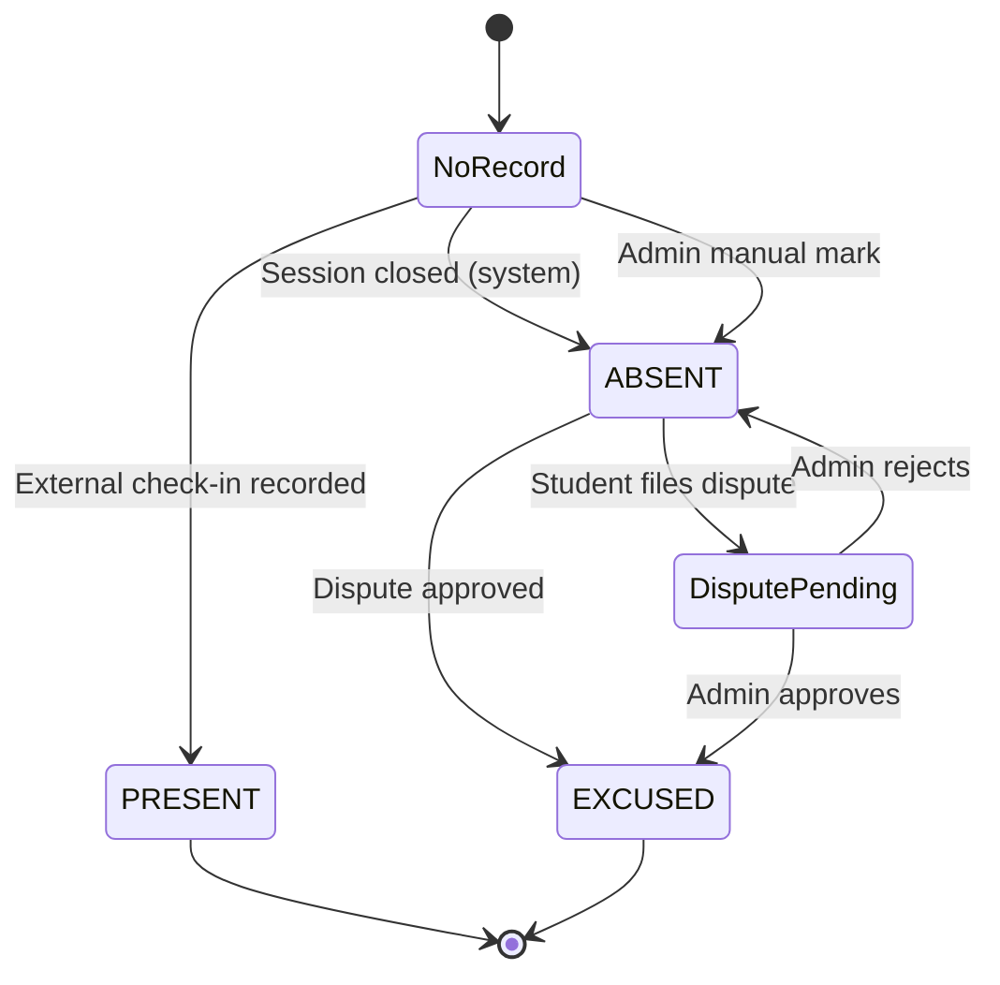
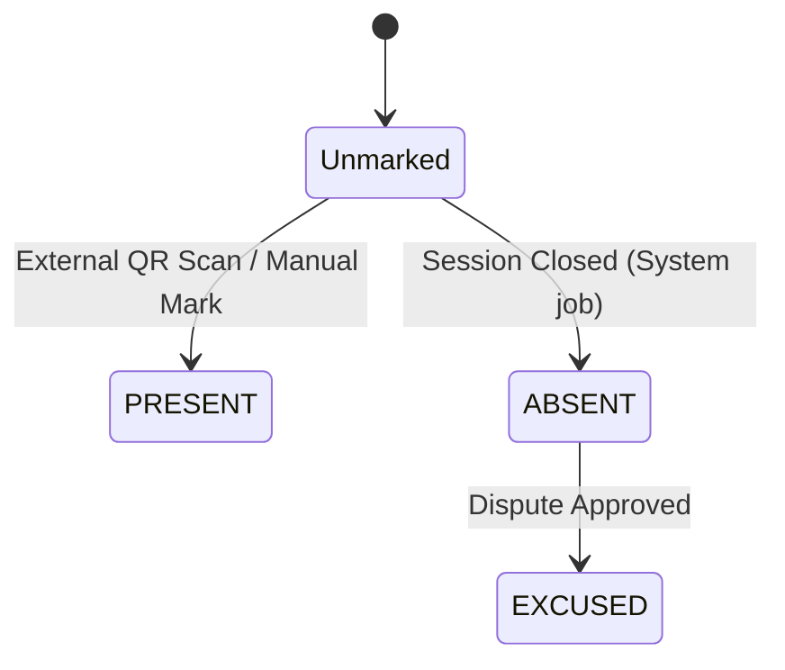

# Attendance State Machine

This models the student-facing attendance state lifecycle on the Student Web App.

*The Student Web App displays attendance results only. Physical check-in (QR scanning) occurs externally.*

## Student-Facing Attendance States

## Backend Record States
*(Internal — the backend determines transitions. The Web App reads the result.)*

## Backend References
- **Read Route**: `GET /users/me/attendance`
- **Dispute Route**: `POST /attendance/disputes`
- **Models**: `AttendanceRecord`, `AttendanceSession`, `AttendanceDispute`
- **Enums**: `AttendanceStatus` (`PRESENT`, `ABSENT`, `EXCUSED`), `AttendanceMethod` (`QR`, `MANUAL`, `SYSTEM`)
