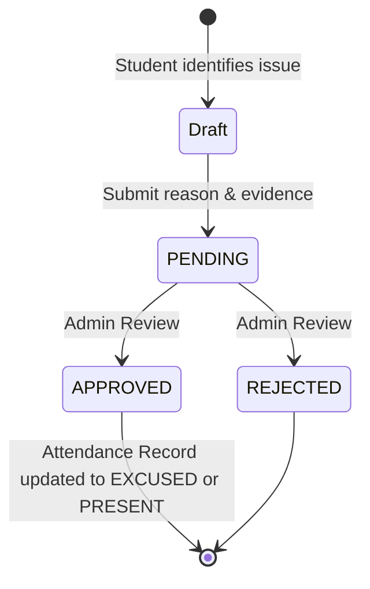

# Attendance Disputes State Machine

This models the lifecycle of a student filing an exception request for missed attendance.

## Backend References
- **Routes**: `POST /attendance/disputes`
- **Models**: `AttendanceDispute`
- **Enums**: `DisputeStatus` (`PENDING`, `APPROVED`, `REJECTED`)
- **Note**: The student cannot cancel or edit a dispute once submitted. There is only one terminal transition decided by the admin.
