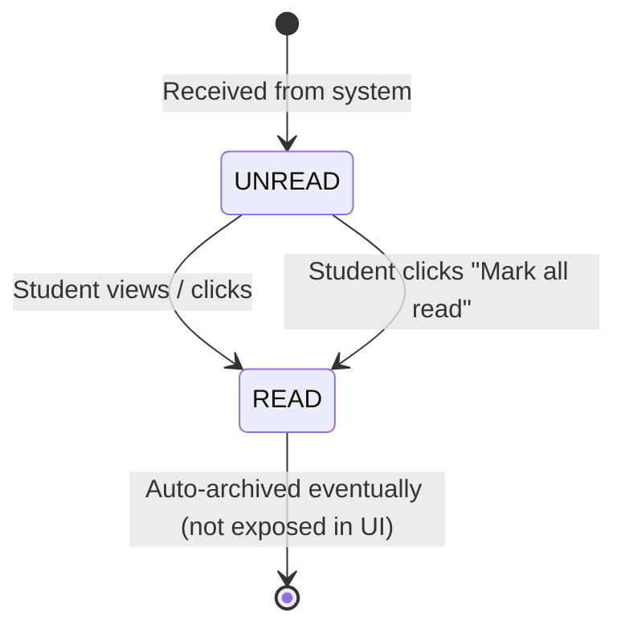

# Notification State Machine

This models the lifecycle of a student's notification inbox items.

## Backend References
- **Routes**: `PATCH /notifications/:id/read`, `PATCH /notifications/read-all`
- **Models**: `Notification`
- **Field**: `readAt` (DateTime or null)
