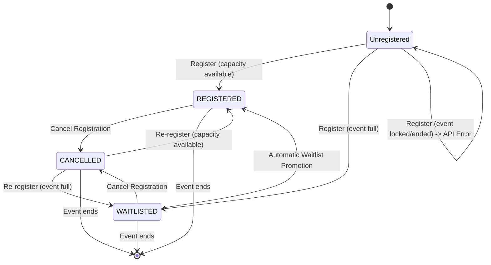

# Registration State Machine

This diagram models the lifecycle of a student's registration for an individual event.

## Backend References
- **Routes**: `POST /events/:id/register`, `DELETE /events/:id/register`
- **Model**: `EventRegistration`
- **Enum**: `RegistrationStatus` (`REGISTERED`, `WAITLISTED`, `CANCELLED`)
- **Note**: Waitlist promotion is handled entirely asynchronously by `NotificationJob` workers executing queue tasks. No student input is required.
