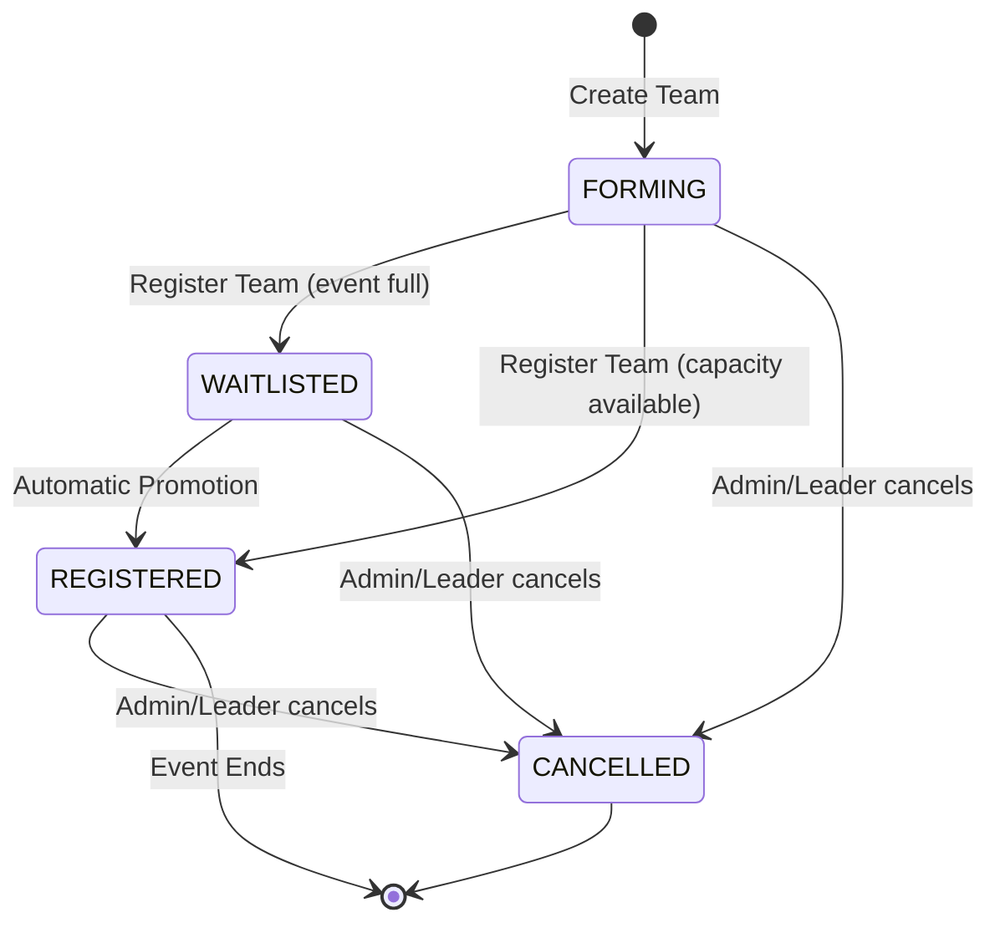
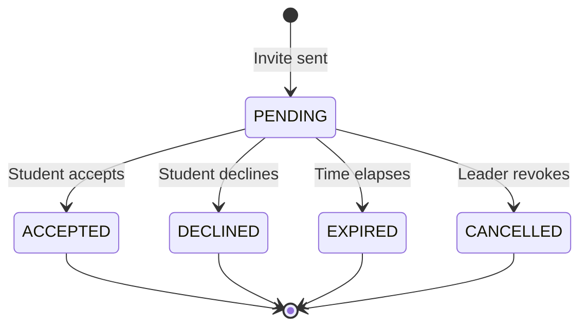

# Teams State Machine

This models the complex state transitions for Team creation, invitation, and event registration.

## Team Lifecycle

## Team Invitation Lifecycle

## Backend References
- **Routes**: `POST /events/:id/teams`, `POST /teams/:id/invitations`, `POST /teams/:id/invitations/:invitationId/accept`
- **Models**: `Team`, `TeamInvitation`
- **Enums**: `TeamStatus` (`FORMING`, `REGISTERED`, `WAITLISTED`, `CANCELLED`), `InvitationStatus` (`PENDING`, `ACCEPTED`, `DECLINED`, `CANCELLED`, `EXPIRED`)
