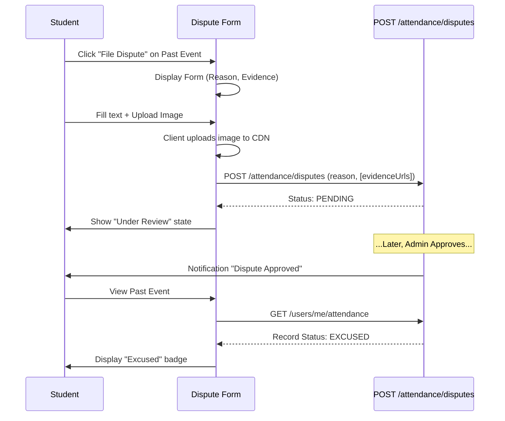

# Attendance Disputes Workflow

## Overview
If a student misses a check-in due to a system error or valid exception, they can file a dispute within a specific time window.

## Flow

## Backend References
- **Routes**: `POST /attendance/disputes`, `GET /attendance/disputes`
- **Models**: `AttendanceDispute`
- **Constraints**: Evidence must be uploaded to a bucket/CDN by the frontend before sending the URLs to the backend. The backend stores string URLs in `evidence_urls`.
