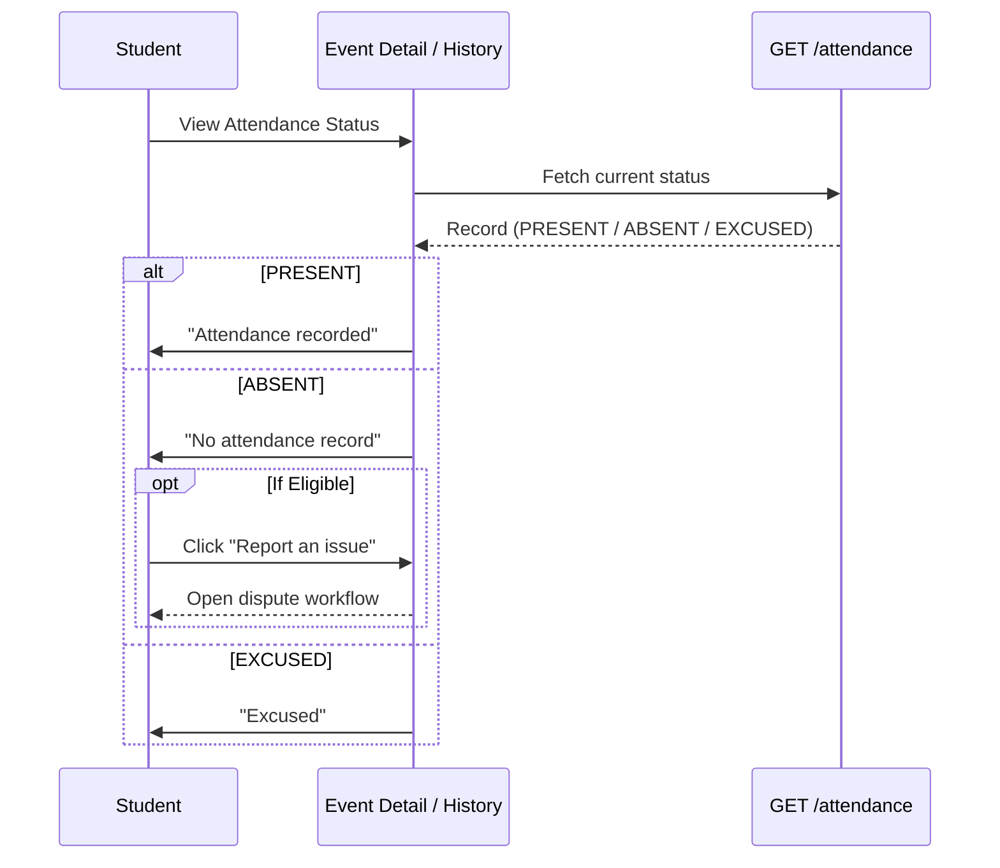

# Attendance Result Workflow

## Overview
Attendance is captured externally (via a separate physical or mobile client). The Student Web Application is responsible for reflecting the resulting state and managing exceptions.

## Flow

## Backend References
- **Routes**: `GET /users/me/attendance`
- **Models**: `AttendanceRecord`, `AttendanceDispute`
