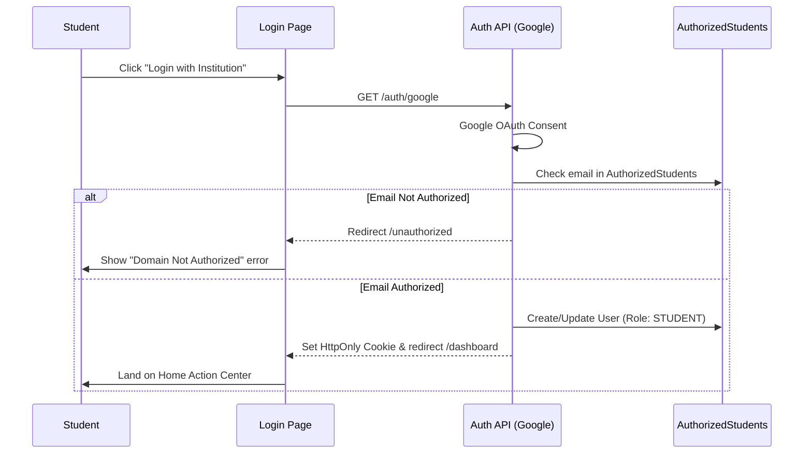

# Authentication & Onboarding Workflow

## Overview
NST Events uses a strict institutional-email gated authentication system. The backend validates users against a pre-authorized directory before granting access.

## Flow

## Backend References
- **Routes**: `GET /auth/google`, `GET /users/me`
- **Models**: `User`, `AuthorizedStudent`

## Edge Cases
- **Revoked Status**: If `DirectoryStatus === REVOKED`, the login is immediately rejected, and the UI displays an "Access Revoked" message.
- **First Login**: Handled seamlessly by the backend; no explicit frontend onboarding multi-step wizard exists in the current backend design.
