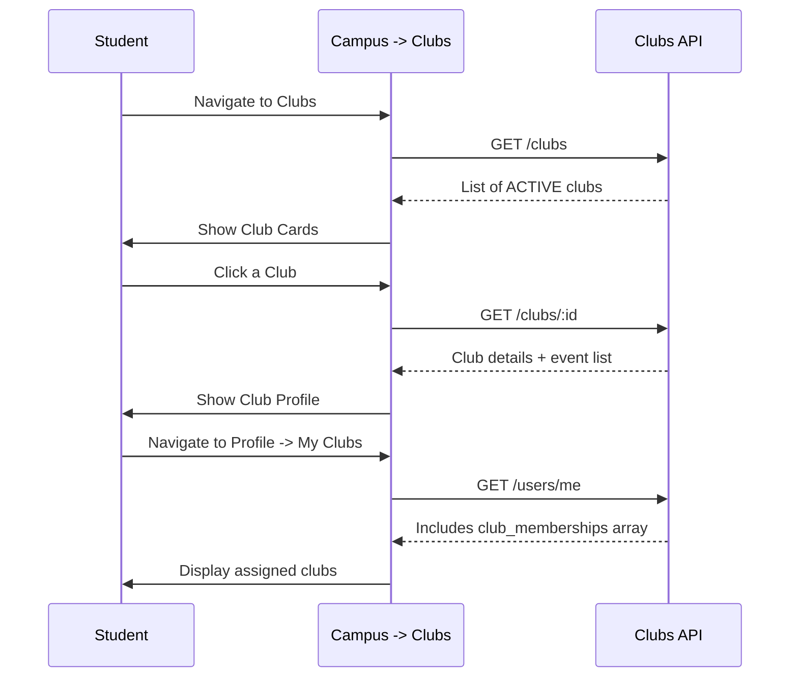

# Club Directory & Membership Workflow

## Overview
Students can view the Club Directory on Campus. "My Clubs" on the Profile is a read-only list populated by admin assignment.

## Flow

## Backend References
- **Routes**: `GET /clubs`, `GET /users/me`
- **Models**: `Club`, `ClubMembership`
- **Constraints**: Students cannot join a club via the API. `club_memberships` mutations are strictly admin-only.
