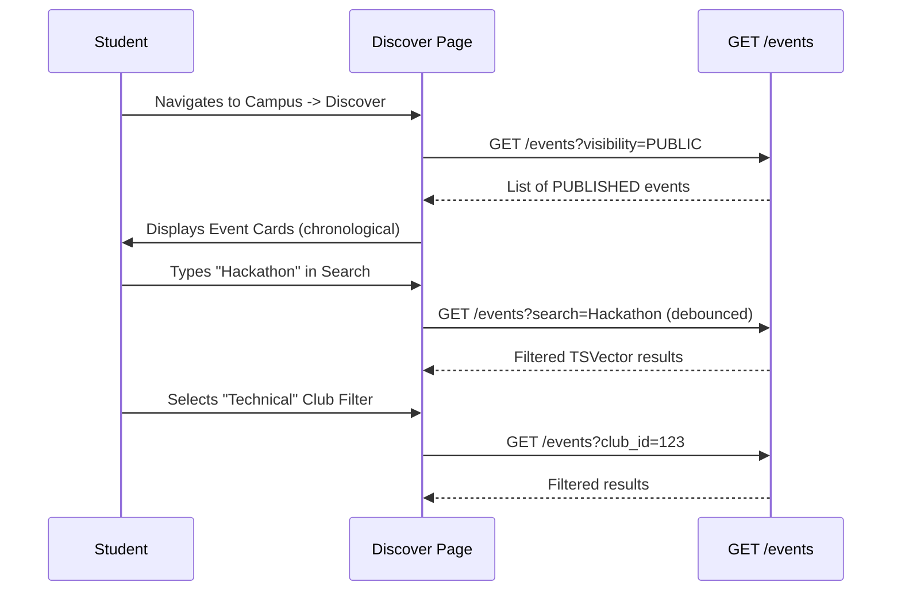

# Event Discovery Workflow

## Overview
Students discover events through the `Campus` -> `Discover` tab. The backend exclusively surfaces events that are in the `PUBLISHED` state, protecting draft and pending events automatically via API filtering.

## Flow

## Backend References
- **Routes**: `GET /events`
- **Models**: `Event`, `EventClub`
- **Query Params**: `search`, `club_id`, `state` (hardcoded to `PUBLISHED` for students on the frontend, also enforced by RLS).

## Event Card UI Requirements
- Display: Title, Primary Club, Start Date/Time, Location, Event Type.
- Contextual Tags: `TEAM` or `INDIVIDUAL`. `SOLD OUT` (if registration count >= max capacity).
