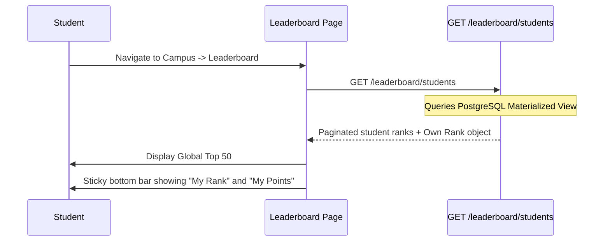

# Leaderboard Workflow

## Overview
The leaderboard exposes the student's relative ranking based on their participation and competition achievements.

## Flow

## Backend References
- **Routes**: `GET /leaderboard/students`, `GET /leaderboard/clubs`
- **Models**: `LeaderboardScore` (but queried via Materialized Views for performance).
- **Constraints**: Point accumulation details (the "why") are abstracted behind the total score on the frontend to avoid slow aggregate joins.
