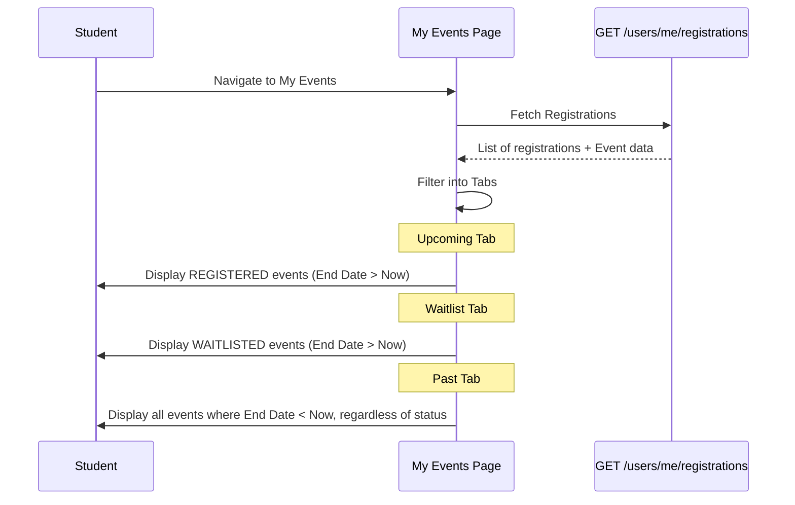

# My Events Workflow

## Overview
My Events serves as the student's personal commitment log. It filters `EventRegistration` records into logical, actionable groups.

## Flow

## Backend References
- **Routes**: `GET /users/me/registrations`
- **Models**: `EventRegistration`
- **Actions available from here**: 
  - Cancel Registration (If Upcoming/Waitlisted and Unlocked)
  - File Dispute (If Past and eligible)
  - View Attendance History (If Past)
