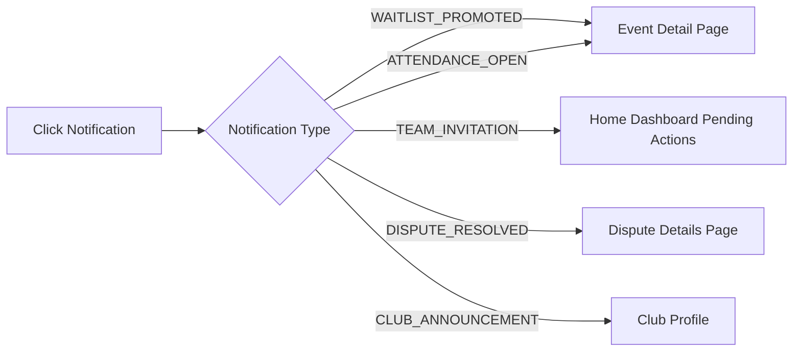
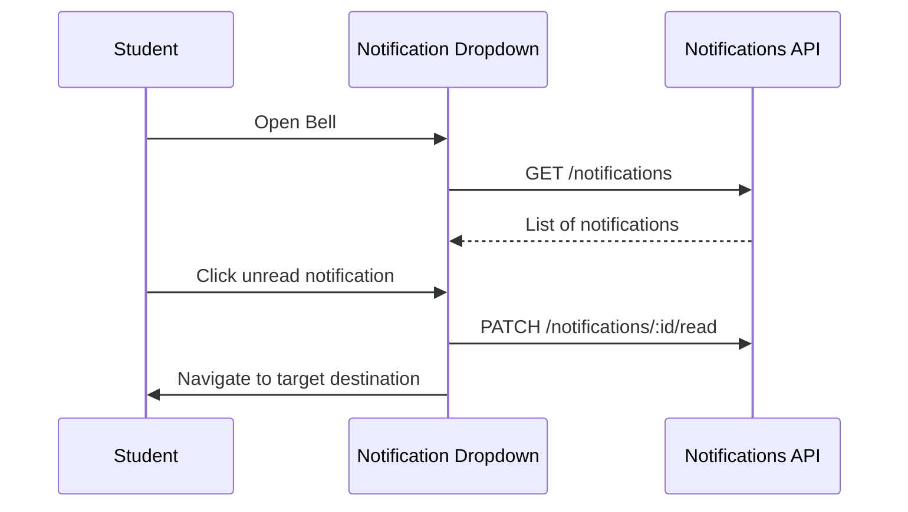

# Notifications Workflow

## Overview
Notifications route students to actionable destinations.

## Routing Flow

## Interaction Flow

## Backend References
- **Routes**: `GET /notifications`, `PATCH /notifications/:id/read`
- **Models**: `Notification`
- **Structure**: The `metadata` JSON field on the Notification model contains the routing information (e.g., `eventId`, `teamId`).
