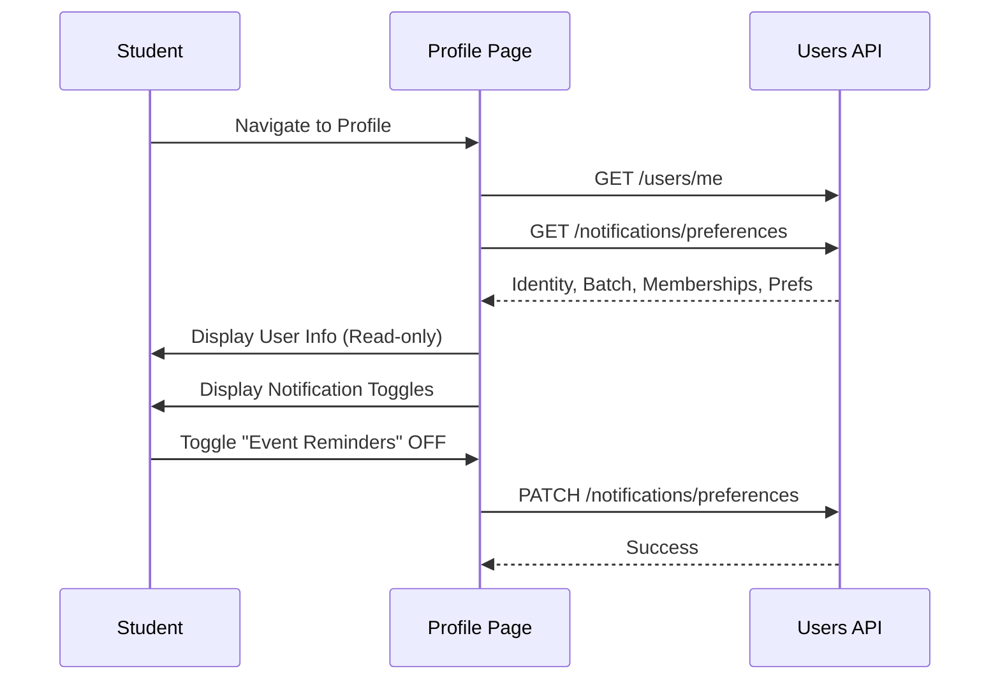

# Profile & Preferences Workflow

## Overview
The profile is a minimal, primarily read-only surface for identity and settings.

## Flow

## Backend References
- **Routes**: `GET /users/me`, `GET /notifications/preferences`, `PATCH /notifications/preferences`
- **Models**: `User`, `NotificationPreference`
- **Constraints**: Profile editing (Name, Batch) is not supported via student endpoints. These are synced from the institutional directory or modified by Admins.
