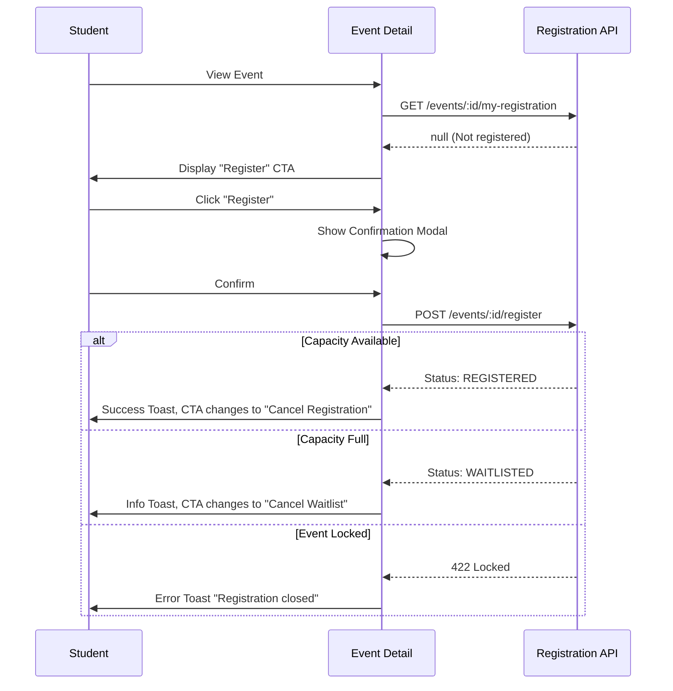

# Event Detail & Registration Workflow

## Overview
The Event Detail page is the primary interaction point for committing to an activity. It adapts dynamically based on the student's registration status.

## Flow (Solo Registration)

## Backend References
- **Routes**: `POST /events/:id/register`, `DELETE /events/:id/register`, `GET /events/:id/my-registration`
- **Constraints**: No optimistic UI. The UI must wait for the POST request to return before mutating the displayed status.

## UI Requirements
- Explicit confirmation modal required before submitting the POST request.
- If `is_locked` is true, hide/disable the Register and Cancel buttons completely.
