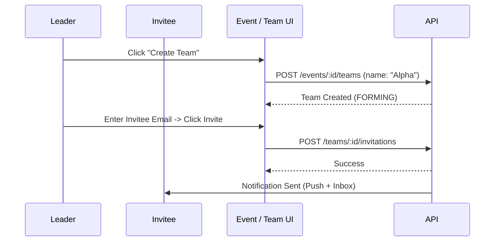
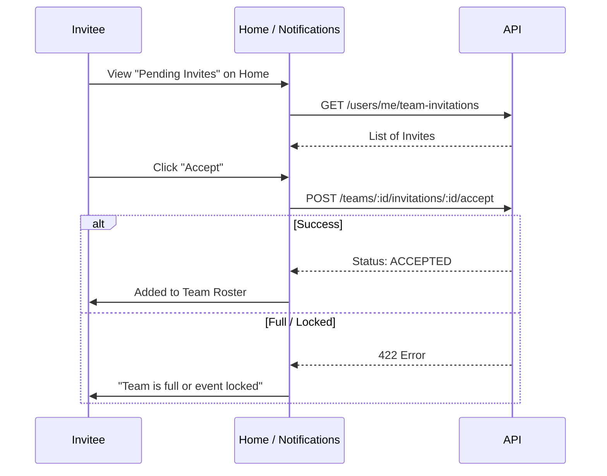

# Team Registration & Invitation Workflow

## Overview
Team events require a multi-step process: creating a team, inviting members, and achieving the required team constraints before participating.

## Flow: Creating & Inviting

## Flow: Accepting Invite

## Backend References
- **Routes**: `POST /events/:id/teams`, `POST /teams/:id/invitations`, `POST /teams/:id/invitations/:invId/accept`
- **Constraints**: 
  - Team members cannot self-register; they are bound to the team's registration status (`FORMING`, `REGISTERED`, `WAITLISTED`).
  - Only the team leader can invite or remove members (`DELETE /teams/:id/members/:userId`).
