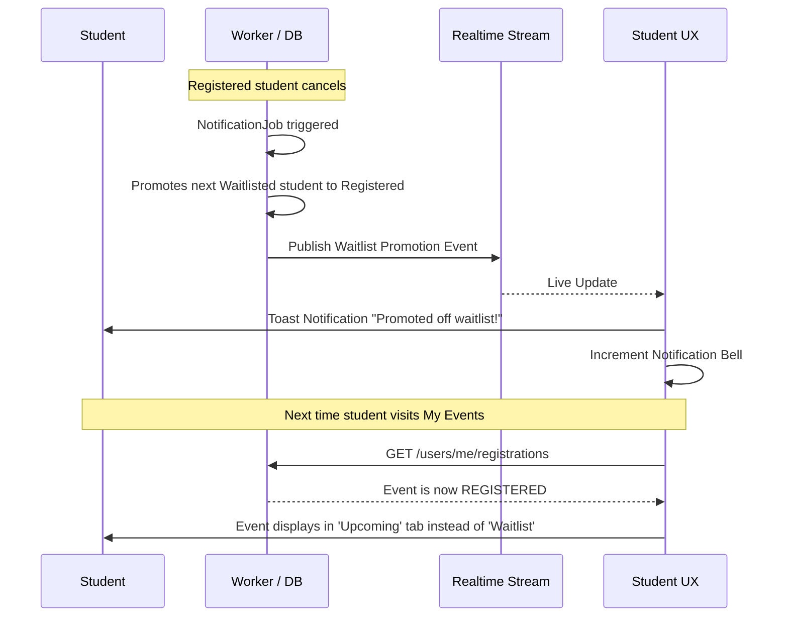

# Waitlist Promotion Workflow

## Overview
Waitlist promotion is a fully automated backend process. The UX challenge is communicating this asynchronous state change to the student without requiring them to act.

## Flow

## Backend References
- **Models**: `NotificationJob`, `EventRegistration`
- **Constraints**: 
  - There is no "Accept" endpoint for waitlists.
  - Waitlist promotion requires no student action.
  - The SSE stream (`/sse/notifications/live`) powers the immediate toast notification.
